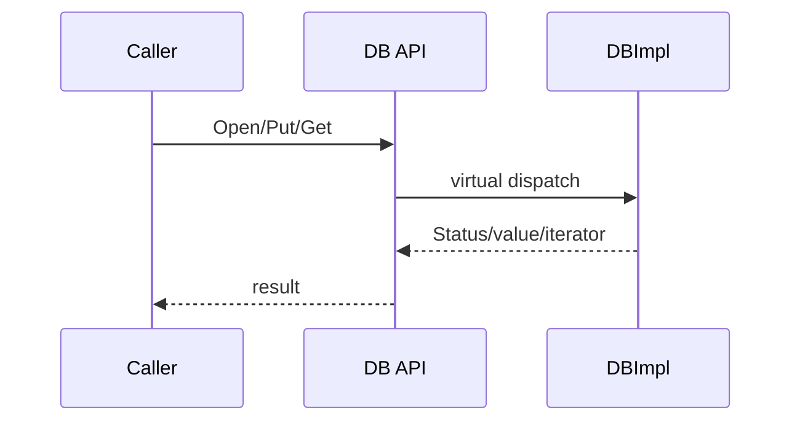

# M01 调用链、图示、开发与风险

- 文档目的：提供 M01 的最小追踪、图示和修改提示。
- 适用范围：公共 API。
- 证据状态：已确认/部分推断。
- 最后更新：2026-09-10
- 前置阅读：[M01 README](README.md)
- 后续阅读：[M02 call-chains](../M02-db-coordinator/call-chains.md)

## 调用链

```text
Caller
  -> DB::Open(options, name, &db)
    -> DBImpl::Recover()
  -> DB::Write(options, batch)
    -> DBImpl::Write()
  -> DB::Get(options, key, &value)
    -> DBImpl::Get()
```

公共虚接口声明在 [include/leveldb/db.h:45-146](../../../source/leveldb/include/leveldb/db.h#L45-L146)，实现入口在 [db/db_impl.cc:1121-1206](../../../source/leveldb/db/db_impl.cc#L1121-L1206)。

## 图示



箭头表示虚调用和返回；内部存储在 M02–M05。

## 开发指南

新增 API 时同步修改公开头、实现、C API（如适用）、CMake 安装清单、行为测试和用户文档。Bug 修复先添加能够复现的 `db_test`，再修内部实现。

## 风险

| 风险 | 触发 | 影响 | 验证 |
|---|---|---|---|
| Slice 悬空 | 保存临时 string 的 Slice | 未定义行为 | 生命周期测试/ASan |
| Snapshot 泄漏 | 忘记 Release | 旧版本和空间无法回收 | compaction 长压 |
| API 不兼容 | 改虚函数/默认值 | 客户端编译或行为变化 | 全量构建/回归 |

## 相关文档

- [interfaces](interfaces.md)
- [development-guide](development-guide.md)
- [risks-and-debt](risks-and-debt.md)

## 源码证据摘要

见正文引用。

## 未解决问题

需实际测试确认错误路径覆盖。

## 下一步阅读建议

进入 M02 的 Open、Write 和 Get 链。
