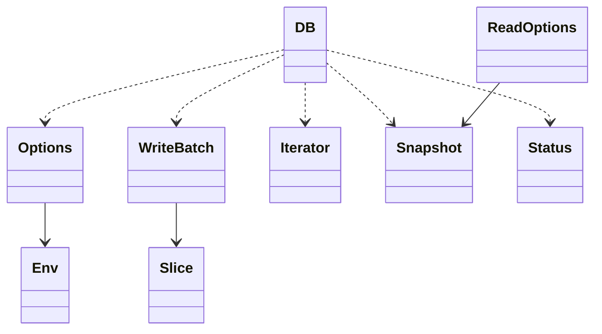

# M01 数据结构与生命周期

- 文档目的：解释公共类型的所有权、不变量和跨模块影响。
- 适用范围：公开头文件。
- 证据状态：已确认。
- 最后更新：2026-09-10
- 前置阅读：[M01 interfaces](interfaces.md)
- 后续阅读：[M03 数据结构](../M03-wal-memtable/data-structures.md)

## 类型关系

`DB` 拥有内部实现但由调用者 delete；`Snapshot` 是只读句柄，由 DB 创建/释放；Iterator 读取 DB 状态且必须先于 DB 销毁；Slice 只是外部缓冲区视图。[include/leveldb/db.h:25-60](../../../source/leveldb/include/leveldb/db.h#L25-L60)、[doc/index.md:201-229](../../../source/leveldb/doc/index.md#L201-L229)

## Options 不变量

Comparator 必须跨打开保持名称和排序一致；`write_buffer_size`、`block_size`、`max_file_size` 等会影响内存、块和 compaction；Env、cache、logger 可以由调用方借用。SanitizeOptions 会复制并规范部分选项，见 M02。[include/leveldb/options.h:40-147](../../../source/leveldb/include/leveldb/options.h#L40-L147)、[db/db_impl.cc:87-117](../../../source/leveldb/db/db_impl.cc#L87-L117)

## 状态对象

Status 是值对象，API 调用方应检查 `ok()`/`IsNotFound()`；WriteBatch 可复制但修改时需外部同步；Range 中 start 包含、limit 不包含。[include/leveldb/status.h](../../../source/leveldb/include/leveldb/status.h)、[include/leveldb/write_batch.h:41-72](../../../source/leveldb/include/leveldb/write_batch.h#L41-L72)、[include/leveldb/db.h:33-40](../../../source/leveldb/include/leveldb/db.h#L33-L40)

## 修改影响

增加公开字段可能改变 ABI/默认行为；改变 Snapshot、Slice 或线程说明会影响所有调用方；Options 中压缩枚举值写入表格式，不能重排。

## 相关文档

- [接口](interfaces.md)
- [M02 设计](../M02-db-coordinator/design.md)

## 源码证据摘要

见正文引用。

## 未解决问题

具体 ABI 导出策略需结合平台编译验证。

## 下一步阅读建议

阅读 `db/db.h` 后进入 DBImpl。
