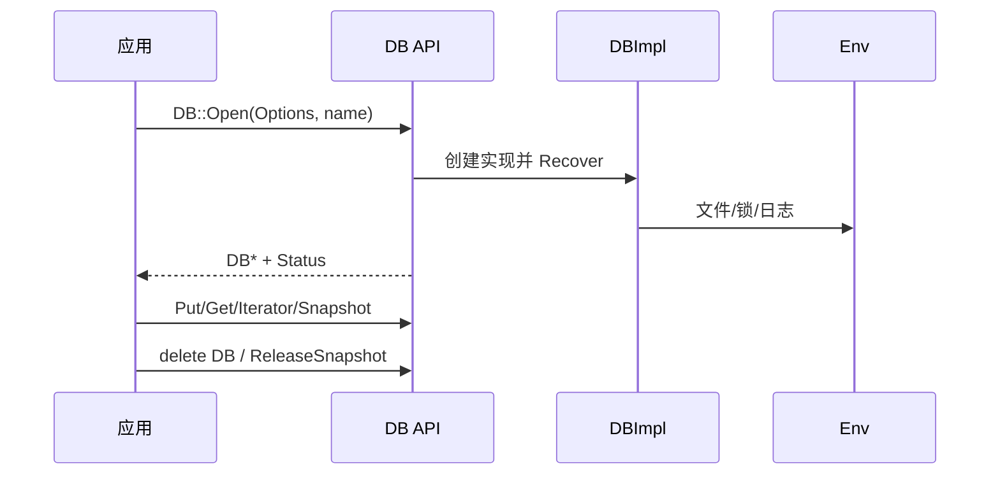
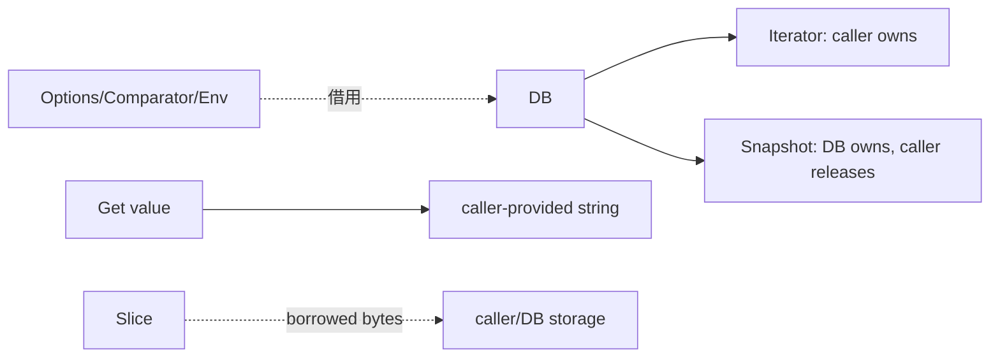
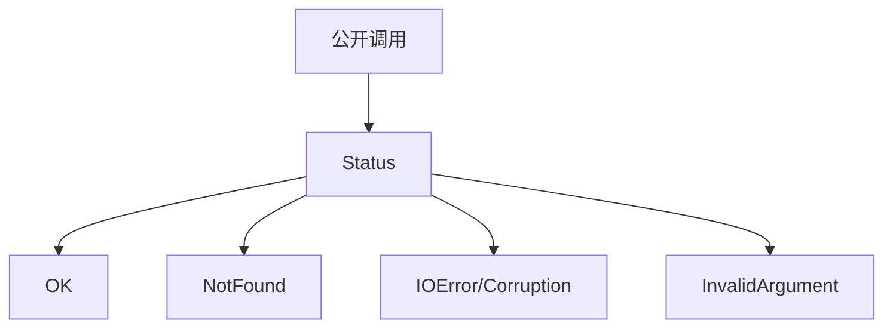

# M01 图示

- 文档目的：展示公共 API 的对象关系和生命周期。
- 适用范围：`include/leveldb/*.h`。
- 对应源码版本：source/leveldb HEAD 7ee830d（2026-09-15 只读确认）。
- 证据状态：契约已确认；图示为源码整理。
- 最后更新：2026-09-10
- 前置阅读：[M01 README](README.md)
- 后续阅读：[M01 line-level-analysis](line-level-analysis.md)
## 结论摘要

本页聚焦 01-modules/M01-public-api/diagrams.md；具体事实以正文引用的目标源码版本为准，未执行的构建、运行和硬件行为保持未验证。

- 源码版本：`main` / `7ee830d`。

## API 生命周期

`DB::Open` 的返回对象由调用方 delete，Snapshot 必须通过 `ReleaseSnapshot` 归还；公共头文件将这些生命周期写进接口注释。[include/leveldb/db.h:42-105](../../../source/leveldb/include/leveldb/db.h#L42-L105)

## 所有权边界

## 错误返回

## 相关源码

- [DB 接口](../../../source/leveldb/include/leveldb/db.h#L42-L162)
- [WriteBatch 契约](../../../source/leveldb/include/leveldb/write_batch.h#L4-L78)
- [Slice 契约](../../../source/leveldb/include/leveldb/slice.h#L1-L100)

## 相关文档
- [项目入口](../../README.md)
- [分析状态](../../00-overview/analysis-state.md)
- [源码证据索引](../../00-overview/evidence-index.md)

## 源码证据摘要
本页结论所需的源码路径和行号以 [源码证据索引](../../00-overview/evidence-index.md) 及正文引用为准；本页不把未执行的构建、运行或硬件行为写成已验证事实。

## 未解决问题
目标环境、动态构建/运行、硬件和外部依赖行为未在本轮执行；缺少直接证据的结论仍标记为未知或未验证。

## 下一步阅读建议
先阅读 [分析状态](../../00-overview/analysis-state.md)，再沿本页已有链接进入对应模块、Demo 或跨模块流程。
