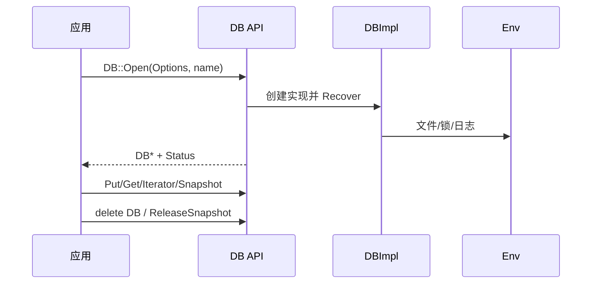
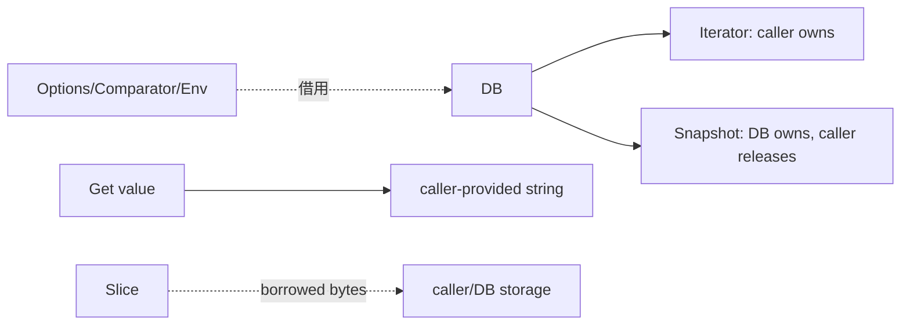
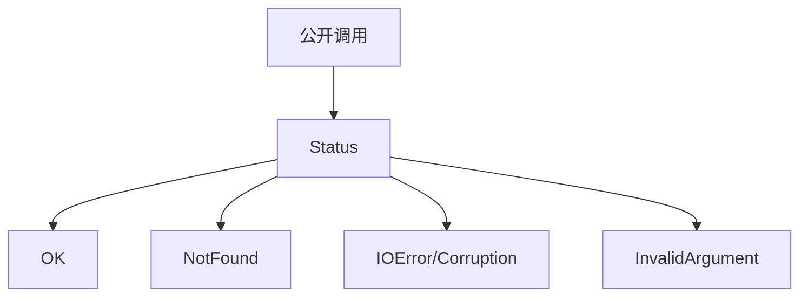

# M01 图示

- 文档目的：展示公共 API 的对象关系和生命周期。
- 适用范围：`include/leveldb/*.h`。
- 源码版本：`main` / `7ee830d`。
- 证据状态：契约已确认；图示为源码整理。
- 最后更新：2026-09-10
- 前置阅读：[M01 README](README.md)
- 后续阅读：[M01 line-level-analysis](line-level-analysis.md)

## API 生命周期

`DB::Open` 的返回对象由调用方 delete，Snapshot 必须通过 `ReleaseSnapshot` 归还；公共头文件将这些生命周期写进接口注释。[include/leveldb/db.h:42-105](../../../source/leveldb/include/leveldb/db.h#L42-L105)

## 所有权边界

## 错误返回

## 相关源码

- [DB 接口](../../../source/leveldb/include/leveldb/db.h#L42-L162)
- [WriteBatch 契约](../../../source/leveldb/include/leveldb/write_batch.h#L4-L78)
- [Slice 契约](../../../source/leveldb/include/leveldb/slice.h#L1-L100)
