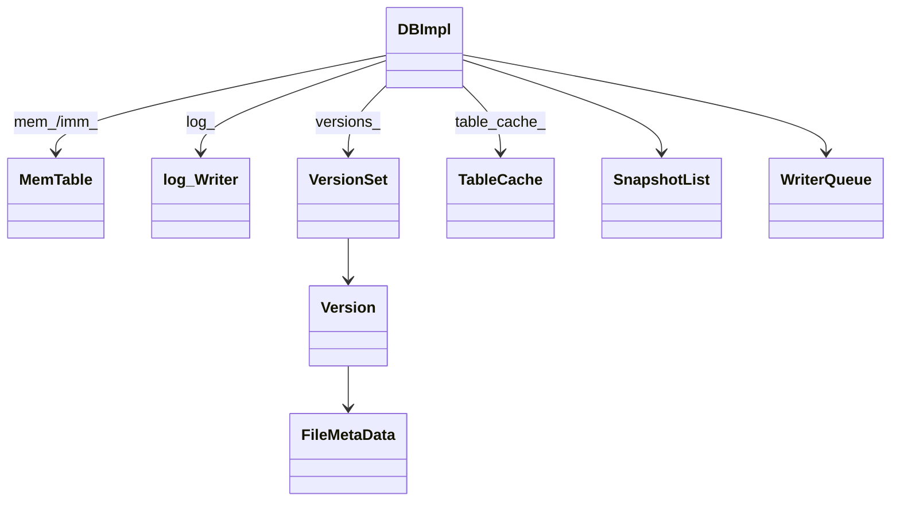

# M02 数据结构与生命周期

- 文档目的：解释 DBImpl 的核心状态和所有权。
- 适用范围：`db_impl.h`。
- 对应源码版本：source/leveldb HEAD 7ee830d（2026-09-15 只读确认）。
- 证据状态：已确认。
- 最后更新：2026-09-10
- 前置阅读：[M02 design](design.md)
- 后续阅读：[M03 data structures](../M03-wal-memtable/data-structures.md)
## 结论摘要

本页聚焦 01-modules/M02-db-coordinator/data-structures.md；具体事实以正文引用的目标源码版本为准，未执行的构建、运行和硬件行为保持未验证。

## 关系图

## 关键字段

| 字段 | 不变量/生命周期 |
|---|---|
| `mem_` | 当前可写 MemTable；DB 持有引用。 |
| `imm_` | 等待后台 flush 的只读 MemTable；`has_imm_` 提示后台。 |
| `logfile_`/`log_` | 当前 WAL 文件和 writer，随 memtable 切换。 |
| `writers_` | 按到达顺序排队的 Writer；队首构建 batch group。 |
| `snapshots_` | 保护最老可见序列号，影响 compaction 丢弃版本。 |
| `pending_outputs_` | 防止后台生成中的表被垃圾回收。 |
| `versions_` | 管理当前和旧 Version。 |

证据：[db/db_impl.h:172-204](../../../source/leveldb/db/db_impl.h#L172-L204)。

## 生命周期图

`DB::Open` 创建 → `Recover` 填充 mem/version → 写入期间切换 mem/imm/log → flush/compaction 安装 VersionEdit → 析构等待后台并释放。任何新增字段必须说明 mutex、原子性和释放者。

## 相关文档

- [design](design.md)
- [runtime model](../../00-overview/runtime-model.md)

## 源码证据摘要

见表格和链接。

## 未解决问题

Writer 批量公平性和最大批次边界需结合 `BuildBatchGroup` 完整分析。

## 下一步阅读建议

阅读 M02 line-level 和 M04 Version 生命周期。
