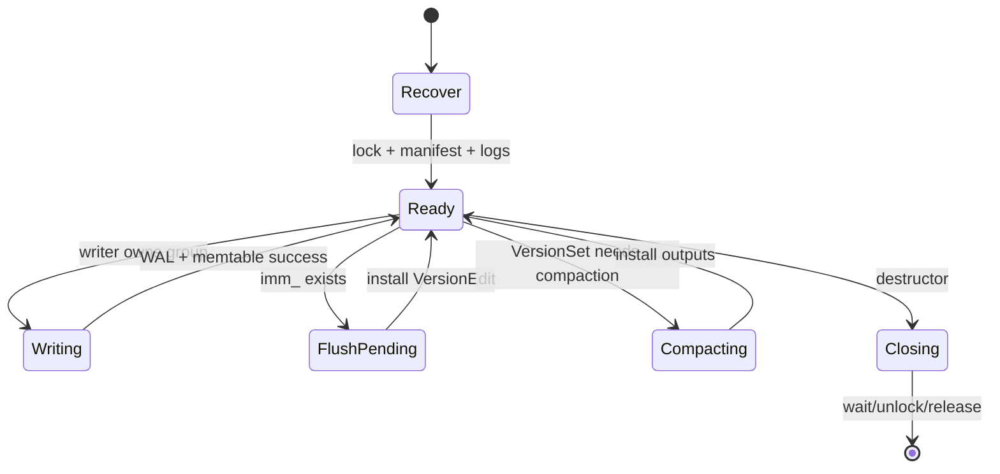

# M02 设计

- 文档目的：解释 DBImpl 的状态机、并发和资源边界。
- 适用范围：`db_impl`。
- 对应源码版本：source/leveldb HEAD 7ee830d（2026-09-15 只读确认）。
- 证据状态：机制已确认，设计动机部分推断。
- 最后更新：2026-09-10
- 前置阅读：[M02 README](README.md)
- 后续阅读：[M02 行级分析](line-level-analysis.md)
## 结论摘要

DBImpl 通过一个主 mutex 保护持久化状态，使用 writer 队列合并写请求，使用 Env 的异步调度运行后台 flush/compaction。它把锁内的元数据变更和锁外的文件 IO 分开，并用 Version/引用计数维持读者看到的稳定状态。

## 状态机

## 并发模型

`mutex_` 保护 `mem_` 之外的大多数 DBImpl 状态；`shutting_down_`/`has_imm_` 为原子标志，后台完成通过条件变量通知。Writer 自带 CondVar，排队者等待其 `done`。[db/db_impl.h:172-205](../../../source/leveldb/db/db_impl.h#L172-L205)、[db/db_impl.cc:41-51](../../../source/leveldb/db/db_impl.cc#L41-L51)

## 资源所有权

DBImpl 构造 TableCache/VersionSet/tmp batch；SanitizeOptions 可能创建 logger/cache，并用 `owns_info_log_`/`owns_cache_` 控制析构。MemTable/Version 通过引用计数或版本链保护活跃读者。文件删除必须考虑 `pending_outputs_`。[db/db_impl.cc:125-149](../../../source/leveldb/db/db_impl.cc#L125-L149)、[db/db_impl.cc:224-289](../../../source/leveldb/db/db_impl.cc#L224-L289)

## 修改影响

写路径改动影响 WAL、sequence、writer fairness、恢复和测试；后台路径改动影响死锁、文件回收和关闭；Get 改动影响 snapshot visibility、cache 和 compaction seek stats。

## 相关文档

- [interfaces](interfaces.md)
- [data-structures](data-structures.md)
- [risks](risks-and-debt.md)

## 源码证据摘要

见正文引用。

## 未解决问题

锁外 IO 的所有路径需结合完整函数体逐一确认。

## 下一步阅读建议

读 `Write`、`MakeRoomForWrite`、`BackgroundCall`。
