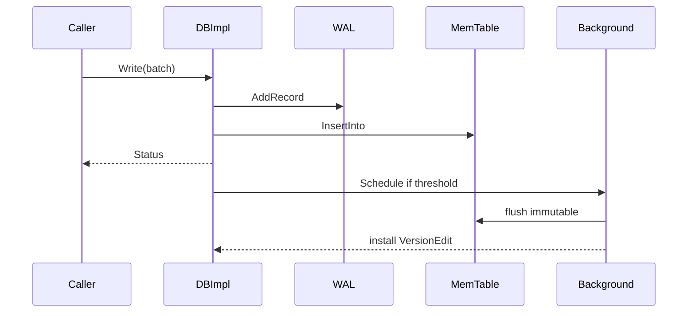

# M02 图示、示例、测试与开发

- 文档目的：集中给出 M02 的时序、真实示例入口、测试和修改步骤。
- 适用范围：DBImpl。
- 对应源码版本：source/leveldb HEAD 7ee830d（2026-09-15 只读确认）。
- 证据状态：源码/仓库入口已确认；命令执行未验证。
- 最后更新：2026-09-10
- 前置阅读：[M02 README](README.md)
- 后续阅读：[M02 风险](risks-and-debt.md)
## 结论摘要

本页聚焦 01-modules/M02-db-coordinator/diagrams.md；具体事实以正文引用的目标源码版本为准，未执行的构建、运行和硬件行为保持未验证。

## 时序图

## 真实示例

`doc/index.md` 的 Open、Put/Get、WriteBatch、Snapshot 示例是 API 入口；`db/db_test.cc` 的测试夹具展示临时目录和重开 DB。示例命令/输出尚未执行，不标记为已验证。

## 测试

重点：`db/db_test.cc`（正常行为）、`recovery_test.cc`（日志/重启）、`corruption_test.cc`（损坏）、`autocompact_test.cc`（后台压缩）、`fault_injection_test.cc`（默认 CMake 注释掉，需单独评估）。CMake 聚合配置见 [CMakeLists.txt:313-352](../../../source/leveldb/CMakeLists.txt#L313-L352)。

## 开发配方

- 修写入 bug：先加 db_test 回归 → 检查 writer/WAL/sequence → 再检查 recovery。
- 改后台：补充 flush/compaction 和 shutdown 测试 → 检查锁、pending_outputs、错误清理。
- 加配置：改 Options、SanitizeOptions、测试默认值和文档。

## 风险

| 风险 | 影响 | 验证 |
|---|---|---|
| mutex/CondVar 顺序不一致 | 死锁 | 线程测试、clang thread-safety |
| 关闭时后台仍访问字段 | UAF | 重复 open/close、TSan |
| VersionEdit 安装失败清理不完整 | 丢表/磁盘泄漏 | fault injection/recovery |

## 相关文档

- [diagrams](diagrams.md)
- [testing](testing.md)
- [development-guide](development-guide.md)
- [risks-and-debt](risks-and-debt.md)

## 源码证据摘要

见正文引用。

## 未解决问题

本次未运行测试和 sanitizers。

## 下一步阅读建议

先运行 `leveldb_tests`，再修改单个 DBImpl 路径。
