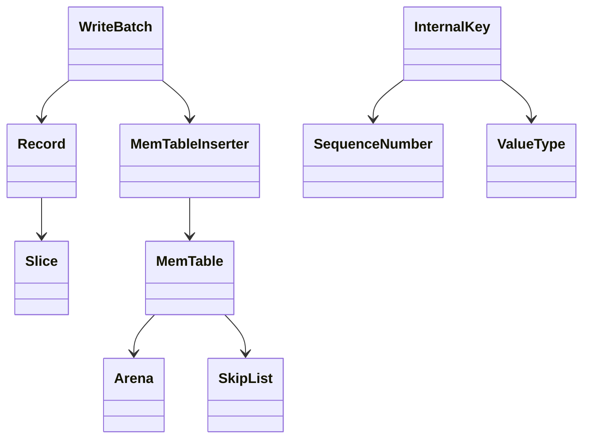

# M03 数据结构与生命周期

- 文档目的：解释 batch、InternalKey、MemTable 条目的布局与所有权。
- 适用范围：M03。
- 对应源码版本：source/leveldb HEAD 7ee830d（2026-09-15 只读确认）。
- 证据状态：已确认。
- 最后更新：2026-09-10
- 前置阅读：[M03 interfaces](interfaces.md)
- 后续阅读：[M04 数据结构](../M04-version-compaction/data-structures.md)
## 结论摘要

本页聚焦 01-modules/M03-wal-memtable/data-structures.md；具体事实以正文引用的目标源码版本为准，未执行的构建、运行和硬件行为保持未验证。

## 关系图

## 内存表条目

`MemTable::Add` 分配一块连续内存，布局是 varint internal_key_size、InternalKey 字节、varint value_size、value 字节；InternalKey tag 为 `(sequence << 8) | type`。[db/memtable.cc:75-99](../../../source/leveldb/db/memtable.cc#L75-L99)

## 可见性

MemTable comparator 先比较内部 key；同一 user key 的高 sequence 在前。`LookupKey` 同时生成 memtable key、internal key 和 user key，Get seek 到不超过 snapshot 的候选。[db/dbformat.h:183-219](../../../source/leveldb/db/dbformat.h#L183-L219)

## 生命周期

DBImpl 持有当前和 immutable MemTable 的引用；后台 flush 完成后释放 immutable；Iterator 不能越过 MemTable 释放。Arena 随 MemTable 一起销毁，不能把其中 Slice 返回到其生命周期之外。

## 相关文档

- [line-level-analysis](line-level-analysis.md)
- [M02 状态](../M02-db-coordinator/data-structures.md)

## 源码证据摘要

见正文链接。

## 未解决问题

SkipList 的节点分配/高度分布需要进一步展开。

## 下一步阅读建议

追踪 `LookupKey` 到 `MemTable::Get`。
