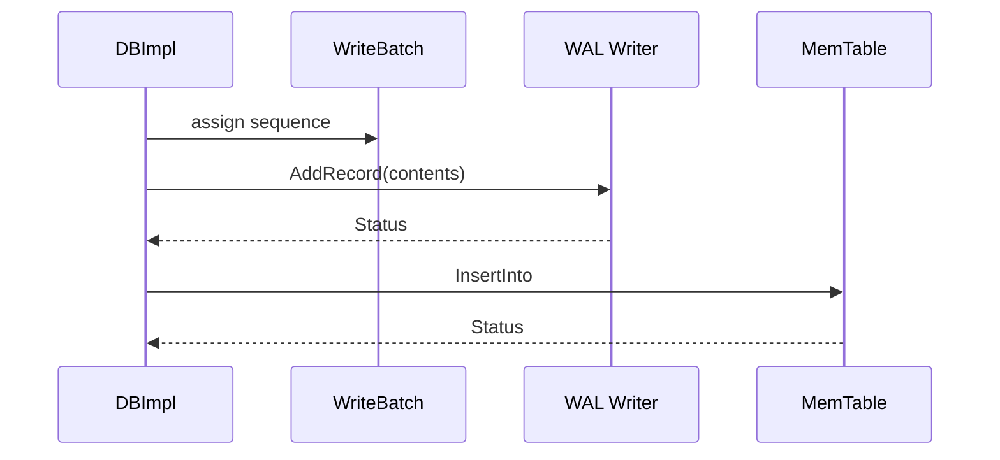

# M03 图示、示例与测试

- 文档目的：展示 WAL/MemTable 时序，给出真实示例入口和测试方法。
- 适用范围：M03。
- 证据状态：源码/测试存在已确认，命令未验证。
- 最后更新：2026-09-10
- 前置阅读：[M03 README](README.md)
- 后续阅读：[M03 开发指南](development-guide.md)

## 时序图

## 示例

真实 API batch 示例：[doc/index.md:67-92](../../../source/leveldb/doc/index.md#L67-L92)。异常/边界示例来自 `db/log_test.cc` 和 `db/write_batch_test.cc`，应以测试源码为输入，不伪造输出。

## 测试

- `db/log_test.cc`：完整/分片记录、offset、损坏。
- `db/write_batch_test.cc`：count/sequence/contents/Append/InsertInto。
- `db/skiplist_test.cc`：有序索引。
- `db/recovery_test.cc`：重放 WAL。
- `db/dbformat_test.cc`：InternalKey 编解码和比较。

## 相关文档

- [testing](testing.md)
- [development-guide](development-guide.md)

## 源码证据摘要

测试由 [CMakeLists.txt:333-341](../../../source/leveldb/CMakeLists.txt#L333-L341) 纳入主目标。

## 未解决问题

当前 CMake 对部分 fault injection 测试是注释状态，需实际构建确认。

## 下一步阅读建议

先运行 log/write batch 单测，再观察 recovery。
