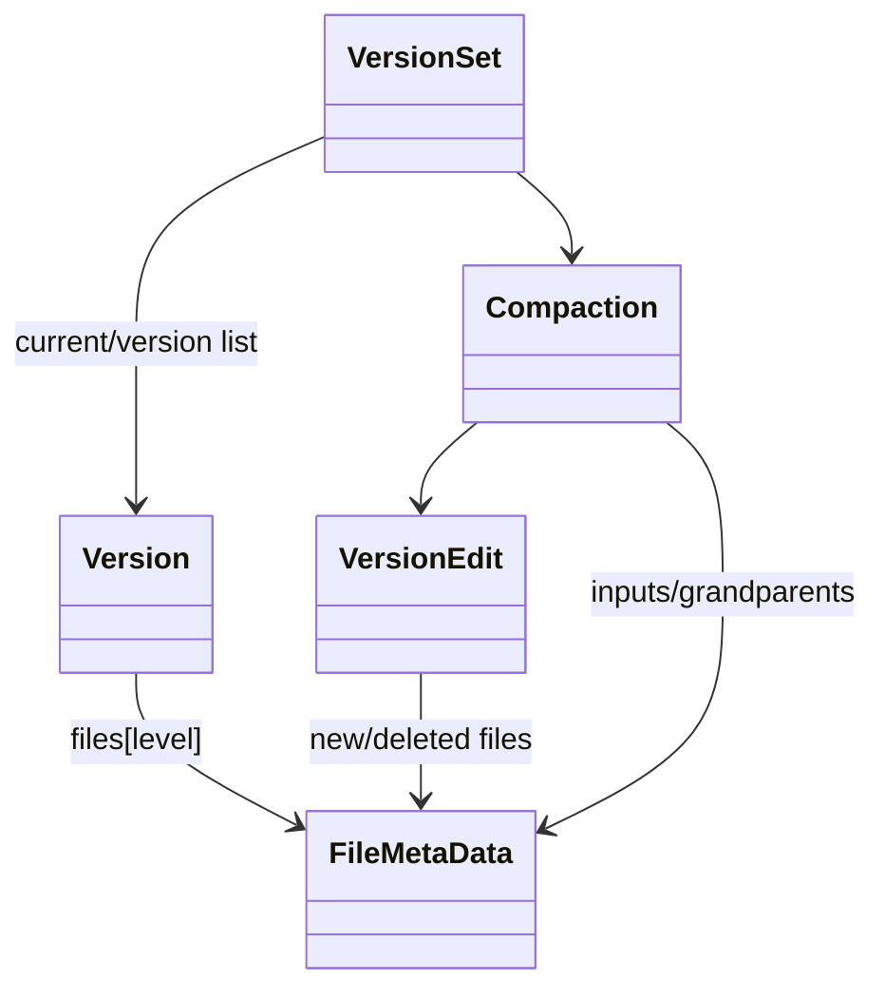

# M04 数据结构与生命周期

- 文档目的：解释 Version、FileMetaData、VersionEdit、Compaction 的关系。
- 适用范围：M04。
- 证据状态：已确认。
- 最后更新：2026-09-10
- 前置阅读：[M04 interfaces](interfaces.md)
- 后续阅读：[M04 line-level](line-level-analysis.md)

## 关系图

`FileMetaData` 记录 refs、allowed_seeks、file number/size 和 smallest/largest InternalKey（[db/version_edit.h:17-26](../../../source/leveldb/db/version_edit.h#L17-L26)）。Version 的 refs 保护 iterator 期间的表集合；VersionSet current 指向链尾。[db/version_set.h:147-164](../../../source/leveldb/db/version_set.h#L147-L164)、[db/version_set.cc:760-775](../../../source/leveldb/db/version_set.cc#L760-L775)

## 生命周期

VersionEdit 临时构造 → Builder 应用到新 Version → MANIFEST 持久化 → AppendVersion 安装 → 旧 Version 引用归零 → live file 回收。Compaction 输入版本必须 Ref，完成后 ReleaseInputs。[db/version_set.cc:792-798](../../../source/leveldb/db/version_set.cc#L792-L798)

## 相关文档

- [design](design.md)
- [shared types](../../90-cross-module/shared-data-and-types.md)

## 源码证据摘要

见正文引用。

## 未解决问题

Version Builder 的排序/重叠断言需逐段补充。

## 下一步阅读建议

阅读 `Version::Get` 和 `VersionSet::Finalize`。
