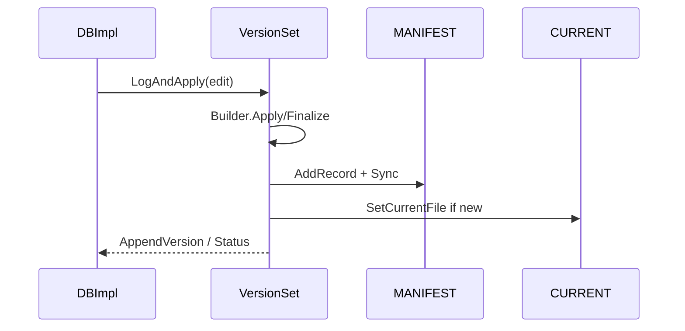

# M04 图示、测试与开发

- 文档目的：说明版本提交时序、测试边界和修改配方。
- 适用范围：M04。
- 证据状态：源码/测试已确认，命令未验证。
- 最后更新：2026-09-10
- 前置阅读：[M04 design](design.md)
- 后续阅读：[M04 risks](risks-and-debt.md)

## 时序图

## 测试

`db/version_set_test.cc` 覆盖文件范围/版本/压缩选择；`db/version_edit_test.cc` 覆盖编辑编解码；`db/autocompact_test.cc` 和 `db/db_test.cc` 验证端到端压缩；`recovery_test.cc` 验证重开。

## 开发配方

改 VersionEdit：先补 Encode/Decode 对称测试；改选压缩：补 level-0 overlap、boundary、seek/size score 测试；改安装：补 MANIFEST 写失败、CURRENT 和旧版本保留测试。

## 相关文档

- [testing](testing.md)
- [development-guide](development-guide.md)
- [risks-and-debt](risks-and-debt.md)

## 源码证据摘要

[CMakeLists.txt:337-340](../../../../CMakeLists.txt#L337-L340)。

## 未解决问题

需实际执行测试确认当前平台的压缩触发时间。

## 下一步阅读建议

结合 M05 表格式观察 Version 文件元数据如何生成。
