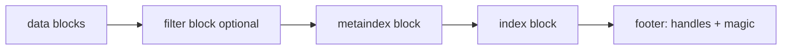
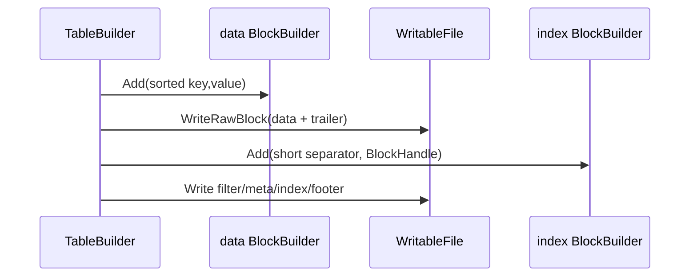
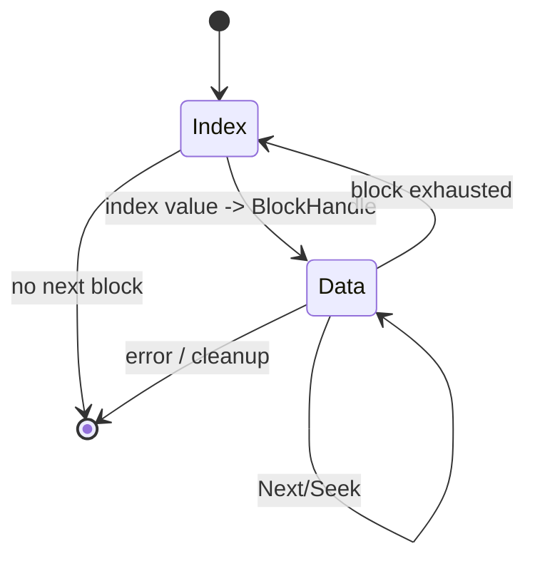
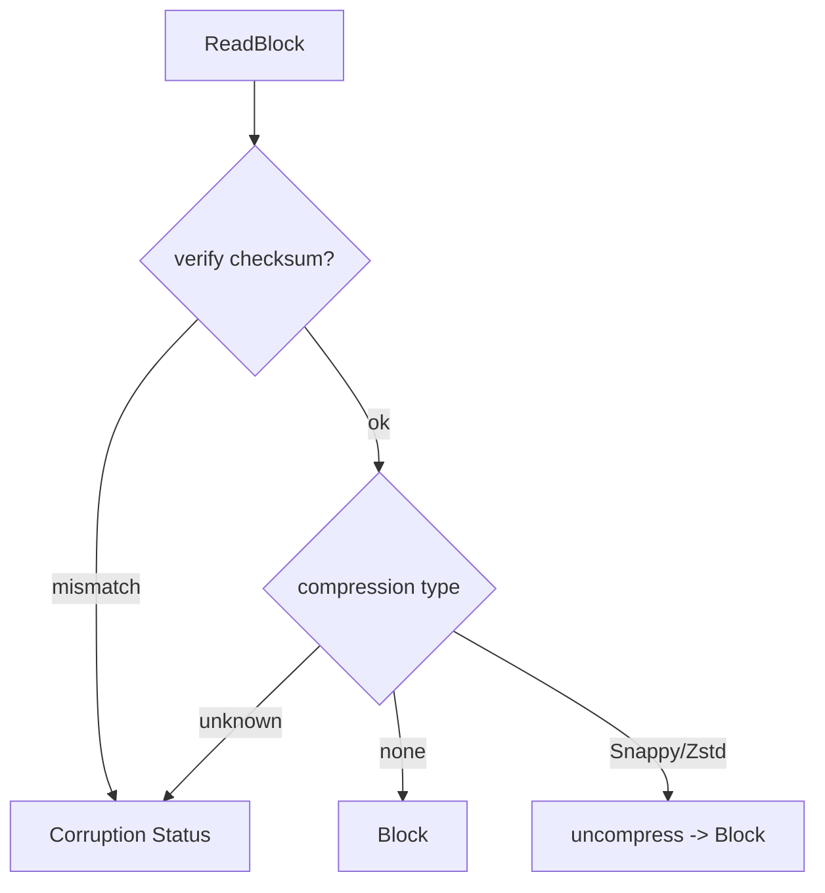

# M05 图示

- 文档目的：用图示呈现 SSTable 布局和读取状态机。
- 适用范围：M05。
- 对应源码版本：source/leveldb HEAD 7ee830d（2026-09-15 只读确认）。
- 证据状态：图示根据源码控制流整理。
- 最后更新：2026-09-10
- 前置阅读：[call-chains](call-chains.md)
- 后续阅读：[testing](testing.md)
## 结论摘要

本页聚焦 01-modules/M05-sstable-table/diagrams.md；具体事实以正文引用的目标源码版本为准，未执行的构建、运行和硬件行为保持未验证。

- 源码版本：`main` / `7ee830d`。

## 文件布局

footer 的固定长度使 reader 可从文件尾部定位 metaindex 和 index。[table/format.h:45-65](../../../source/leveldb/table/format.h#L45-L65)

## 写入时序

## 读取状态机

`TwoLevelIterator` 的 `SkipEmptyDataBlocksForward/Backward` 实现了两个方向的跨 block 跳转。[table/two_level_iterator.cc:102-137](../../../source/leveldb/table/two_level_iterator.cc#L102-L137)

## 错误边界

未知类型和解压失败不会创建可用 Block。[table/format.cc:89-160](../../../source/leveldb/table/format.cc#L89-L160)

## 相关文档
- [项目入口](../../README.md)
- [分析状态](../../00-overview/analysis-state.md)
- [源码证据索引](../../00-overview/evidence-index.md)

## 源码证据摘要
本页结论所需的源码路径和行号以 [源码证据索引](../../00-overview/evidence-index.md) 及正文引用为准；本页不把未执行的构建、运行或硬件行为写成已验证事实。

## 未解决问题
目标环境、动态构建/运行、硬件和外部依赖行为未在本轮执行；缺少直接证据的结论仍标记为未知或未验证。

## 下一步阅读建议
先阅读 [分析状态](../../00-overview/analysis-state.md)，再沿本页已有链接进入对应模块、Demo 或跨模块流程。
