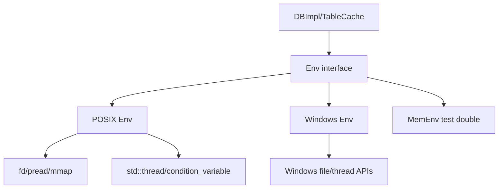
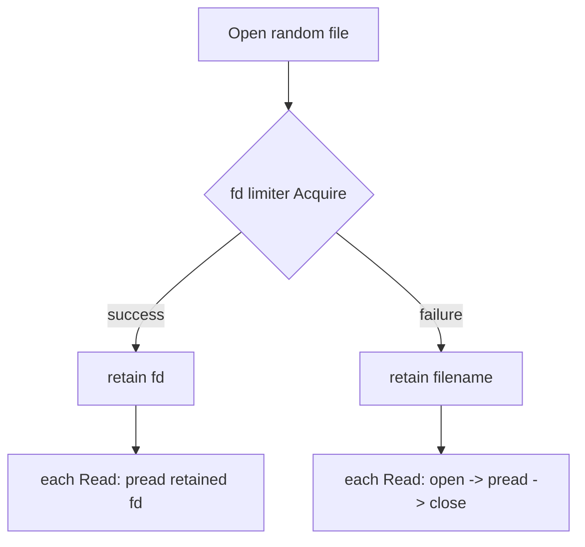
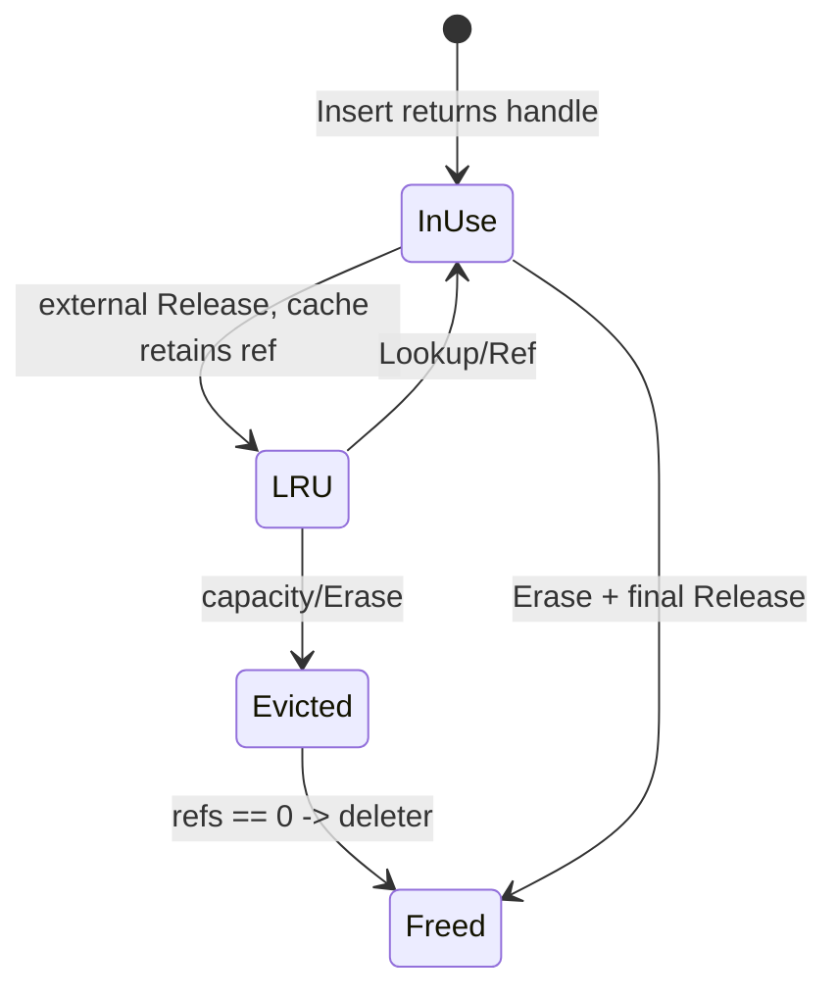
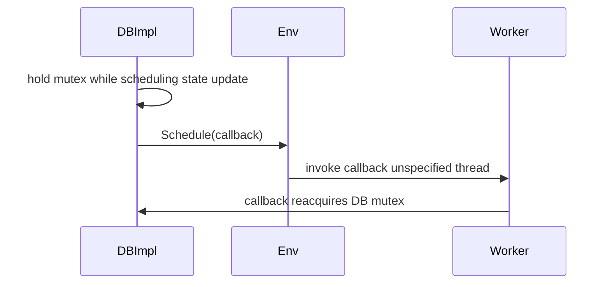

# M06 图示

- 文档目的：展示 Env 分层、资源限额和 Cache 引用状态。
- 适用范围：M06。
- 源码版本：`main` / `7ee830d`。
- 证据状态：图示根据源码和公共契约整理。
- 最后更新：2026-09-10
- 前置阅读：[call-chains](call-chains.md)
- 后续阅读：[testing](testing.md)

## Env 分层

## 随机文件资源降级

## Cache 引用状态

`LRUCache` 明确维护 in-use 与 LRU 两条链，避免活跃客户端持有的对象被提前释放。[util/cache.cc:21-38](../../../source/leveldb/util/cache.cc#L21-L38)

## 锁边界

Env 不替 DBImpl 管理共享状态；任务并发约束必须由调用方承担。
