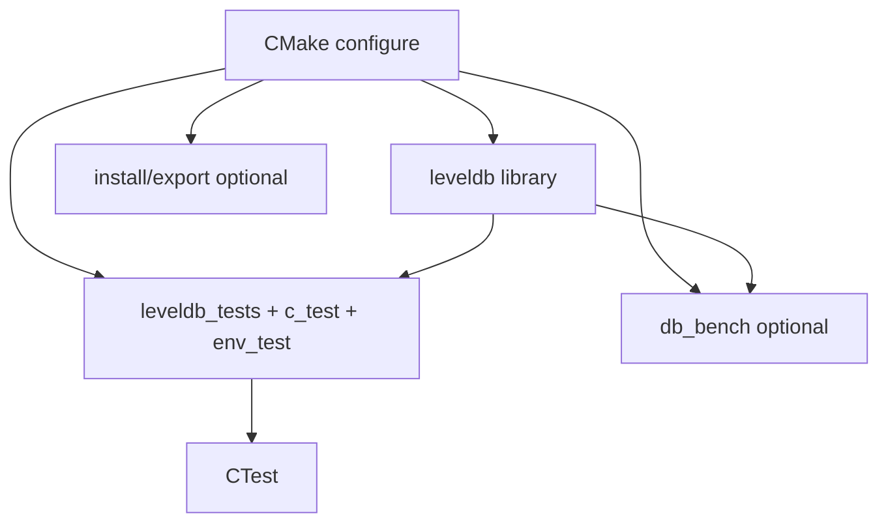
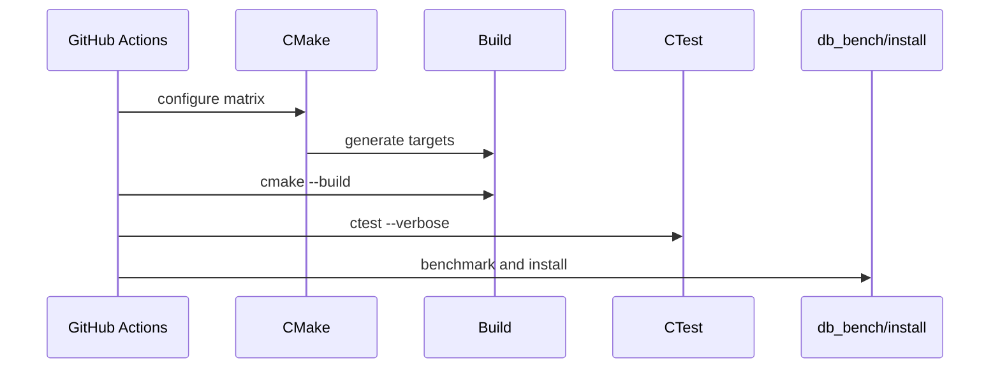
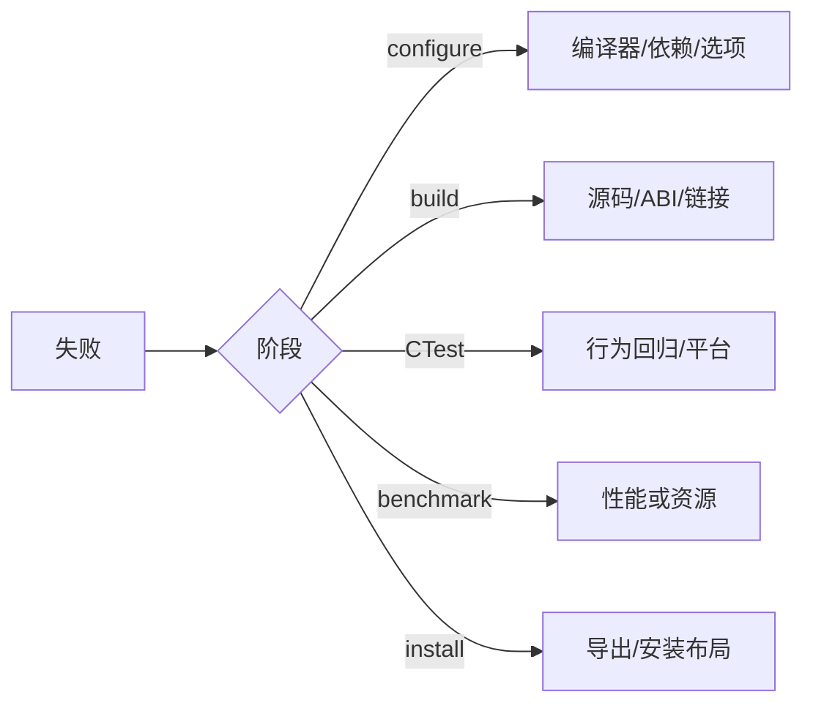

# M07 图示

- 文档目的：展示构建目标、测试和 CI 的关系。
- 适用范围：M07。
- 源码版本：`main` / `7ee830d`。
- 证据状态：图示根据 CMake/CI 整理。
- 最后更新：2026-09-10
- 前置阅读：[M07 call-chains](call-chains.md)
- 后续阅读：[M07 testing](testing.md)

## 目标图

## CI 时序

## 失败定位

