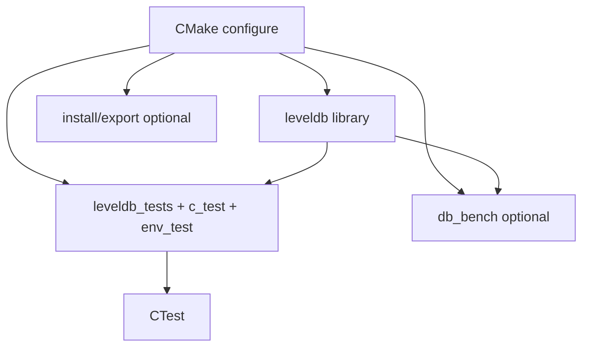
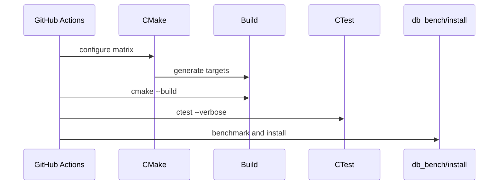
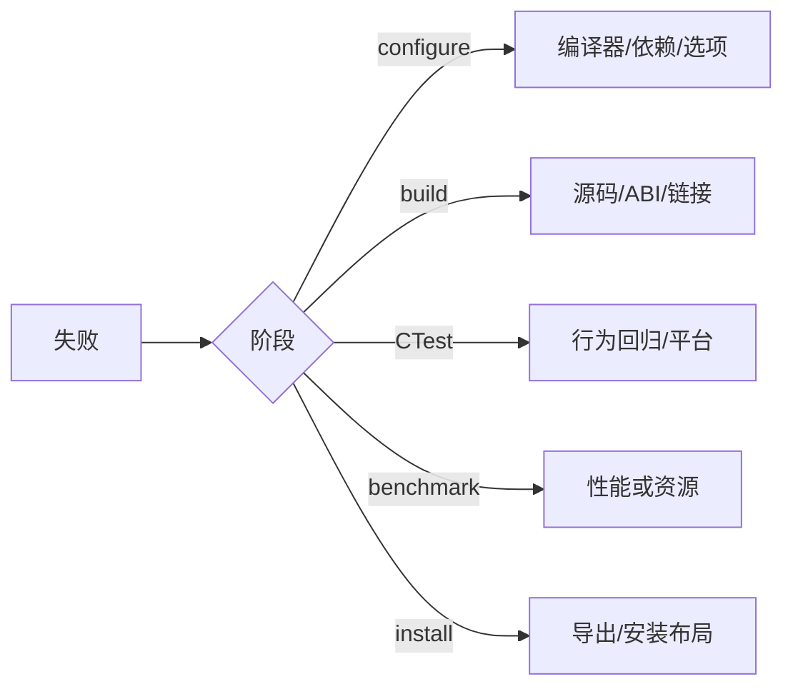

# M07 图示

- 文档目的：展示构建目标、测试和 CI 的关系。
- 适用范围：M07。
- 对应源码版本：source/leveldb HEAD 7ee830d（2026-09-15 只读确认）。
- 证据状态：图示根据 CMake/CI 整理。
- 最后更新：2026-09-10
- 前置阅读：[M07 call-chains](call-chains.md)
- 后续阅读：[M07 testing](testing.md)
## 结论摘要

本页聚焦 01-modules/M07-tests-build/diagrams.md；具体事实以正文引用的目标源码版本为准，未执行的构建、运行和硬件行为保持未验证。

- 源码版本：`main` / `7ee830d`。

## 目标图

## 相关文档
- [项目入口](../../README.md)
- [分析状态](../../00-overview/analysis-state.md)
- [源码证据索引](../../00-overview/evidence-index.md)

## 源码证据摘要
本页结论所需的源码路径和行号以 [源码证据索引](../../00-overview/evidence-index.md) 及正文引用为准；本页不把未执行的构建、运行或硬件行为写成已验证事实。

## 未解决问题
目标环境、动态构建/运行、硬件和外部依赖行为未在本轮执行；缺少直接证据的结论仍标记为未知或未验证。

## 下一步阅读建议
先阅读 [分析状态](../../00-overview/analysis-state.md)，再沿本页已有链接进入对应模块、Demo 或跨模块流程。

## CI 时序

## 失败定位

