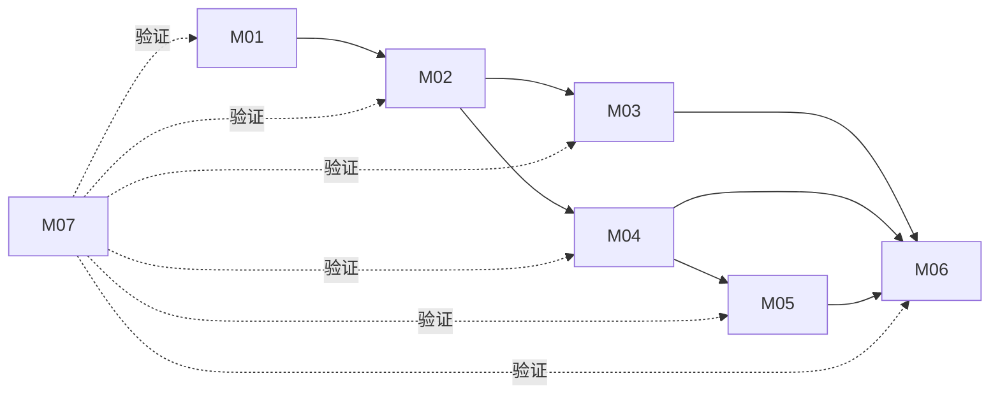

# 模块注册表

- 文档目的：登记稳定模块 ID、职责、边界、入口、依赖和测试。
- 适用范围：目标提交 `7ee830d02b623e8ffe0b95d59a74db1e58da04c5`。
- 证据状态：部分已确认；调用关系以源码和 CMake 为准。
- 最后更新：2026-09-10
- 前置阅读：[项目概览](../00-overview/project-overview.md)
- 后续阅读：各模块 README

## 模块表

| ID | 模块 | 源码范围 | 入口 | 依赖/被依赖 | 测试边界 | 风险 |
|---|---|---|---|---|---|---|
| M01 | 公共 API 与契约 | `include/leveldb/*.h` | `DB::Open`、`DB` 虚接口 | 被 M02、应用、C API 依赖 | `db_test`、`c_test`、各 API 测试 | 高 |
| M02 | DB 生命周期与协调器 | `db/db_impl.*`、`db/c.cc`、恢复/修复辅助 | `DBImpl::Recover/Write/Get` | 依赖 M03–M06；被 M01 依赖 | `db/db_test.cc`、`recovery_test.cc`、`corruption_test.cc` | 高 |
| M03 | WAL、WriteBatch、MemTable | `db/log_*`、`write_batch*`、`memtable*`、`dbformat*` | `log::Writer::AddRecord`、`MemTable::Add/Get` | 依赖 M06；被 M02/M04/M05 依赖 | `log_test`、`write_batch_test`、`skiplist_test` | 高 |
| M04 | Version、Manifest、Compaction | `db/version_set*`、`version_edit*`、`builder*`、`table_cache*` | `VersionSet::Recover/LogAndApply/PickCompaction` | 依赖 M03、M05、M06；被 M02 依赖 | `version_set_test`、`version_edit_test`、`autocompact_test` | 高 |
| M05 | SSTable、Block、迭代器 | `table/*` | `Table::Open`、`TableBuilder::Finish` | 依赖 M01、M06；被 M02/M04 依赖 | `table_test`、`filter_block_test` | 高 |
| M06 | Env、平台和基础设施 | `util/*`、`port/*`、`helpers/memenv/*` | `Env::Default`、`NewMemEnv` | 被 M02–M05、测试依赖 | env/cache/arena/coding 等测试 | 中高 |
| M07 | 构建、测试、基准与回归 | `CMakeLists.txt`、`.github/`、`benchmarks/`、`issues/` | CMake/CTest、`db_bench` | 驱动所有模块验证 | CTest、CI 矩阵、benchmark | 中 |

## 依赖图

实线为代码依赖或控制关系，虚线为构建/测试验证关系。M01 是稳定公共边界；M02–M06 为内部实现；M07 不应被理解成运行时模块。

## 边界规则

- 只把 `include/leveldb` 中标为 `LEVELDB_EXPORT` 或公开接口的内容作为应用契约。
- 任何改变 WAL、InternalKey、Block、Footer、Manifest 编码的修改都跨越 M03/M04/M05，并必须评估旧库兼容。
- `Env` 是平台和测试替身边界，不应在 `db/` 直接散布 POSIX/Windows 系统调用。
- 第三方子模块只登记版本和构建用途，不纳入实现分析。

## 相关文档

- [总体架构](../00-overview/architecture.md)
- [跨模块影响](../90-cross-module/change-impact-map.md)
- [分析状态](../00-overview/analysis-state.md)

## 源码证据摘要

- [CMakeLists.txt:119-231](../../source/leveldb/CMakeLists.txt#L119-L231)
- [db/db_impl.h:28-71](../../source/leveldb/db/db_impl.h#L28-L71)
- [db/version_set.h:166-258](../../source/leveldb/db/version_set.h#L166-L258)

## 未解决问题

目录级依赖图未替代完整 include 图；若进行大规模重构，应重新生成静态依赖分析。

## 下一步阅读建议

按目标阅读 M01→M02，或直接从 M03/M04 进入存储核心。
