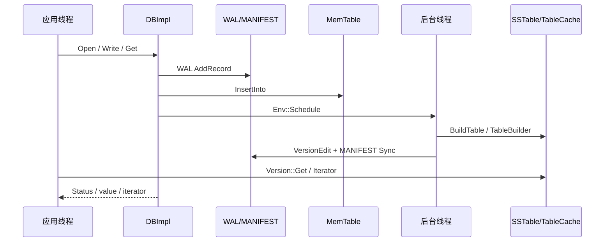

# LevelDB 端到端深度链路

- 文档目的：把公共 API、DBImpl、WAL/MemTable、Version/MANIFEST、SSTable、Env 和后台线程串成可逐阶段审查的完整运行链路。
- 适用范围：正常运行、恢复、读取、迭代器、flush、compaction、关闭与错误处理。
- 源码版本：`main` / `7ee830d02b623e8ffe0b95d59a74db1e58da04c5`。
- 证据状态：函数控制流、主要锁边界、数据结构和资源动作来自源码；线程实际调度时序、磁盘崩溃窗口和性能仍需实验。
- 最后更新：2026-09-10
- 前置阅读：[跨模块端到端流程](end-to-end-flows.md)
- 后续阅读：[共享数据与类型](shared-data-and-types.md)

## 如何阅读本页

每条链都按同一顺序展开：触发条件 → 调用阶段 → 锁与线程 → 数据表示 → 所有权 → Status/持久化副作用 → 最小例子。代码中的“解锁”不是省略细节：LevelDB 有意在文件 IO、日志 IO 和长时间 compaction 时释放 `DBImpl::mutex_`，因此必须同时观察引用计数、状态标志和文件编号，不能只看函数名串联。

贯穿示例使用同一个数据库 `demo` 和 key `k`：先写 `v1`，取得 Snapshot `S1`，再写 `v2`、删除 `k`，触发 MemTable 切换和 compaction，最后关闭、重开并读取。该示例是源码驱动的概念场景，未在本机执行。



---

## 链 1：首次打开与创建数据库

### 1.1 触发与入口

应用调用 `leveldb::DB::Open(const Options&, const std::string&, DB**)`。该函数先把输出指针置空，再用 `new DBImpl(options, dbname)` 建立协调器；构造函数会保存 Env、规范化 comparator/filter/options，创建 `TableCache`、`VersionSet`、临时 `WriteBatch`，但此时 `mem_`、日志和数据库锁仍未就绪。[`DB::Open`](../../source/leveldb/db/db_impl.cc#L1503-L1544)、[`DBImpl::DBImpl`](../../source/leveldb/db/db_impl.cc#L126-L150)

`DB::Open` 随后显式取得 `impl->mutex_`，把创建、恢复、初始日志和版本安装放进同一套状态转换中。`DBImpl` 的构造成功不等于数据库已经打开：只有 `Recover` 和必要的 `LogAndApply` 成功，函数才把 `impl` 写回 `*dbptr`。[`DB::Open`](../../source/leveldb/db/db_impl.cc#L1503-L1543)

### 1.2 阶段表

| 阶段 | 代码动作 | 锁/线程 | 关键状态与副作用 |
|---|---|---|---|
| A | 构造 `DBImpl` | Open 调用线程持有前后边界；构造本身未取得 DB 锁 | `VersionSet` 先有空的 dummy/current Version；创建 TableCache |
| B | `Recover` 创建目录并 `LockFile` | `mutex_` 已持有 | `db_lock_` 成为 DBImpl 所有的锁句柄；失败直接返回 |
| C | 检查 `CURRENT` | `mutex_` 已持有 | 不存在且 `create_if_missing=false` 返回 `InvalidArgument` |
| D | `NewDB` 创建 MANIFEST | `mutex_` 已持有；文件写入在当前线程 | 写入初始 `VersionEdit`，Sync/Close MANIFEST，再写 `CURRENT` |
| E | 创建新的 WAL 和 MemTable | `mutex_` 已持有 | 分配 file number；`logfile_`、`log_`、`mem_` 建立，`mem_->Ref()` |
| F | 若需保存恢复结果，`LogAndApply` | 函数内部暂时释放 `mutex_` 写 MANIFEST | 成功后 AppendVersion；失败销毁临时版本/manifest |
| G | 清理与调度 | `mutex_` 仍持有 | `RemoveObsoleteFiles`，`MaybeScheduleCompaction`；返回 DB 指针 |

### 1.3 `Recover` 的创建分支

`Recover` 首先忽略 `CreateDir` 的“目录已存在”错误，因为真正的创建提交点是 descriptor/MANIFEST；然后锁定 `LOCK` 文件。没有 `CURRENT` 时，如果 `create_if_missing` 为真，调用 `NewDB`；若为假，返回“does not exist”。已有 `CURRENT` 且 `error_if_exists` 为真则返回错误。[`DBImpl::Recover`](../../source/leveldb/db/db_impl.cc#L292-L324)

`NewDB` 构造初始 `VersionEdit`：写 comparator name、log number 0、next file number 2、last sequence 0。它把 edit 编码为 MANIFEST 的 log record，成功后 `file->Sync()`、`file->Close()`，最后调用 `SetCurrentFile` 让 `CURRENT` 指向 MANIFEST #1；任一写失败会删除临时 manifest。[`DBImpl::NewDB`](../../source/leveldb/db/db_impl.cc#L181-L213)

这里有一个重要的提交语义：目录创建本身不代表数据库创建完成，初始 descriptor 写成功并被 `CURRENT` 指向后才有可恢复的版本元数据。`DB::Open` 随后发现 `impl->mem_ == nullptr`，再分配新 WAL，设置 edit 的 log number，并创建带引用的 MemTable。[`DB::Open`](../../source/leveldb/db/db_impl.cc#L1511-L1525)

### 1.4 所有权和错误出口

- `DBImpl` 由 `DB::Open` 的成功调用方最终 `delete`；Open 失败时 `DB::Open` 自己 `delete impl`。[`DB::Open`](../../source/leveldb/db/db_impl.cc#L1536-L1543)
- `DBImpl` 析构负责解锁 `db_lock_`、删除 VersionSet、对 `mem_`/`imm_` 做 `Unref`、删除日志和 TableCache；因此 Open 失败路径也必须让字段处于可析构状态。[`DBImpl::~DBImpl`](../../source/leveldb/db/db_impl.cc#L152-L178)
- WAL、MANIFEST、CURRENT 的错误以 `Status` 向上返回；Open 失败不会返回半初始化 `DB*`。
- 首次 Open 的后台调度不是必然发生：只有 immutable MemTable、manual compaction 或 `VersionSet::NeedsCompaction()` 为真时才调用 Env 的 `Schedule`。[`DBImpl::MaybeScheduleCompaction`](../../source/leveldb/db/db_impl.cc#L668-L682)

### 1.5 最小例子与预期

```cpp
leveldb::Options options;
options.create_if_missing = true;
leveldb::DB* db = nullptr;
leveldb::Status s = leveldb::DB::Open(options, "demo", &db);
if (s.ok()) {
  // 此时 db、当前 WAL、MemTable 和 CURRENT/MANIFEST 已建立。
  delete db;
}
```

未验证的观察清单：目录出现 `LOCK`、`CURRENT`、MANIFEST 和 log 文件；`Status` 为 OK；失败时 `db == nullptr`。不要把目录中残留文件直接当作成功创建，应检查 `CURRENT` 和 Open 返回值。

---

## 链 2：已有数据库重开与崩溃恢复

### 2.1 恢复入口和版本恢复

已有数据库的 `Recover` 仍先加锁，再调用 `versions_->Recover(save_manifest)`。`VersionSet::Recover` 读取 `CURRENT`，要求文件非空且以换行结束；去掉换行后把内容解释为 MANIFEST 文件名，并通过 `NewSequentialFile` 打开。不存在的目标被转换为 `Corruption("CURRENT points to a non-existent file")`。[`VersionSet::Recover`](../../source/leveldb/db/version_set.cc#L861-L888)

MANIFEST 本身是 log reader 输入。每条记录被解码为 `VersionEdit`，比较器名称必须与当前 comparator 相同；edit 应用到 `VersionSet::Builder`。Builder 不逐次构造完整 Version，而是收集 deleted files 和 added files，最后一次 `SaveTo` 合并 base Version，且 Debug 构建会检查 level>0 不重叠。[`VersionSet::Recover`](../../source/leveldb/db/version_set.cc#L899-L945)、[`VersionSet::Builder::Apply/SaveTo`](../../source/leveldb/db/version_set.cc#L628-L715)

恢复至少必须找到 next-file、log-number 和 last-sequence 元数据；缺少这些字段返回 corruption。成功后创建并安装 recovered Version，恢复 file number、last sequence、当前 log/prev log，并尝试复用未过大的 MANIFEST；不能复用时设置 `save_manifest=true`，让上层写新的 descriptor。[`VersionSet::Recover`](../../source/leveldb/db/version_set.cc#L950-L991)

### 2.2 WAL 扫描和重放

版本元数据恢复后，`DBImpl::Recover` 枚举数据库目录，收集 file number，建立 `expected` live file 集合；只把 log number 大于等于 descriptor 中 log number、或旧格式 `prev_log` 的日志加入待恢复列表，然后排序后依次调用 `RecoverLogFile`。缺少 Version 声明的文件会导致 corruption。[`DBImpl::Recover`](../../source/leveldb/db/db_impl.cc#L324-L375)

`RecoverLogFile` 为每个 WAL 建立 `SequentialFile` 与 `log::Reader`。Reader 始终做 checksum，即使 `paranoid_checks=false`，因为坏记录应被丢弃而不是把异常 sequence 注入数据库；Reporter 在 paranoid 模式保存第一个 corruption Status，否则只记录日志。每一条完整 record 被置入 `WriteBatch`，然后 `WriteBatchInternal::InsertInto(&batch, mem)` 重放到临时 MemTable，并更新 `max_sequence`。[`DBImpl::RecoverLogFile`](../../source/leveldb/db/db_impl.cc#L385-L452)

临时 MemTable 超过 `write_buffer_size` 时，恢复线程立即调用 `WriteLevel0Table` 生成 SSTable，并设置 `save_manifest`；这不是后台延迟 flush，因为 Open 必须在返回前让恢复数据可见。若是最后一个 log、没有产生 compaction 且 `reuse_logs` 开启，函数可以重新打开该日志为 appendable，并把临时 MemTable 接回 `mem_`；否则剩余 mem 也要写成 Level-0 表。[`DBImpl::RecoverLogFile`](../../source/leveldb/db/db_impl.cc#L455-L502)

### 2.3 恢复状态机

```text
CURRENT
  └─> MANIFEST records
       └─> Builder(base Version + VersionEdits)
            └─> current Version + log/sequence/file counters
                 └─> directory scan
                      └─> newer WALs sorted by number
                           └─> Reader reassembles WriteBatch
                                └─> MemTable::Add
                                     ├─> reuse last WAL + mem_
                                     └─> BuildTable + VersionEdit
```

这里的 sequence 有两个来源：MANIFEST 记载的 `last_sequence`，以及 WAL 重放中各 WriteBatch 的末尾 sequence。`Recover` 取二者最大值，避免 descriptor 在分配新日志后尚未写入最新 sequence 时倒退。[`DBImpl::Recover`](../../source/leveldb/db/db_impl.cc#L363-L382)

### 2.4 截断、损坏和所有权

- 合法尾部截断与中间损坏的具体判定由 `log::Reader::ReadRecord`/Reporter 决定；本链只确认 `RecoverLogFile` 会读取完整 record、记录 corruption，并按 `paranoid_checks` 决定是否返回错误。[`DBImpl::RecoverLogFile`](../../source/leveldb/db/db_impl.cc#L388-L422)
- `SequentialFile* file` 是恢复函数通过 Env 得到的裸指针，函数在读取结束后 `delete file`；临时 MemTable 若未复用则 `Unref`。[`DBImpl::RecoverLogFile`](../../source/leveldb/db/db_impl.cc#L467-L502)
- 由恢复产生的 SSTable 在 `WriteLevel0Table` 中先加入 `pending_outputs_`，BuildTable 完成后从集合移除，再加入待安装的 `VersionEdit`。[`DBImpl::WriteLevel0Table`](../../source/leveldb/db/db_impl.cc#L505-L546)
- MANIFEST 恢复失败不会继续扫描 WAL 并伪造版本；Open 直接返回错误。

### 2.5 可复现概念例子

1. Open `demo`，`Put(k, v1)`，关闭；
2. 再 Open，先恢复 CURRENT/MANIFEST，通常没有需要重放的已注册 WAL；
3. 在 WAL 有记录但尚未进入 MANIFEST 的窗口结束进程，再 Open；目录扫描会把较新的 log 纳入 `logs`，Reader 重放 `k -> v1`；
4. 用大 value 让一条 WAL record 跨物理块，验证 Reader 必须把 FIRST/MIDDLE/LAST 片段组装后才调用 WriteBatch；
5. 修改/截断 MANIFEST 或 CURRENT，仅检查 Open 返回的 `Status`，不要在损坏文件上继续写入。

上述故障窗口和命令未验证；源码验证点是 `Recover` 的 log 筛选、`RecoverLogFile` 的重放和 `VersionSet::Recover` 的元数据完整性检查。

---

## 链 3：并发批量写入、限流与日志先行

### 3.1 API 包装到 writer queue

`DB::Put` 和 `DB::Delete` 只是创建临时 `WriteBatch`，再调用虚拟 `Write`；多个操作的原子批次直接传入 `DBImpl::Write`。[`DB::Put/Delete`](../../source/leveldb/db/db_impl.cc#L1487-L1499)

`DBImpl::Write` 在栈上创建 `Writer w`，保存调用者的 `WriteBatch*` 和 `sync` 标志，取得 `mutex_` 后把 `&w` 放入 `writers_`。非队首 writer 在条件变量上等待；被前一批处理后设置 `done` 并收到自己的 Status。队首 writer 才能推进 sequence、写日志和更新 `mem_`。[`DBImpl::Write`](../../source/leveldb/db/db_impl.cc#L1206-L1223)

### 3.2 批处理和 sync 边界

`BuildBatchGroup` 从队首 batch 开始，最大通常为 1 MiB；若首批不大，允许的增长是首批大小加 128 KiB，以免小写入被大批次拖慢。后续 writer 若要求 `sync` 而队首不要求，则停止合并；这保证同步写不会被一个非同步队首批次“代办”。合并多个 batch 时使用 `tmp_batch_`，不修改调用者持有的首个 batch。[`DBImpl::BuildBatchGroup`](../../source/leveldb/db/db_impl.cc#L1279-L1327)

### 3.3 `MakeRoomForWrite` 的分支

队首 writer 调用 `MakeRoomForWrite(updates == nullptr)`。循环依次处理：

1. `bg_error_` 非 OK：立即返回已保存错误；
2. Level-0 文件达到 slowdown 阈值：释放锁，睡眠 1ms 一次，再继续；
3. 当前 MemTable 内存不超过 `write_buffer_size`：直接获得空间；
4. `imm_ != nullptr`：旧 MemTable 尚在 flush，持锁等待 `background_work_finished_signal_`；
5. L0 达到 stop 阈值：等待后台压缩；
6. 否则创建新 WAL，关闭旧 log，把旧 `mem_` 移到 `imm_`，创建新 `mem_`，发布 `has_imm_` 并调度后台工作。[`DBImpl::MakeRoomForWrite`](../../source/leveldb/db/db_impl.cc#L1331-L1405)

`force=true` 用于 `TEST_CompactMemTable` 的空 batch：它不写用户数据，但可迫使 MemTable 切换/等待前序写入完成。普通写入允许一次 slowdown 延迟；这不是固定的端到端延迟保证。[`DBImpl::TEST_CompactMemTable`](../../source/leveldb/db/db_impl.cc#L643-L657)、[`DBImpl::MakeRoomForWrite`](../../source/leveldb/db/db_impl.cc#L1331-L1352)

### 3.4 先 WAL、后 MemTable

队首 writer 分配批次 sequence，从 `versions_->LastSequence()+1` 开始，按 batch count 增长 last sequence。随后释放 `mutex_`，调用 `log_->AddRecord(Contents)`；若 `options.sync` 为真，再调用 `logfile_->Sync()`；只有上述 Status 仍为 OK 才调用 `WriteBatchInternal::InsertInto(write_batch, mem_)`。之后重新持锁，更新 VersionSet 的 last sequence，并依次弹出本次处理的 writer、设置状态和唤醒队列头。[`DBImpl::Write`](../../source/leveldb/db/db_impl.cc#L1221-L1276)

这段解锁是安全边界而非竞态漏洞的自动证明：队首 `Writer` 在 queue 中负责日志，其他 writer 不能越过它；注释明确依赖该队列和对 `mem_` 的并发保护。修改此处必须同时审查队列、WAL writer 和 MemTable 插入的互斥关系。

### 3.5 Sync 错误的特殊语义

若 WAL `Sync` 失败，日志记录是否会在重开时出现是不确定的。代码设置 `sync_error=true`，重新取得锁后调用 `RecordBackgroundError(status)`；该错误会阻止后续写入，而不是假装当前状态可继续接受新写入。[`DBImpl::Write`](../../source/leveldb/db/db_impl.cc#L1235-L1257)、[`DBImpl::RecordBackgroundError`](../../source/leveldb/db/db_impl.cc#L660-L666)

注意：`AddRecord` 失败时不会插入 MemTable；`Sync` 失败时也不会插入当前 batch，但 `bg_error_` 会使未来写失败。写入方必须检查返回的 `Status`，不能只依赖之后的 Get 结果。

### 3.6 并发示例

两个线程同时执行：

```text
T1 Write(sync=false, [Put(k,v1), Put(a,x)])
T2 Write(sync=true,  [Put(k,v2)])
```

可能的源码级结果：T1 先入队并成为队首；T2 等待。T1 的 batch 与后续非 sync writer 可合并，但因为 T2 是 sync writer，`BuildBatchGroup` 不会把 T2 合并进一个非 sync 首批。T1 完成后唤醒 T2，T2 分配后续 sequence、写 WAL、Sync、插入 MemTable。具体线程何时到达队列和后台线程何时运行未由 `Env::Schedule` 顺序保证。

---

## 链 4：单键读取，从快照序号到 Table block

### 4.1 读取入口和引用保护

`DBImpl::Get` 先持有 `mutex_`，从 `ReadOptions::snapshot` 取 SnapshotImpl 的 sequence；没有 snapshot 时使用 `versions_->LastSequence()`。然后抓取 `mem_`、`imm_`、current Version 指针并分别 `Ref`，这样接下来释放锁进行文件/内存读取时，这些对象不会被切换或销毁。[`DBImpl::Get`](../../source/leveldb/db/db_impl.cc#L1121-L1141)

函数释放 `mutex_`，用 `(user key, snapshot sequence)` 构造 `LookupKey`。先查当前 MemTable，再查 immutable MemTable；两者都没有结果才调用 `current->Get`。读完重新加锁，必要时根据 `GetStats` 更新 seek 计数并调度 seek compaction，最后对三类引用 `Unref`。[`DBImpl::Get`](../../source/leveldb/db/db_impl.cc#L1143-L1165)

### 4.2 MemTable 分支

MemTable 的入口把 LookupKey 的 memtable key 交给 SkipList 查找。InternalKey 的排序使同一 user key 的较新 sequence 排在前面；找到 value 返回字符串，找到 deletion 返回 NotFound/删除语义，未找到才让 DBImpl 继续下一个层次。此处的 `Slice` 和 entry 只在被 Ref 的 MemTable 存活期间有效。

### 4.3 Version overlap 顺序

`Version::Get` 设置 `State`，其中 `ikey` 是 LookupKey 的 internal key，`saver` 保存目标 user key 和输出字符串。`ForEachOverlapping` 先按 Level-0 的文件顺序，再从 level 1 向上用二分找到可能覆盖的文件；每个候选调用 `TableCache::Get`。Table 返回 NotFound 时继续，找到 value/deletion 时停止，底层错误或坏 internal key 则停止并返回错误。[`Version::Get`](../../source/leveldb/db/version_set.cc#L324-L400)、[`Version::ForEachOverlapping`](../../source/leveldb/db/version_set.cc#L260-L322)

Level-0 文件可能互相重叠，所以读取可能访问多个文件；level>0 文件按 key range 不重叠，最多选择对应候选。多次 seek 会记录第一个文件，`UpdateStats` 递减 `allowed_seeks`，耗尽后把文件标记为 seek compaction 候选。[`Version::UpdateStats`](../../source/leveldb/db/version_set.cc#L402-L413)

### 4.4 TableCache、过滤器和 block

`TableCache::FindTable` 用 file number 编码成 cache key。cache miss 时通过 Env 打开 `.ldb`（失败再尝试旧 `.sst` 名称），调用 `Table::Open` 读取 footer、index 和可选 filter 元数据；成功后将同时拥有 `RandomAccessFile*` 与 `Table*` 的 `TableAndFile` 插入 cache。打开失败不缓存错误，使暂时 IO 失败或修复后的文件可重试。[`TableCache::FindTable`](../../source/leveldb/db/table_cache.cc#L40-L75)

`TableCache::Get` 在 cache handle 有效期间调用 `Table::InternalGet`，然后显式 `cache_->Release(handle)`。Table 内部通常按 index iterator 定位 data block，先用 filter 判断“可能不存在”时跳过，再通过 `ReadBlock` 读取、校验/解压 block，最后在 data iterator 上 Seek 并调用 `handle_result`。过滤器异常必须按可能命中处理，不能造成 false negative。[`TableCache::Get`](../../source/leveldb/db/table_cache.cc#L99-L111)、[`Table::InternalGet`](../../source/leveldb/table/table.cc#L152-L240)

### 4.5 读取例子：Snapshot 不会被新写入改变

```text
seq=1: Put(k,v1)
S1 = GetSnapshot()        // S1.sequence = 1
seq=2: Put(k,v2)
Get(k, snapshot=S1)       // LookupKey(k,1) -> v1
Get(k, no snapshot)        // latest sequence 2 -> v2
```

Snapshot 只是 DB 管理的不可变序号句柄，不复制 value；调用方用完必须 `ReleaseSnapshot`。若 Get 命中 mem_，不会触及 TableCache；若 mem_/imm_ 都 miss，才进入 Version/TableCache。该顺序解释了为什么“已经 flush 到 SSTable”不改变 snapshot 的可见结果：InternalKey sequence 过滤仍在读取和 compaction 规则中生效。

---

## 链 5：Iterator 与快照的长生命周期读取

### 5.1 构造 child iterators

`DBImpl::NewIterator` 调用 `NewInternalIterator`。后者在锁下捕获 latest sequence，创建 `mem_->NewIterator()`，若存在则创建 `imm_` iterator，再让 current Version 添加各层表 iterator；随后用 InternalKey comparator 创建 merging iterator。它对 mem、imm、current Version 各加一个引用，并把 `CleanupIteratorState` 注册到 internal iterator。[`DBImpl::NewInternalIterator`](../../source/leveldb/db/db_impl.cc#L1083-L1107)

Version 的表 iterator 通过 TableCache 持有 cache handle；TableCache 在 child iterator 的 cleanup 中 Release handle。最外层 `NewDBIterator` 再以 user comparator、snapshot/latest sequence 和随机 seed 包装 internal iterator，把内部键折叠成用户可见迭代。[`DBImpl::NewIterator`](../../source/leveldb/db/db_impl.cc#L1168-L1177)

### 5.2 迭代时发生什么

内部 merging iterator 按 InternalKey 顺序合并 MemTable、immutable MemTable 和各层表；DB iterator 对同一 user key 的多个 InternalKey 应用 snapshot sequence 和删除/覆盖规则，向调用者暴露 user key/value。子 iterator 返回的 `Slice` 可能指向 block cache、MemTable Arena 或 iterator 自有临时存储，只能在下一次移动/释放规则允许的范围内使用。

### 5.3 cleanup 和析构

当调用者 `delete Iterator` 或迭代器自身触发 cleanup，`CleanupIteratorState` 重新取得 DB mutex，对构造时捕获的 `mem`、`imm`、Version 做 `Unref`，释放 `IterState`。这说明 Iterator 可以在 DB 后续发生 MemTable 切换或 Version 安装后继续读取已捕获视图；同时也说明 DB 析构前必须确保调用方先释放 iterator，否则 iterator cleanup 可能持有已销毁的 DB mutex/DB 状态。[`CleanupIteratorState`](../../source/leveldb/db/db_impl.cc#L1059-L1079)

### 5.4 快照和 Iterator 的组合示例

```cpp
const leveldb::Snapshot* s1 = db->GetSnapshot();
// 写入新版本；s1 的 sequence 不变
leveldb::ReadOptions ro;
ro.snapshot = s1;
leveldb::Iterator* it = db->NewIterator(ro);
for (it->SeekToFirst(); it->Valid(); it->Next()) {
  // 使用 it->key()/value()，不要把 Slice 当 owning string 保存。
}
leveldb::Status iter_status = it->status();
delete it;
db->ReleaseSnapshot(s1);
```

顺序要求是：先释放 Iterator，再释放 Snapshot，再 delete DB。源码能确认 DB 的 Snapshot 删除由 `snapshots_.Delete` 完成，Iterator 的对象引用由 cleanup 完成；应用必须遵守公共头文件的生命周期契约。[`DBImpl::GetSnapshot/ReleaseSnapshot`](../../source/leveldb/db/db_impl.cc#L1187-L1195)、[`DB::NewIterator`](../../source/leveldb/include/leveldb/db.h#L83-L95)

---

## 链 6：MemTable 切换、immutable flush 与 Level-0 安装

### 6.1 从写满到切换

当当前 MemTable 超过内存阈值且没有已有 `imm_`，`MakeRoomForWrite` 先申请新的 log file number 和 WritableFile；关闭/删除旧 `log_` 与 `logfile_`，把新文件安装到 `logfile_`/`log_`，将 `mem_` 指针移动到 `imm_`，以 release 顺序发布 `has_imm_=true`，创建并 Ref 新 MemTable，然后调用 `MaybeScheduleCompaction`。[`DBImpl::MakeRoomForWrite`](../../source/leveldb/db/db_impl.cc#L1367-L1402)

如果创建新 WAL 失败，会复用 file number 并返回错误；旧日志 close 失败则仍切换到新日志，但记录 `bg_error_`，因为旧日志中数据状态已经不确定。写入线程之后会看到 background error，避免继续扩大不可恢复状态。[`DBImpl::MakeRoomForWrite`](../../source/leveldb/db/db_impl.cc#L1367-L1395)

### 6.2 调度不是同步调用链

`MaybeScheduleCompaction` 只设置 `background_compaction_scheduled_` 并调用 `env_->Schedule(&DBImpl::BGWork, this)`；它没有直接调用 `BackgroundCall`。后台何时运行取决于 Env；DBImpl 自己用 scheduled 标志避免重复排队，用条件变量让写线程等待 imm 完成。[`DBImpl::MaybeScheduleCompaction`](../../source/leveldb/db/db_impl.cc#L668-L687)

`BackgroundCall` 在锁下检查 shutdown 和 `bg_error_`，正常时调用 `BackgroundCompaction`。完成后清除 scheduled 标志，若新状态仍需要工作则再次调度，并广播 `background_work_finished_signal_`。[`DBImpl::BackgroundCall`](../../source/leveldb/db/db_impl.cc#L689-L706)

### 6.3 `CompactMemTable` 到 SSTable

后台若发现 `imm_ != nullptr`，优先调用 `CompactMemTable`。它 Ref 当前 Version 作为 base，调用 `WriteLevel0Table(imm_, &edit, base)`；后者分配表 file number，将其放入 `pending_outputs_`，取得 MemTable iterator，释放 mutex 后调用 `BuildTable`，完成后重新加锁、删除 iterator、移除 pending 标记，并把文件 metadata 加到 edit。[`DBImpl::CompactMemTable`](../../source/leveldb/db/db_impl.cc#L549-L580)、[`DBImpl::WriteLevel0Table`](../../source/leveldb/db/db_impl.cc#L505-L546)

`CompactMemTable` 成功生成表后为 edit 设置 prev/log number，调用 `versions_->LogAndApply(&edit, &mutex_)`。LogAndApply 在写 MANIFEST record 和 Sync 期间解锁 DB mutex；成功后才 AppendVersion。最后 `imm_->Unref()`、清空 `imm_`、release `has_imm_`，再调用 `RemoveObsoleteFiles`。[`DBImpl::CompactMemTable`](../../source/leveldb/db/db_impl.cc#L564-L580)、[`VersionSet::LogAndApply`](../../source/leveldb/db/version_set.cc#L777-L858)

### 6.4 文件和资源时间线

```text
旧 mem_ + 旧 WAL
  ├─ 写满
  ├─ imm_ = 旧 mem_（仍有 Ref）
  ├─ mem_ = 新 MemTable（新 Ref）
  ├─ pending_outputs_ += table number
  ├─ BuildTable（锁外）
  ├─ pending_outputs_ -= table number
  ├─ VersionEdit -> MANIFEST AddRecord -> Sync
  ├─ AppendVersion（新表成为可见文件）
  ├─ imm_->Unref()
  └─ live-file 扫描/删除 obsolete
```

在 VersionEdit 安装前新 SSTable 不能被 obsolete 清理删除，所以 `pending_outputs_` 与 `VersionSet::AddLiveFiles` 一起构成保护集合。`RemoveObsoleteFiles` 在后台错误非 OK 时直接返回，因为此时无法安全判断某次版本安装是否已经发生。[`DBImpl::RemoveObsoleteFiles`](../../source/leveldb/db/db_impl.cc#L225-L290)

### 6.5 可观察例子

将 `write_buffer_size` 设小，连续写入不同 key，然后使用现有 `TEST_CompactMemTable`/fixture 等待 `imm_` 为空；检查 `GetProperty("leveldb.num-files-at-level0")`、读取值和目录表文件。不要使用固定 sleep 作为唯一成功条件；源码已有条件变量等待路径。[`DBImpl::TEST_CompactMemTable`](../../source/leveldb/db/db_impl.cc#L643-L657)、[`DBImpl::GetProperty`](../../source/leveldb/db/db_impl.cc#L1407-L1467)

---

## 链 7：分层 compaction、版本裁剪与输出安装

### 7.1 触发和选择

后台没有 imm 时，自动 compaction 调用 `VersionSet::PickCompaction`；size score 优先于 seek compaction。size compaction 根据 current Version 预计算的 score 选 level，并从 compact pointer 后选择文件；seek compaction 使用 `file_to_compact_`。[`DBImpl::BackgroundCompaction`](../../source/leveldb/db/db_impl.cc#L716-L733)、[`VersionSet::PickCompaction`](../../source/leveldb/db/version_set.cc#L1252-L1288)

Level-0 文件允许重叠，选择一个文件后会计算范围，再用 `GetOverlappingInputs` 扩大为所有重叠 L0 文件；随后 `SetupOtherInputs` 加入 level+1 重叠文件、boundary files，并计算 grandparents。boundary file 不能随意漏掉：同一 user key 的 InternalKey 若跨两个文件，漏掉后续文件会让按 level 搜索的读取得到错误版本。[`VersionSet::PickCompaction`](../../source/leveldb/db/version_set.cc#L1287-L1303)、[`VersionSet::SetupOtherInputs`](../../source/leveldb/db/version_set.cc#L1385-L1446)

`SetupOtherInputs` 还可能在不增加 level+1 文件的前提下扩大 level 输入，避免不必要的输出边界；grandparent overlap 用于控制输出文件切分和写放大。它立即更新 compact pointer，即便本次 compaction 失败，下次也尝试另一个 key range。[`VersionSet::SetupOtherInputs`](../../source/leveldb/db/version_set.cc#L1400-L1446)

### 7.2 输入迭代器与锁

`MakeInputIterator` 对 L0 的多个文件建立多个 TableCache iterator，并对非 L0 文件使用按 file number 拼接的 two-level iterator，最后用 InternalKey comparator 创建 merging iterator；compaction 设置 `verify_checksums` 取决于 paranoid_checks，并关闭 cache fill。[`VersionSet::MakeInputIterator`](../../source/leveldb/db/version_set.cc#L1219-L1249)

`DoCompactionWork` 计算 `smallest_snapshot`：没有活动 Snapshot 时为 last sequence，有 Snapshot 时为最老 Snapshot sequence；创建输入 iterator 后释放 DB mutex，在长循环中读取、解析和写 SSTable。若期间有 immutable MemTable，循环会短暂重新取得锁优先 flush imm，随后继续 compaction。[`DBImpl::DoCompactionWork`](../../source/leveldb/db/db_impl.cc#L898-L939)

### 7.3 每个 InternalKey 的保留规则

对同一 user key，输入按 InternalKey 顺序出现。若前一个更高 sequence 的条目已经对最老 snapshot 可见，后续更旧条目被 `drop`；如果是 deletion 且 sequence 不高于最老 snapshot，并且该 key 已到 base level、上层没有数据，则删除标记本身也可以丢弃。否则把 key/value 写入输出 TableBuilder。[`DBImpl::DoCompactionWork`](../../source/leveldb/db/db_impl.cc#L941-L1019)

这条规则解释了三个常见现象：

- 活动 Snapshot 会延长旧 value 和 deletion 的保留时间；
- 没有 Snapshot 时，覆盖版本可更积极地裁剪；
- deletion 只有在确认更低层不会有旧值、且更高层无数据时才能删除，不能以“当前 Get 看不到”为理由直接删除。

### 7.4 输出文件完成、验证和安装

输出达到 `MaxOutputFileSize` 或遇到 grandparent boundary 时，`FinishCompactionOutputFile` 检查输入 iterator Status，调用 `TableBuilder::Finish` 或 `Abandon`，记录文件大小，Sync/Close WritableFile，并用 TableCache 新建 iterator 验证刚生成的表可读。[`DBImpl::FinishCompactionOutputFile`](../../source/leveldb/db/db_impl.cc#L831-L877)

输入遍历结束后，`DoCompactionWork` 删除 input iterator、统计读写字节，重新取得 mutex，调用 `InstallCompactionResults`。该函数把所有输入标成 RemoveFile，把输出加入 level+1 的 VersionEdit，然后交给 `VersionSet::LogAndApply`；MANIFEST Sync 成功后新 Version 才可见。[`DBImpl::DoCompactionWork`](../../source/leveldb/db/db_impl.cc#L1022-L1057)、[`DBImpl::InstallCompactionResults`](../../source/leveldb/db/db_impl.cc#L880-L896)

如果 compaction 是 trivial move（单个输入且无需合并），后台不重写数据，只在 VersionEdit 中从当前 level 删除文件、在下一 level 添加同一 file metadata，再 LogAndApply。[`DBImpl::BackgroundCompaction`](../../source/leveldb/db/db_impl.cc#L735-L764)

### 7.5 失败清理

任何输出打开、builder、Sync、Close、验证或 MANIFEST 错误都会形成 Status；后台调用 `RecordBackgroundError`，`CleanupCompaction` 放弃未完成 builder、删除 outfile、移除 pending output，释放 `CompactionState`。成功或失败之后释放 compaction 输入 Version 引用，运行 obsolete 清理；但由于 `bg_error_` 非 OK，清理函数会保守地不删除文件。[`DBImpl::BackgroundCompaction`](../../source/leveldb/db/db_impl.cc#L754-L764)、[`DBImpl::CleanupCompaction`](../../source/leveldb/db/db_impl.cc#L789-L804)

### 7.6 具体版本例子

```text
L0: #10 [k@5, m@5], #11 [j@6, z@6]
L1: #20 [a@2, k@2], #21 [n@3, z@3]
```

对 `#10` 做 L0 compaction 不能只读 #10：#11 与其 range 重叠，且 L1 的 #20/#21 也要按扩展 range 纳入。若 `S1` 的 sequence=5 仍存在，`k@5` 必须保留到输出；若无 Snapshot，且更旧版本在 base-level 条件下不可见，才可丢弃。该表是解释算法的概念输入，不是测试输出。

---

## 链 8：错误、关闭和资源生命周期

### 8.1 错误分层

```text
Env errno / Read / Write / Sync / Close
  -> Env Status
       -> log::Reader / Table / VersionSet parser
            -> DBImpl::Recover immediate return
            -> DBImpl::Write synchronous return 或 bg_error_
            -> 后台 RecordBackgroundError
                 -> 后续 Write 在 MakeRoomForWrite 失败
                 -> RemoveObsoleteFiles 保守停止
```

Open/恢复中的错误通常同步返回，因为数据库尚未交给调用方；Get 的表读取错误从 `TableCache::Get` 经过 `Version::Get` 返回；后台错误则保存第一个 Status，并广播等待者。[`DBImpl::RecordBackgroundError`](../../source/leveldb/db/db_impl.cc#L660-L666)、[`DBImpl::MakeRoomForWrite`](../../source/leveldb/db/db_impl.cc#L1331-L1341)

TableCache 不缓存打开错误；因此单次文件打开失败不会永久污染 cache。相反，MANIFEST Sync 或后台输出状态不确定时，DBImpl 不能继续当作正常状态运行。[`TableCache::FindTable`](../../source/leveldb/db/table_cache.cc#L48-L74)、[`VersionSet::LogAndApply`](../../source/leveldb/db/version_set.cc#L816-L858)

### 8.2 关闭与后台线程

`DBImpl::~DBImpl` 先取得 mutex，release-store `shutting_down_=true`，在 `background_compaction_scheduled_` 为真时等待条件变量；后台 `BackgroundCall` 看到 shutdown 后不再执行新的 compaction，清除 scheduled 标志并广播，析构才能继续。[`DBImpl::~DBImpl`](../../source/leveldb/db/db_impl.cc#L152-L159)、[`DBImpl::BackgroundCall`](../../source/leveldb/db/db_impl.cc#L689-L706)

等待结束后析构释放 DB lock、VersionSet、MemTable/imm、临时 batch、log writer/file、TableCache，以及 DBImpl 所拥有的 info log/cache。调用方仍持有的 Iterator、Snapshot 或 cache handle 是公共生命周期违规，不能期待析构替他们安全修复。[`DBImpl::~DBImpl`](../../source/leveldb/db/db_impl.cc#L161-L178)、[`include/leveldb/db.h`](../../source/leveldb/include/leveldb/db.h#L42-L162)

### 8.3 所有权核对表

| 对象 | 创建/持有者 | 借用者 | 释放规则 |
|---|---|---|---|
| `DBImpl` | `DB::Open`/调用方 | API 调用 | 成功由调用方 `delete`，失败由 Open 删除 |
| `db_lock_` | DBImpl | 无 | 析构 `UnlockFile` |
| `mem_`/`imm_` | DBImpl + 引用计数 | Get/Iterator/flush | `Ref`/`Unref`；iterator cleanup 释放捕获引用 |
| `Version` | VersionSet current/版本链 | Get/Iterator/Compaction | `Ref`/`Unref`，引用为 0 时删除 |
| `TableAndFile` | TableCache entry | Table iterator/Get | cache deleter 删除 Table、file、包装体 |
| Cache Handle | Cache 返回 | Table/iterator | 每个 Lookup/Insert handle 恰好 Release |
| Snapshot | DB SnapshotList | ReadOptions | 调用方 `ReleaseSnapshot` |
| `Slice` | 外部 string、Arena、block 或 iterator | API 调用方 | 不拥有 bytes；不得越过 owner/lifetime |
| `WritableFile`/`SequentialFile` | Env 返回调用者 | builder/reader | 调用者 delete，先按路径 Close/Sync |

TableCache 的 iterator 把 cache handle 注册为 cleanup；直接 `Get` 则在 `InternalGet` 返回后释放 handle。Arena entry 由 Arena owner 批量释放，不能对 entry 指针单独 `delete`。[`TableCache`](../../source/leveldb/db/table_cache.cc#L13-L29)、[`TableCache::NewIterator/Get`](../../source/leveldb/db/table_cache.cc#L77-L111)

### 8.4 错误场景例子

**WAL Sync 失败**：`Write` 返回失败并记录 `bg_error_`；之后新写入在 `MakeRoomForWrite` 起点失败。重开时该 WAL record 是否存在不能由当前进程假定，必须通过实际恢复测试确定。

**MANIFEST Sync 失败**：`LogAndApply` 不 Append 新 Version，删除刚创建的临时 manifest（如适用），保留旧 current Version；后台调用方记录错误并清理未完成输出。不得直接删除输入 SSTable，因为 MANIFEST 是否已提交不确定。

**读取 block/文件失败**：`TableCache::Get` 返回 Status；Version 停止继续尝试或向上报告，Get 返回错误。cache handle 必须仍被 Release，失败结果不应永久缓存。

**关闭期间 compaction**：`DoCompactionWork` 检查 `shutting_down_`，产生 `IOError("Deleting DB during compaction")`；清理路径 Abandon builder、删除 outfile、释放 pending output。析构等待后台标志归零后才删除共享对象。

---

## 一条贯穿示例：`k` 从写入到重开

1. **Open**：`DB::Open` 创建 `LOCK`、MANIFEST/CURRENT、新 WAL #2 和 `mem_`。
2. **写 `v1`**：`DB::Put` 建立 WriteBatch；`DBImpl::Write` 分配 sequence 1，WAL AddRecord，插入 MemTable。
3. **取得 S1**：`GetSnapshot` 记录 sequence 1；S1 不复制数据，只固定可见上限。
4. **写 `v2`、Delete**：后续批次使用 sequence 2、3；最新 Get 看不到 `k`，S1 仍应看到 `v1`。
5. **MemTable 满**：旧 mem 变 imm，新 WAL/mem 建立；后台被 Schedule。写线程可能等待 imm flush，不能假设立即完成。
6. **flush**：`CompactMemTable` 用 `BuildTable` 生成 L0；VersionEdit 经 MANIFEST Sync 后安装新 Version；imm 释放。
7. **compaction**：Version score/seek 触发输入选择；合并 InternalKey，依据最老 Snapshot（此处 S1）保留 `v1` 所需历史；输出表验证后安装。
8. **释放 S1 与关闭**：先删 iterator，再 `ReleaseSnapshot(S1)`，再 delete DB；析构等待后台任务、解锁 LOCK、释放版本和文件资源。
9. **重开**：新 DBImpl 锁定同一目录，VersionSet 从 CURRENT/MANIFEST 恢复，扫描较新 WAL；恢复后的 last sequence 至少为 MANIFEST 和 WAL 最大值。之后 `Get(k)` 返回当前删除语义，按 S1 创建的读取只能在旧 DB 实例存活期间使用。

这条示例把“用户可见值”和“物理文件状态”分开：Get 的结果由 InternalKey/snapshot 决定；文件是否已从 L0 移到更高层由后台调度和 compaction 决定；重开能否恢复则由 WAL、MANIFEST、CURRENT 的同步和损坏状态共同决定。

## 证据与未验证边界

已由源码确认：上述主要函数调用、锁释放/重新取得点、引用计数动作、MANIFEST/WAL 写入顺序、compaction 丢弃规则和错误保存位置。已由本机 Linux Debug 验证：configure/build、CTest 三个聚合目标和有限 `db_bench` 场景。尚未由本机实验确认：具体 Env 后台线程数、任务实际执行顺序、断电时每个 Sync 窗口的磁盘可见性、不同可选压缩库对块大小的影响，以及独立 fault injection 和 D01 filter 的逐项结果。

## 相关文档

- [端到端流程总览](end-to-end-flows.md)
- [跨模块调用链](cross-module-call-chains.md)
- [共享数据与类型](shared-data-and-types.md)
- [错误边界](error-boundaries.md)
- [修改影响地图](change-impact-map.md)
- [M02 DB 协调器](../01-modules/M02-db-coordinator/README.md)
- [M03 WAL/MemTable](../01-modules/M03-wal-memtable/README.md)
- [M04 Version/Compaction](../01-modules/M04-version-compaction/README.md)
- [M05 SSTable](../01-modules/M05-sstable-table/README.md)

## 源码证据摘要

- [DBImpl 创建、恢复、关闭](../../source/leveldb/db/db_impl.cc#L126-L383)
- [DBImpl 写入和限流](../../source/leveldb/db/db_impl.cc#L1206-L1405)
- [DBImpl 读取和迭代器](../../source/leveldb/db/db_impl.cc#L1059-L1195)
- [MemTable flush 和后台 compaction](../../source/leveldb/db/db_impl.cc#L505-L1057)
- [VersionSet 恢复、版本安装和 compaction 选择](../../source/leveldb/db/version_set.cc#L777-L1030)、[../../../db/version_set.cc#L1219-L1479]
- [Version 读取和引用计数](../../source/leveldb/db/version_set.cc#L324-L495)
- [TableCache 文件/cache 资源](../../source/leveldb/db/table_cache.cc#L13-L117)

## 未解决问题

- 断电/文件系统缓存语义需要 fault injection 或真实文件系统实验，不能只由 `Sync` 调用推断。
- Env::Schedule 的实际线程数和排队公平性依平台实现及运行时观察确定。
- compaction 的常数和历史设计动机需要 benchmark 与历史提交；本文不把源码中的估算注释当作当前性能保证。

## 下一步阅读建议

先按“贯穿示例”逐段打开源码锚点；然后用 `db/db_test.cc` 的 fixture 复现写入、Snapshot、flush、reopen，再分别阅读 WAL、Table 和 VersionSet 的测试。Linux Debug 聚合测试已通过；若需要更强证据，再单独执行 D01 filter、Sanitizer、fault injection 或 Release 构建。
