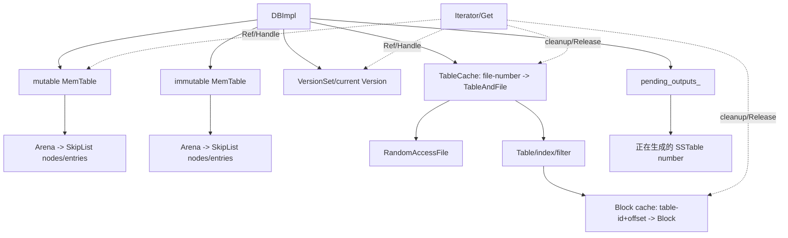

# 池化与资源管理专题

- 文档目的：统一解释 Arena、两级 LRU cache、引用计数、文件句柄和后台输出资源的生命周期。
- 适用范围：LevelDB `7ee830d02b623e8ffe0b95d59a74db1e58da04c5`。
- 对应源码版本：`main` / `7ee830d`。
- 证据状态：静态源码和既有 Linux Debug 测试结果已确认；故障注入、跨平台及峰值内存行为未验证。
- 最后更新：2026-09-14
- 前置阅读：[运行时模型](../00-overview/runtime-model.md)、[端到端链路](end-to-end-traces.md)
- 后续阅读：[错误边界](error-boundaries.md)、[性能关键路径](performance-critical-paths.md)

## 结论摘要

LevelDB 没有统一的全局内存池。它组合了三种不同机制：MemTable 用 Arena 做“只分配、不单独释放”的区域分配；Table/block 用带 handle 引用计数的分片 LRU cache 做复用与淘汰；DBImpl、MemTable、Version、Iterator 和文件对象再用明确所有权或引用计数闭合生命周期。[source/leveldb/util/arena.h:16-65] [source/leveldb/util/cache.cc:17-399] [source/leveldb/db/db_impl.cc:126-178]

这些机制解决的问题不同，不能互换：Arena 优化大量短小节点的分配成本，但只在整个 MemTable 销毁时批量回收；cache 可以逐 entry 淘汰，但 handle 会 pin 住对象；`pending_outputs_` 不是缓存，而是防止正在生成的 SSTable 被并发垃圾回收的生命周期集合。[source/leveldb/util/arena.cc:11-64] [source/leveldb/db/db_impl.cc:235-285] [source/leveldb/db/db_impl.cc:501-535]

Graph 边界：LevelDB 核心没有 GPU/CUDA Graph、capture/replay 或执行图内存池；源码中的 graph 关键词主要来自 benchmark/第三方依赖，不属于 DBImpl 资源模型。本专题只分析 CPU Arena、LRU cache、文件句柄和后台任务，不将外部图框架概念引入 LevelDB。

## 资源分层



实线表示拥有，虚线表示临时引用或 cache handle。`DBImpl` 可以拥有默认 block cache，也可以只借用调用方传入的 cache；该差异由 `owns_cache_` 明确记录。[source/leveldb/db/db_impl.cc:100-150] [source/leveldb/db/db_impl.cc:161-178]

## Arena：MemTable 的区域分配

### 分配策略

| 条件 | 动作 | 资源后果 |
|---|---|---|
| 当前块余量足够 | bump `alloc_ptr_` | 无系统分配，无单项释放 |
| `bytes <= 1024` 且余量不足 | 新建 4096-byte block | 当前块尾部余量直接浪费 |
| `bytes > 1024` | 单独按请求大小建 block | 避免大对象造成 4 KiB 块内部碎片 |
| 需要对齐 | 计算到至少 8-byte/指针对齐的 slop | slop 计入当前块消耗 |

证据：[source/leveldb/util/arena.h:16-65] [source/leveldb/util/arena.cc:9-64]

Arena 把每次 `new[]` 的块指针放进 `blocks_`，析构时逐块 `delete[]`。它不运行单个 entry 的析构函数，也不能回收单个 SkipList 节点；这与 MemTable “构建后整体废弃”的生命周期相匹配。[source/leveldb/util/arena.cc:14-18] [source/leveldb/db/memtable.h:19-82]

`MemoryUsage()` 使用 relaxed atomic 只是允许在写入并行发生时读取估算值；`alloc_ptr_`、剩余字节和 `blocks_` 没有锁，所以这并不把 Arena 变成可由多个写线程直接并发调用的 allocator。[source/leveldb/util/arena.h:29-50]

## LRU cache：handle 即生命周期票据

### 核心状态

每个 `LRUHandle` 同时有 `in_cache` 和 `refs`：cache 自己持有一份引用，调用方拿到的每个 handle 再持有一份。只有 `in_cache=false && refs==0` 时才调用 entry deleter 并释放 handle 内存。[source/leveldb/util/cache.cc:17-53] [source/leveldb/util/cache.cc:218-238]

```text
Insert
  -> refs=1（返回给调用方）
  -> capacity>0 时 refs++（cache 持有）并进入 in_use_
Release
  -> refs 从 2 降到 1：移入 lru_，可以淘汰
Evict/Erase
  -> 去掉 cache 引用；若仍有外部 handle，entry 继续存活
最后一个 Release
  -> deleter(value) -> free(LRUHandle)
```

证据：[source/leveldb/util/cache.cc:198-238] [source/leveldb/util/cache.cc:253-333]

### 容量与并发含义

- `NewLRUCache` 实际创建 16 个 shard；每 shard 用独立 mutex，容量按向上取整分配。[source/leveldb/util/cache.cc:337-399]
- 淘汰循环只从 `lru_` 选择没有外部引用的 entry；如果所有 entry 都被 handle pin 住，`usage_` 可以暂时超过配置 capacity。[source/leveldb/util/cache.cc:267-306]
- `charge` 是调用方定义的成本，不一定是字节。block cache 插入时使用 `block->size()`；TableCache 插入时固定使用 `1`，所以它限制的是缓存 table/file 对数量。[source/leveldb/table/table.cc:152-203] [source/leveldb/db/table_cache.cc:41-75]
- cache 析构断言 `in_use_` 为空。仍持有 handle 时销毁 cache 属生命周期错误，而不是由析构自动容错。[source/leveldb/util/cache.cc:198-216]

## TableCache 与 BlockCache 的两级所有权

| 层 | key | value | deleter | handle 释放点 |
|---|---|---|---|---|
| TableCache | file number | `TableAndFile{RandomAccessFile*, Table*}` | 依次 delete Table、file、包装体 | direct Get 返回；Table iterator cleanup |
| BlockCache | `cache_id + block offset` | `Block*` | `delete Block` | block iterator cleanup |

TableCache miss 会打开 `.ldb`（失败时再尝试旧 `.sst` 名），随后 `Table::Open`。失败路径删除已经打开的 file 且不缓存错误；成功才把 file 与 Table 一并交给 cache deleter。[source/leveldb/db/table_cache.cc:13-75]

Block miss 时若内容允许缓存且 `ReadOptions::fill_cache=true`，新 Block 进入 block cache；否则 iterator 注册 `DeleteBlock`，在自身销毁时直接删除。命中或成功插入 cache 时则注册 `ReleaseBlock`，把 cache handle 延长到 iterator 生命周期结束。[source/leveldb/table/table.cc:145-203]

## MemTable、Version 与 Iterator 的引用闭环

MemTable 初始引用数为 0，调用方创建后必须 `Ref()`；`Unref()` 降到 0 时 `delete this`，从而连带销毁内部 Arena 和全部节点。[source/leveldb/db/memtable.h:19-82]

`DBImpl::Get` 在持锁状态下抓取 `mem_`、`imm_`、current Version 并逐一 Ref，随后解锁执行内存/文件读取，重新加锁后才 Unref。这样后台线程即使同时把 mutable MemTable 切成 immutable、安装新 Version，本次读仍持有有效对象。[source/leveldb/db/db_impl.cc:1121-1166]

内部 Iterator 的生命周期更长：创建时 Ref mem/imm/current Version，并把 `CleanupIteratorState` 注册到 merging iterator；调用方 delete iterator 时 cleanup 重新拿 DB mutex，再依次 Unref。[source/leveldb/db/db_impl.cc:1063-1107]

Version 也在 refs 降到 0 时自销毁，但 current Version 链还受 VersionSet 管理；修改引用配对必须同时检查 Get、Iterator、compaction 和 VersionSet 安装路径。[source/leveldb/db/version_set.cc:453-462]

## 文件和后台任务资源

### pending outputs 防删除协议

创建 flush/compaction 输出文件前，DBImpl 在锁内分配 file number 并插入 `pending_outputs_`；`RemoveObsoleteFiles` 把该集合并入 live set，因此并发扫描目录时不会删除半成品。BuildTable 或 compaction cleanup 结束后才移除 number。[source/leveldb/db/db_impl.cc:235-285] [source/leveldb/db/db_impl.cc:501-535] [source/leveldb/db/db_impl.cc:789-835]

### DB 关闭顺序

```text
设置 shutting_down_
  -> 等待 background_compaction_scheduled_ 清零
  -> UnlockFile(db_lock_)
  -> delete VersionSet
  -> Unref mem_/imm_
  -> delete batch/log writer/log file/TableCache
  -> 按 owns_info_log_/owns_cache_ 释放默认创建的资源
```

证据：[source/leveldb/db/db_impl.cc:151-178]

这个顺序说明调用方必须先销毁 Iterator、释放 Snapshot，再 delete DB。否则 Iterator cleanup 需要的 DB mutex、MemTable/Version 或 cache 已经不存在。[source/leveldb/include/leveldb/db.h:83-105] [source/leveldb/db/db_impl.cc:1063-1107]

## 配置到资源行为

| 配置 | 资源影响 | 所有权 |
|---|---|---|
| `write_buffer_size` | 间接控制 MemTable/Arena 达到切换阈值的规模 | MemTable 引用计数 |
| `block_cache=nullptr` | DB 创建默认 8 MiB LRU | `DBImpl::owns_cache_=true`，析构删除 |
| 调用方提供 `block_cache` | 多 DB 可共享同一个 cache | 调用方必须晚于所有 DB/iterator 删除 |
| `max_open_files` | TableCache entries = sanitized value - 10 | TableCache entry 持有 file/Table |
| `ReadOptions::fill_cache=false` | block miss 不插入 cache | 临时 Block 由 iterator cleanup 删除 |
| cache capacity 0 | `Insert` 只返回外部 handle，不保留 cache 引用 | 最后 Release 立即触发 deleter |

证据：[source/leveldb/include/leveldb/options.h:67-103] [source/leveldb/db/db_impl.cc:100-150] [source/leveldb/util/cache.cc:267-306]

## 失败路径与不变量

| 场景 | 必须保持的不变量 | 处理 |
|---|---|---|
| Table open 失败 | 不把失败结果放入 cache | delete 已打开 file，返回 Status |
| cache erase 时 handle 仍被使用 | value 不能提前释放 | 去掉 cache ref；等最后 Release |
| compaction 中途 shutdown/错误 | builder/file/pending number 必须闭合 | Abandon/delete builder，delete outfile，erase pending outputs |
| 后台错误后 obsolete scan | 不删除提交状态不确定的文件 | `bg_error_` 非 OK 时直接返回 |
| Arena 大对象 | 不浪费大块剩余空间 | 大于 1 KiB 独立 block |
| DB 析构 | 不与后台 compaction 并发释放共享状态 | signal + wait，后台结束后再逐项释放 |

证据：[source/leveldb/db/table_cache.cc:41-75] [source/leveldb/db/db_impl.cc:230-285] [source/leveldb/db/db_impl.cc:789-804]

## 测试与修改建议

- Arena：运行 `arena_test` 覆盖小/大/对齐分配和 MemoryUsage；增加极端对齐与生命周期后 UAF 的 ASan 场景。[source/leveldb/util/arena_test.cc:1-61]
- Cache：运行 `cache_test` 覆盖 hit/miss、eviction、pinned handle、capacity 0、Prune 和 deleter 次数。[source/leveldb/util/cache_test.cc:1-224]
- Table/block：组合 `fill_cache=false`、tiny cache、iterator 跨 eviction 存活和损坏 block 读取。
- DB 生命周期：在 fault-injection 中覆盖输出文件创建后失败、pending output 保留、重开恢复和 shutdown 等待。
- 改 cache API 时，不要只跑 lookup 测试；必须验证 entry 从 in-use → LRU → erased → last Release 的每个状态。

## 风险与取舍

| 风险/取舍 | 影响 | 控制方法 |
|---|---|---|
| Arena 不回收单项 | MemTable 存活期可能有内部碎片 | 用 write buffer 阈值控制代际；不要把长生命周期对象放进 MemTable Arena |
| 外部 handle 长期不 Release | cache 超容量、析构断言或泄漏 | RAII 包装 handle；iterator cleanup 必须注册成功 |
| 共享 block cache 提前 delete | 多 DB/iterator UAF | 调用方最后删除 cache；文档化所有权 |
| TableCache 的 charge 不是字节 | “容量”被误解为内存上限 | 按 entries/fd 分析，另测 Table/metadata 实际内存 |
| 后台错误阻止旧文件清理 | 磁盘空间持续增长 | 观察 bg_error/log，修复后安全重开并验证 live set |
| pending_outputs_ 配对遗漏 | 半成品被删或垃圾文件残留 | 所有输出创建/失败/成功路径做集合不变量测试 |

## 相关文档

- [M03 WAL/MemTable](../01-modules/M03-wal-memtable/README.md)
- [M05 SSTable/Table](../01-modules/M05-sstable-table/README.md)
- [M06 Env/平台](../01-modules/M06-env-platform/README.md)
- [端到端深度链路](end-to-end-traces.md)

## 源码证据摘要

Arena：[source/leveldb/util/arena.h:16-65]、[source/leveldb/util/arena.cc:9-64]；LRU：[source/leveldb/util/cache.cc:17-399]；TableCache：[source/leveldb/db/table_cache.cc:13-117]；block cache：[source/leveldb/table/table.cc:145-203]；DB 生命周期：[source/leveldb/db/db_impl.cc:100-178]；Get/Iterator 引用：[source/leveldb/db/db_impl.cc:1063-1166]。

## 未解决问题

- 不同工作负载下 Arena 尾部浪费、cache pinned bytes 和真实 fd 峰值尚未测量。
- POSIX/Windows fd limiter、mmap 和后台 Schedule 的动态交错仍需跨平台验证。
- 崩溃窗口内 `pending_outputs_`、MANIFEST 和目录持久化的最终可见性需要 fault injection。

## 下一步阅读建议

先沿 Get/Iterator 引用闭环理解对象存活，再沿 compaction 输出路径理解文件资源和错误清理。
