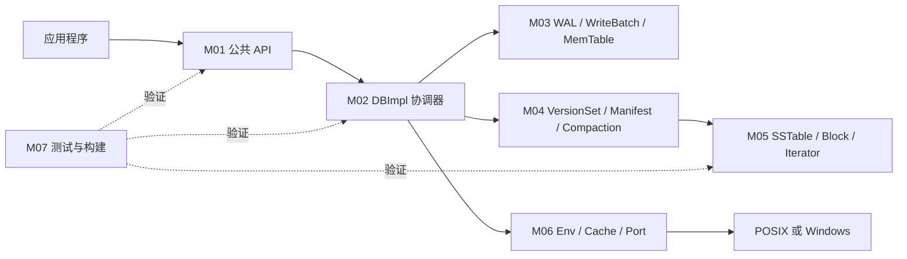

# LevelDB 项目理解知识库

- 文档目的：为未参与过 LevelDB 的开发者提供可追溯的架构、代码、构建、调试和扩展入口。
- 适用范围：仓库 `main` 在提交 `7ee830d02b623e8ffe0b95d59a74db1e58da04c5` 的源码；项目版本 `1.23.0`。
- 证据状态：核心源码和 Linux Debug 验证已确认；未执行的 Release、Sanitizer、跨平台和故障注入实验明确标注。
- 最后更新：2026-09-10
- 前置阅读：无
- 后续阅读：[5 分钟项目概览](00-overview/project-overview.md)、[阅读指南](99-roadmap/reading-guide.md)

## 一句话介绍

LevelDB 是一个嵌入式、进程内、持久化且按键有序的字符串键值库。它把最近写入先落到 WAL 和内存表，再异步转换为分层 SSTable，通过版本清单和后台 compaction 在崩溃恢复、写入吞吐与读取放大之间取得平衡。

## 5 分钟快速理解

1. 外部程序调用 `leveldb::DB::Open` 以及 `Put/Get/Delete/Write/NewIterator`；公共契约在 `include/leveldb/`。
2. `DBImpl` 串联锁、写入者队列、日志、MemTable、快照、VersionSet 与后台压缩。
3. 每个写批次先编码为 WAL 记录，再插入 MemTable；读取按快照序号合并内存表与 SSTable。
4. MemTable 达到阈值后变为 immutable MemTable，后台用 `TableBuilder` 生成 Level-0 表，并把 VersionEdit 写入 MANIFEST。
5. VersionSet 按层维护表文件，后台 compaction 合并重叠文件、丢弃被覆盖版本和安全的删除标记。
6. Env 抽象文件、锁、线程和调度；POSIX、Windows、MemEnv 可替换同一边界。

## 目录导航

- [总览层](00-overview/project-overview.md)：定位、架构、运行、数据流、依赖、错误、构建。
- [模块注册表](01-modules/module-registry.md)：M01–M07 的边界和证据。
- [模块层](01-modules/)：公共 API、DB 协调、WAL/MemTable、Version/Compaction、SSTable、Env、测试工程。
- [关联层总览](90-cross-module/end-to-end-flows.md)：跨模块流程导航。
- [端到端深度链路](90-cross-module/end-to-end-traces.md)：八条从 API 到文件、线程、资源和错误出口的逐阶段轨迹。
- [实践层](99-roadmap/quick-start.md)：上手、调试、测试、功能开发和路线图。
- [真实测试 Demo 注册表](80-demos/demo-registry.md)：以 `db/db_test.cc`/`leveldb_tests` 为入口的 D01 端到端源码解剖。

## 总体架构



箭头表示调用或资源依赖；虚线表示测试/构建验证关系。M01 的公开头文件是稳定边界，`db/` 和 `table/` 的内部头文件不是公共契约（证据：[README.md:207-214](../../README.md#L207-L214)）。

## 三条最重要流程

| 流程 | 入口 | 关键链 | 深度轨迹 |
|---|---|---|---|
| 打开/恢复 | `DB::Open` | `DBImpl::Recover` → `VersionSet::Recover` → `RecoverLogFile` | [链 1、2](90-cross-module/end-to-end-traces.md#链-1首次打开与创建数据库) |
| 写入/flush | `DB::Write` | writer 队列 → WAL → MemTable → immutable flush → MANIFEST | [链 3、6](90-cross-module/end-to-end-traces.md#链-3并发批量写入限流与日志先行) |
| 读取/压缩 | `DBImpl::Get` | MemTable → `Version::Get` → `TableCache` → Block；后台 `DoCompactionWork` | [链 4、7](90-cross-module/end-to-end-traces.md#链-4单键读取从快照序号到-table-block) |

## 主 Demo 与覆盖矩阵

仓库没有独立的 `demo/` 程序；知识库以真实公共 API 场景和 `db/db_test.cc` 等测试 fixture 为主线，另提供源码驱动的贯穿示例。该场景从 `DB::Open`、`Put`、Snapshot、Delete 经过 WAL/MemTable、flush、compaction、reopen 和 `Get`，具体步骤见[端到端深度链路贯穿示例](90-cross-module/end-to-end-traces.md#一条贯穿示例k-从写入到重开)。它是“合成、未运行”的概念轨迹，不应当作本机执行结果。

| Demo/测试阶段 | 模块 | 真实入口/实现 | 源码证据 |
|---|---|---|---|
| Open/reopen | M01/M02/M04/M06 | `DB::Open` → `DBImpl::Recover` → `VersionSet::Recover` → `Env` | [`DB::Open`](../../db/db_impl.cc#L1503-L1544) |
| Put/WAL/MemTable | M01/M02/M03 | `DB::Put` → `DBImpl::Write` → `log::Writer` → `MemTable` | [`DBImpl::Write`](../../db/db_impl.cc#L1206-L1276) |
| flush/compaction | M02/M04/M05/M06 | `CompactMemTable`/`DoCompactionWork` → `BuildTable` → `LogAndApply` | [`DBImpl::CompactMemTable`](../../db/db_impl.cc#L549-L580) |
| Get/Snapshot/Table | M01/M02/M04/M05 | `DBImpl::Get` → `Version::Get` → `Table::InternalGet` | [`DBImpl::Get`](../../db/db_impl.cc#L1121-L1165) |

## 构建与运行入口

```bash
cmake -S . -B build -DCMAKE_BUILD_TYPE=Debug   # 已验证：configure 成功
cmake --build build -j2                        # 已验证：100% 完成
ctest --test-dir build --output-on-failure     # 已验证：3/3 通过
./build/db_bench --benchmarks=fillseq,readrandom \
  --num=10000 --value_size=100 --threads=1 \
  --db=/tmp/leveldb-knowledge-bench-20260910-r2  # 已验证：10000/10000 命中
```

CMake 默认打开测试、基准和安装选项（[CMakeLists.txt:32-34](../../CMakeLists.txt#L32-L34)）；CI 使用配置、构建、CTest、benchmark 和安装步骤（[.github/workflows/build.yml:74-102](../../.github/workflows/build.yml#L74-L102)）。本机 Debug 构建、CTest 和有限 benchmark 已执行；此前缺少的 GoogleTest/benchmark 子模块已在用户授权后初始化。CTest 结果为 `leveldb_tests`、`c_test`、`env_posix_test` 全部通过（本轮总计 91.24 s）。benchmark 在 Debug、启用断言且未启用 Snappy 的条件下得到 `fillseq 3.114 micros/op`、`readrandom 1.199 micros/op`，仅作可运行性记录。

## 按角色阅读

- C++/API 使用者：M01 → M02 `DBImpl::Open/Write/Get` → M03。
- 存储引擎开发者：先读[端到端深度链路](90-cross-module/end-to-end-traces.md)，再读 M03 → M04 → M05。
- 平台/测试开发者：M06 → M07 → 实践层。
- 故障定位：[错误边界](90-cross-module/error-boundaries.md) → [调试指南](99-roadmap/debugging-guide.md)。

## 状态与缺口

当前已完成仓库盘点、目标版本确认、总体模型、模块划分、全部标准模块文档、八条端到端深度链路，以及 Linux Debug 构建验证。最新静态检查覆盖 117 个 Markdown 文件、1212 个相对链接（断链 0）、源码锚点越界 0；`git diff --check` 无输出。深度文档使用的函数控制流、锁边界、引用动作和错误出口已由源码核对；CTest 聚合目标和有限 benchmark 已实际运行。

本机已完成 Debug configure、build、CTest 和有限 benchmark；本轮 CTest 的 3 个目标全部通过。此前本地 prefix install 也已完成。Release/RelWithDebInfo、Sanitizer、fault injection、跨平台构建、D01 各 filter 的独立记录和生产性能基线仍未验证。没有运行服务或修改 LevelDB 源码。

## 相关文档

- [项目概览](00-overview/project-overview.md)
- [总体架构](00-overview/architecture.md)
- [模块注册表](01-modules/module-registry.md)
- [分析状态](00-overview/analysis-state.md)
- [端到端深度链路](90-cross-module/end-to-end-traces.md)
- [构建/调试/测试实践](99-roadmap/quick-start.md)

## 源码证据摘要

- [README.md:1-31](../../README.md#L1-L31)
- [CMakeLists.txt:4-34](../../CMakeLists.txt#L4-L34)
- [db/db_impl.h:28-71](../../db/db_impl.h#L28-L71)
- [doc/impl.md:7-49](../../doc/impl.md#L7-L49)

## 未解决问题

- Release/RelWithDebInfo、Sanitizer、跨平台构建、真实故障注入和生产性能基线仍需实验确认。
- 独立 D01 GoogleTest filter 尚未逐组登记；全量 `leveldb_tests` 已作为 CTest 目标通过。

## 下一步阅读建议

先读 [端到端深度链路](90-cross-module/end-to-end-traces.md) 的贯穿示例，再按目标选择 [项目概览](00-overview/project-overview.md)、[模块注册表](01-modules/module-registry.md) 或 [阅读指南](99-roadmap/reading-guide.md)。
