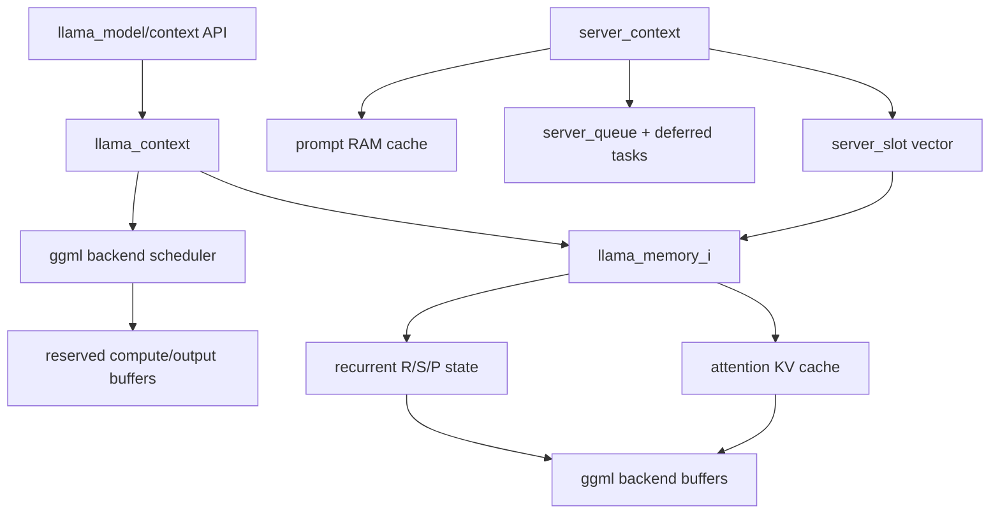

# 池化与资源管理专题

- 文档目的：追踪 llama.cpp 的 KV/循环状态 buffer、ggml backend buffer、计算图工作区、server slot/队列和模型文件映射生命周期。
- 适用范围：当前 checkout `093a2f86c3e37c54fa3e1f9efb17b304f3433abd`。
- 对应源码版本：`master` / `093a2f86c`。
- 证据状态：静态源码已确认；模型加载、GPU backend、长压和异常路径未在本环境重新运行。
- 最后更新：2026-09-14
- 前置阅读：[M01 ggml/backend](../01-modules/M01-ggml-backend/README.md)、[M02 llama runtime](../01-modules/M02-llama-runtime/README.md)
- 后续阅读：[线程/队列/资源](thread-queue-resource.md)、[D01 server](../80-demos/D01-server-chat/README.md)

## 结论摘要

llama.cpp 的资源管理不是单一 pool，而是由 backend buffer RAII、KV memory 模块、计算图 scheduler reserve 和 server slot/队列四层组成。KV cache 按 buffer type 为每层建立 ggml tensor，再由 backend 分配真实 buffer；`llama_memory_hybrid` 可以把 attention cache 与 recurrent state 组合起来；server 则把多个请求映射到固定 slot，并通过统一/分离 KV 策略决定 slot 清理是否真的释放可复用空间。[source/llamacpp/src/llama-kv-cache.cpp:65-125] [source/llamacpp/src/llama-memory-recurrent.cpp:20-139] [source/llamacpp/tools/server/server-context.cpp:1238-1360]

## 资源层次图

## 1. KV cache：按 backend buffer type 分配

`llama_kv_cache` 先按 buffer type 建立 `ggml_context`，每层创建 K/V tensor 和按 stream 切分的 view；`offload` 决定使用 CPU 或模型设备的 buffer type，`reuse/share` 回调可以让层共享已有 tensor view，而不是重新分配物理存储。[source/llamacpp/src/llama-kv-cache.cpp:65-125] [source/llamacpp/src/llama-kv-cache.cpp:165-249]

构造结束时对每个 context 调用 `ggml_backend_alloc_ctx_tensors_from_buft`，把 tensor metadata 落地到真实 backend buffer，随后 clear padding 以避免未初始化 NaN。`ctxs_bufs` 用 `ggml_context_ptr` 与 `ggml_backend_buffer_ptr` 成对持有，因此 cache 对象销毁时会按智能指针释放两者。[source/llamacpp/src/llama-kv-cache.cpp:276-304]

`kv_size` 不是可动态增长的通用 vector；它在 context 初始化时确定，`n_seq_max` 决定 unified 与 per-sequence stream 数。若创建 shared cache，目标 size 会被强制改成 source cache size，避免 view 越界。[source/llamacpp/src/llama-kv-cache.cpp:83-100]

## 2. Recurrent/Hybrid memory

`llama_memory_recurrent` 为每层分配 R/S（以及可选 PLE P）状态 tensor，shape 的第二维是 `mem_size * (1 + n_rs_seq)`；同时维护 `cells`、`head`、`used` 和 sequence→state 索引。`clear(data=true)` 重置 cell 元数据并清零 backend buffer，`clear(false)` 只重置索引而保留数据。[source/llamacpp/src/llama-memory-recurrent.cpp:20-139]

`llama_memory_hybrid` 将 attention memory 与 recurrent memory 作为两个 `unique_ptr` 子模块；`init_batch/init_full/init_update` 分别创建两个 context，并合并 status。它们共享同一逻辑生命周期，但底层 buffer 可位于不同 backend type，`memory_breakdown()` 按 buffer type 汇总大小。[source/llamacpp/src/llama-memory-hybrid.cpp:67-75] [source/llamacpp/src/llama-memory-hybrid.cpp:182-187] [source/llamacpp/src/llama-memory-hybrid.cpp:212-237]

## 3. 计算图工作区与 reserve

`llama_context` 初始化 backend 后先创建 `llama_memory_i`，再枚举 backend/buffer type 并建立 scheduler。`sched_reserve()` 计算最坏 token/sequence/node 数，创建 `llm_graph_result`，对 prompt-processing 与 token-generation 两种 graph 分别 reserve；必要时还会在 pipeline parallel 分配失败后回退到非 pipeline scheduler。[source/llamacpp/src/llama-context.cpp:385-450] [source/llamacpp/src/llama-context.cpp:582-683]

reserve 的目的不是预热 בלבד：它把 `backend_buf_exp_size` 固定下来，避免推理过程中 ggml allocator 反复 realloc。`graph_compute_async` 提交后必须由 `synchronize()` 等待 backend 完成，才能安全读取 output buffer 或释放/复用批次 tensor。[source/llamacpp/src/llama-context.cpp:685-721] [source/llamacpp/src/llama-context.cpp:2508-2521]

`ggml-alloc.c` 提供两种不同粒度的 host-side allocator：`ggml_tallocr` 是给一个 backend buffer 顺序 bump allocation，超出 buffer 直接 abort；`ggml_dyn_tallocr` 在最多 16 个 chunk 中保存按地址排序的 free block，释放后重新插入并合并相邻区。后者是 graph/workspace 生命周期中的复用器，不是 KV cache allocator；chunk 上限、`MAX_FREE_BLOCKS=256` 和单 tensor 超大分支都会改变失败行为。[source/llamacpp/ggml/src/ggml-alloc.c:53-91,94-177]

`llama_context::graph_reserve` 每次 reset scheduler、reset 旧 graph result、构造最坏 batch graph，并调用 `ggml_backend_sched_reserve` 或 `reserve_size`；memory module、LoRA、speculative 等变化会重新设置 `sched_need_reserve`。因此 graph 复用的有效期由 scheduler reserve 版本和 memory context 状态决定，不能把一次 reserve 当成永久容量。[source/llamacpp/src/llama-context.cpp:582-712,819-843,2418-2464]

## 4. Server slot/队列是上层对象池

server_context 按 `n_parallel` 创建固定数量 `server_slot`；每个 slot 持有 target/draft context、memory context、prompt token 状态、sampler 和统计信息。`slot.reset()` 清除任务、prompt、状态和 sampler，但 slot 本身留在 vector 中供下一请求复用。[source/llamacpp/tools/server/server-context.cpp:1249-1314] [source/llamacpp/tools/server/server-context.cpp:239-410]

`server_queue` 用 `queue_tasks`、`queue_tasks_deferred` 和 `queue_tasks_unhandled` 管理任务所有权；`process_new_tasks` 取出 task 后解锁再调用 callback，yield 期间被拒绝的 task 暂存，yield 结束后按原顺序放回。停止流程设置 `worker.stop`、唤醒条件变量并 join worker thread。[source/llamacpp/tools/server/server-queue.cpp:28-74] [source/llamacpp/tools/server/server-queue.cpp:138-220] [source/llamacpp/tools/server/server-queue.cpp:222-275]

slot 选择先尝试指定 id 或 prompt LCP 相似度，最后才选择最久未使用 slot；这使 slot prompt cache 有机会复用，但不等于 KV 一定被清空。[source/llamacpp/tools/server/server-context.cpp:1547-1630]

## 5. Unified KV 与 prompt cache 的真实释放语义

`--kv-unified` 下，idle slot 的 `prompt_clear()` 可以释放该 slot 在统一 KV pool 中的可复用空间；非 unified 模式清除 slot 只发布 RAM prompt cache 副本，VRAM KV 仍留在原 context 中。源码明确把后者标记为“clearing a slot frees no reusable room”。[source/llamacpp/tools/server/server-context.cpp:1400-1433]

`--cache-ram` 创建 `server_prompt_cache`，它是 host-side prompt/state cache；开启 `cache_idle_slots` 还要求非零 RAM cache。prompt cache 的命中/失败会调用 `prompt_save`/`prompt_load`，失败则 `prompt_clear`，因此 RAM cache 与 VRAM KV 生命周期是两个层次。[source/llamacpp/tools/server/server-context.cpp:1351-1361] [source/llamacpp/tools/server/server-context.cpp:1638-1655]

## 6. 模型文件和 backend 所有权

公开 API 的 owner 关系是：调用方持有 `llama_model*`，由 `llama_model_free()` 释放；context 由 `llama_free()` 释放；model loader/backend buffer/mmap 等内部资源随对象 RAII 释放。模型 offload 的 buffer type 选择发生在 KV/cache 和 model 初始化阶段，不能把 CPU mmap、device buffer 和 compute workspace 混为同一池。[source/llamacpp/src/llama-context.cpp:385-422] [source/llamacpp/examples/simple/simple.cpp:200-220]

## 资源所有权表

| 对象 | Owner | 借用者 | 释放点 | 风险 |
|---|---|---|---|---|
| KV K/V tensor + backend buffer | `llama_kv_cache` | attention graph/memory context | cache/context 析构 | buffer type 错配、view 越界 |
| recurrent R/S/P state | `llama_memory_recurrent` | recurrent context/graph | memory/context 析构或 clear | partial rollback 状态不一致 |
| compute/output buffer | `llama_context` scheduler | graph result/API caller | context 析构/resize | async 未同步就复用 |
| ggml graph/workspace allocator | `ggml_backend_sched`/`ggml_dyn_tallocr` | graph node tensors、backend buffers | scheduler reset/re-reserve/context free | chunk/free-block 上限、graph 变化后旧地址复用 |
| server slot | `server_context::slots` | task/update_slots | `slot.reset`，vector 生命周期结束 | reset 时仍有 callback |
| queued task | `server_queue` 容器 | worker callback | pop/decline/reinsert/terminate | task 丢失或重复提交 |
| prompt RAM cache | `server_prompt_cache` | slot/prompt | cache eviction/context 析构 | 与 VRAM KV 语义混淆 |
| model/backend/mmap | model/context RAII | loader/graph | `llama_model_free`/`llama_free` | backend 仍在异步使用 |

## 正常、失败与清理路径

| 路径 | 关键动作 | 结果 |
|---|---|---|
| context 初始化 | create memory → enumerate backend → reserve graph/output | 固定 KV/compute buffer 可供异步执行 |
| KV miss/扩容 | memory context `init_batch` 返回失败状态，或 reserve 抛异常 | 上层返回 failed prepare/compute，不继续读未分配 buffer |
| server 新任务 | queue pop → slot 选择 → slot.reset/launch | 复用 slot；deferred task 按 slot callback 唤醒 |
| slot idle | unified 才清 VRAM KV；否则仅 RAM cache copy | 释放语义取决于 `kv_unified` |
| worker 异常 | worker 捕获 exception，yield 结束时 rethrow | queue 中未处理 task 恢复；调用方负责 server 销毁 |
| context shutdown | synchronize → free memory/scheduler/backend | 需确保没有 callback/worker 使用 raw pointer |

## 测试与修改建议

- 为 KV cache 修改增加 `memory_breakdown`、size mismatch、layer share/reuse 和 clear(data=false/true) 测试。
- 为 server slot 修改覆盖 unified/non-unified、idle prompt cache、deferred task、cancel、worker exception 和 `slot.reset` 后 sampler 状态。
- 为 backend scheduler 修改同时检查 reserve 的 PP/TG 两种 graph、output buffer resize、异步提交后 synchronize；不要只验证同步 CPU backend。
- 为 ggml allocator/graph 修改覆盖 bump overflow、动态 chunk 上限、free block merge、graph reserve 重建和 `graph_compute_async` 失败后的 buffer 复用；动态 graph 变化时必须验证 `sched_need_reserve` 是否重新置位。
- 为模型/文件资源修改使用最小 GGUF fixture，并在无模型/无 GPU 环境把命令标为未验证。

## 风险与取舍

| 风险/取舍 | 影响 | 控制方法 |
|---|---|---|
| KV size 固定且按 layer/buffer type 分配 | 大 context 直接增加常驻内存 | 在 context 创建前计算 size；记录 `memory_breakdown` |
| non-unified slot 清理不释放 VRAM | 长时间服务显存驻留接近峰值 | 明确启用 unified 或重建 context；观察 slot/cache 指标 |
| 裸指针 view 跨 shared cache | source cache 变小/销毁会越界或 UAF | 共享时强制 size 对齐，先停止所有 context 再销毁 |
| async scheduler 未同步 | 输出或 buffer 被提前读取/复用 | 使用 `synchronize()`，在错误路径也释放 graph context |
| queue 回调跨线程 | task/slot 生命周期竞态 | worker join 前停止提交，保留 unhandled task 回放顺序 |

## 相关文档

- [M01 ggml/backend](../01-modules/M01-ggml-backend/README.md)
- [M02 llama Runtime](../01-modules/M02-llama-runtime/README.md)
- [M04 server](../01-modules/M04-server/README.md)
- [线程、队列与资源](thread-queue-resource.md)
- [D01 Server Demo](../80-demos/D01-server-chat/README.md)

## 源码证据摘要

KV buffer：[source/llamacpp/src/llama-kv-cache.cpp:65-125,165-304]；recurrent/hybrid：[source/llamacpp/src/llama-memory-recurrent.cpp:20-159]、[source/llamacpp/src/llama-memory-hybrid.cpp:67-237]；scheduler reserve/async：[source/llamacpp/src/llama-context.cpp:385-450,582-721,2508-2521]；server slot/queue：[source/llamacpp/tools/server/server-context.cpp:1249-1433]、[source/llamacpp/tools/server/server-queue.cpp:28-275]。

## 未解决问题

- CUDA/Metal/Vulkan backend 的真实 allocator、mmap 和异步 event 行为尚未在当前环境验证；`ggml_dyn_tallocr` 的 chunk/free-block 上限也未做压力验证。
- 不同 `kv_unified`、SWA、recurrent rollback 和 speculative context 组合的峰值内存与清理时序需要实测。
- server prompt cache 的实际 eviction 策略、RAM 上限和多请求交错仍需专项测试。

## 下一步阅读建议

先读 KV buffer 构造，再沿 `ggml-alloc.c`、`llama_context::sched_reserve` 和 server `update_slots` 观察“常驻资源”“graph workspace”和“可复用 slot”三条生命周期。
