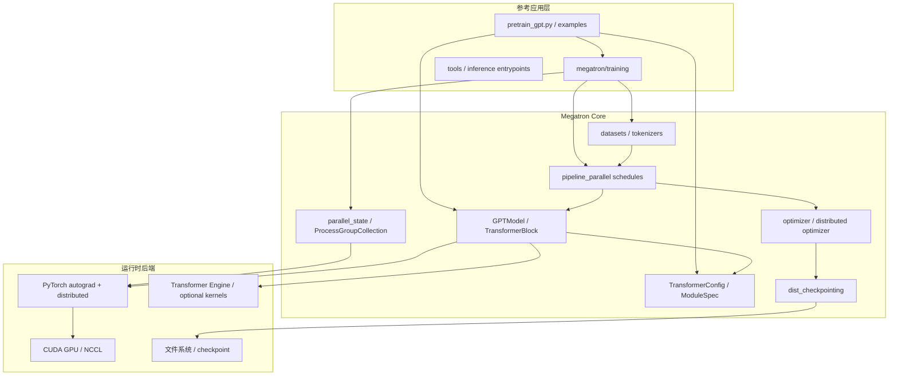

# 总体架构

- 文档目的：建立从入口到设备/输出的分层模型。
- 适用范围：训练主路径及其 Core 组件。
- 对应源码版本：`8190837c2b6ce176a431bc2a6ffd3439507648a7`
- 证据状态：已确认 + 部分推断
- 最后更新：2026-09-10
- 前置阅读：[项目定位](project-overview.md)
- 后续阅读：[运行时模型](runtime-model.md)

## 结论摘要

架构不是单一服务，而是“Python 参考程序 + Core 库 + PyTorch/CUDA/NCCL 后端”。入口负责配置，初始化负责集群拓扑，builder 负责模块装配，schedule 负责 microbatch 控制流，模型/数据/优化器负责实际计算和状态持久化。

节点证据：入口 [pretrain_gpt.py:33-80]；训练导入和 loop 依赖 [megatron/training/training.py:43-155]；模型 [megatron/core/models/gpt/gpt_model.py:52-130,234-242]；调度 [megatron/core/pipeline_parallel/schedules.py:53-168]；进程组 [megatron/core/parallel_state.py:28-165,232-260]。箭头含调用、数据或运行时依赖，具体 CUDA kernel 由 PyTorch/TE 选择，部分动态。

## 分层职责

1. **入口/配置层**：解析命令行、YAML 和环境，产生 args/config。
2. **初始化层**：设置 device，初始化 `torch.distributed` 和 Megatron process groups，种子和可选编译。[megatron/training/initialize.py:113-176]
3. **装配层**：`model_provider` 选择 ModelOpt 或传入 builder；`gpt_builder` 按 spec、TE、MoE、异构配置选择具体 `ModuleSpec`。[model_provider.py:19-58] [gpt_builders.py:24-110]
4. **执行层**：schedule 依据 PP/VP 选择无流水线、流水线或交错流水线函数。[schedules.py:53-168]
5. **状态层**：optimizer 更新参数，checkpoint 读写 sharded state dict；日志和 telemetry 伴随训练。

## 关键边界

`ProcessGroupCollection` 是较新的显式通信上下文；仍存在 `parallel_state` 全局兼容接口。Core 新代码应优先显式传递 process group，训练兼容层可以读取 MPU 全局（见仓库 CLAUDE/AGENTS 规则）。

## 相关文档

- [全局数据流](global-data-flow.md)
- [模块注册表](../01-modules/module-registry.md)
- [系统串联](../90-cross-module/system-wiring.md)

## 源码证据摘要

`model_provider.py:19-58`; `gpt_builders.py:24-110`; `schedules.py:53-168`; `gpt_model.py:98-242`。

## 未解决问题

不同模型（Hybrid/Mamba/VLM）具有不同 builder 和数据路径，本文以 GPT 主路径为统一骨架。

## 下一步阅读建议

进入 M02 了解并行拓扑，再回到 M03 了解完整训练 loop。
