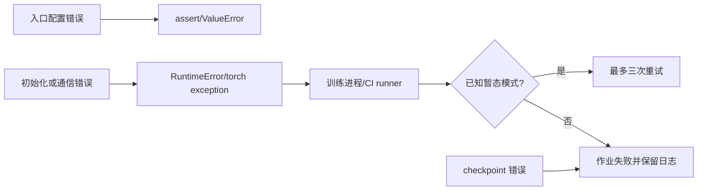

# 全局错误模型

- 文档目的：记录静态可见的错误检测、传播、重试和恢复边界。
- 适用范围：初始化、并行、数据、训练和 checkpoint 主路径。
- 对应源码版本：`8190837c2b6ce176a431bc2a6ffd3439507648a7`
- 证据状态：已确认（代码路径）；运行时故障结果未验证
- 最后更新：2026-09-10
- 前置阅读：[运行时模型](runtime-model.md)
- 后续阅读：[跨模块错误边界](../90-cross-module/error-boundaries.md)

## 结论摘要

错误主要以 Python exception/assertion 跨层传播；初始化主动拒绝无 CUDA，group 创建和配置 validation 抛出异常；unit-test CI 对已知 NCCL/ECC/segfault 等暂态模式最多重试三次，functional test 用 recipe/runner 负责调度。错误发生后是否能继续同一进程取决于调用方，没有全局事务回滚保证。

## 错误类别

| 类别 | 首个检测/生成点 | 传播方式 | 恢复 |
|---|---|---|---|
| 无 CUDA | `initialize_megatron` assert | `AssertionError` | 修正环境或 `allow_no_cuda` 仅用于 CPU 数据处理 [initialize.py:73-76] |
| process-group 参数错误 | `create_group`/初始化校验 | `RuntimeError`/torch exception | 修正 TP/PP/DP 等配置 |
| optional backend 缺失 | `_initialize_tp_communicators` | `RuntimeError` | 安装 yaml/TE 或禁用功能 [initialize.py:201-214] |
| loss 输入不合法 | schedule loss-scale validation | `ValueError` | 返回 scalar/size-1 loss scale [schedules.py:243-268] |
| CI 暂态硬件/通信故障 | workload launcher | 最多 3 次重试 | runner 重新发起，仍失败才报告 |
| checkpoint 文件/布局问题 | `dist_checkpointing.load` | exception | 修复目录/版本/分片，不保证自动恢复 |

## 传播图

证据：初始化 [initialize.py:73-76,201-214]；runner retry [skills/mcore-testing/SKILL.md:61-63]。重试条件是 CI 实现约束，不等同于 Core 内部 retry。

## 清理与恢复限制

初始化已经建立的 groups、CUDA allocations 或 async worker 不一定由每个 exception 分支逐项回滚；正式训练的 cleanup 需看具体 outer `pretrain` 路径。本文不把“进程终止时 OS 回收”误写成应用层清理。

## 相关文档

- [错误边界](../90-cross-module/error-boundaries.md)
- [D01 失败路径](../80-demos/D01-simple-mcore-training/failure-paths.md)

## 源码证据摘要

见类别表。

## 未解决问题

需通过受控的非法配置单测和非破坏性 checkpoint 缺失测试补全实际日志、rank 间错误同步和 cleanup 顺序。

## 下一步阅读建议

查看 `tests/unit_tests/test_parallel_state.py` 的异常断言。
