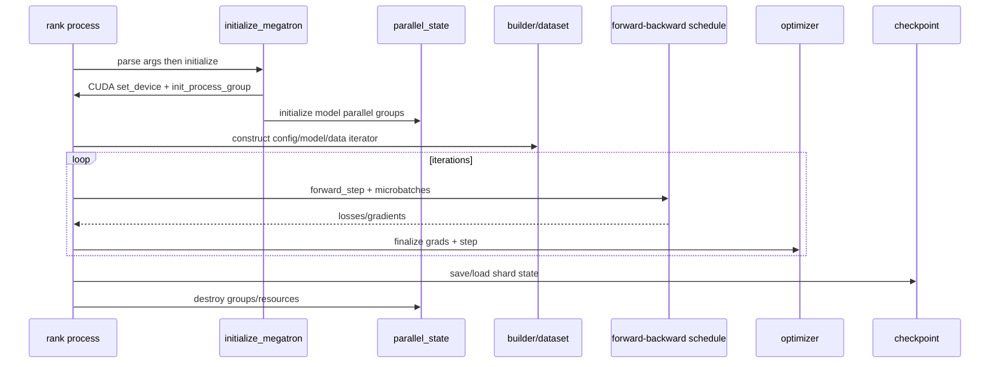

# 运行时模型

- 文档目的：解释启动、一次迭代、持久化和退出时的控制与资源生命周期。
- 适用范围：GPT 训练主路径；完整生产 fault-tolerance 仍需专项分析。
- 对应源码版本：`3703d4e33a3a2b2d11ebcc8e41f45af7ce7d1eda`
- 证据状态：已确认（静态）；GPU 动态行为未验证
- 最后更新：2026-09-10
- 前置阅读：[总体架构](architecture.md)
- 后续阅读：[D01 执行轨迹](../80-demos/D01-simple-mcore-training/execution-trace.md)

## 结论摘要

进程启动后先建立 device 和 default process group，再建立模型并行 groups；模型和数据 iterator 就绪后，schedule 反复消费 microbatch，反向完成后同步梯度并更新参数。正式训练还会编译 dataset helper、处理 autoresume、日志、异步保存和销毁 group。

启动初始化证据 [megatron/training/initialize.py:73-176,279-299]；Demo 初始化 [examples/run_simple_mcore_train_loop.py:28-53]；迭代 [examples/run_simple_mcore_train_loop.py:246-270]；checkpoint [examples/run_simple_mcore_train_loop.py:168-217]。循环箭头是控制/同步关系，具体退出异常清理依赖调用路径。

## 生命周期表

| 阶段 | 关键对象/资源 | 创建/操作 | 所有者或约束 |
|---|---|---|---|
| 初始化 | CUDA device、default PG | `torch.cuda.set_device`, `init_process_group` | 每 rank / torch.distributed |
| 拓扑 | TP/PP/DP/CP/EP groups | `initialize_model_parallel` | `parallel_state` 兼容状态 |
| 装配 | config、model、ModuleSpec | builder/GPTModel 构造 | 调用方持有 model |
| 运行 | iterator、activation、grad | schedule/autograd | microbatch 期间由模型/引擎持有 |
| 更新 | param groups、grad buffers | finalize + optimizer step | optimizer/model |
| 持久化 | shard state dict、文件 | `dist_checkpointing.save/load` | checkpoint 目录 |
| 退出 | process groups、helper worker | destroy/finalize | 训练 runtime |

## 暂停、恢复与关闭

checkpoint load 的直接 API 在 Demo 中是 `dist_checkpointing.load` 后 `model.load_state_dict`。[examples/run_simple_mcore_train_loop.py:192-217] 正式训练另有 autoresume 与异步保存路径，已确认初始化会调用 `_init_autoresume` 和可选 async worker；完整恢复时序需结合作业配置验证。[initialize.py:82-83,164-169]

## 相关文档

- [全局错误模型](global-error-model.md)
- [D01 数据和状态](../80-demos/D01-simple-mcore-training/data-and-state-trace.md)

## 源码证据摘要

见生命周期表和图示。

## 未解决问题

尚未在真实故障退出或多节点环境观察 group destroy、异步 checkpoint worker 的最终时序。

## 下一步阅读建议

先看 `examples/run_simple_mcore_train_loop.py:220-283`，再看训练初始化。
