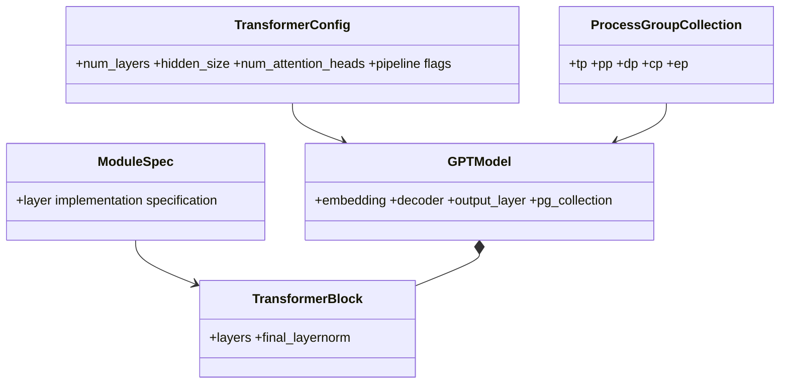

# M01 数据结构与生命周期

- 文档目的：追踪模型配置、模块和 tensor 的所有权与不变量。
- 适用范围：GPT 主模型。
- 对应源码版本：`3703d4e33a3a2b2d11ebcc8e41f45af7ce7d1eda`
- 证据状态：部分完成
- 最后更新：2026-09-10

节点证据：config [transformer_config.py:55-67,150-160]；GPT fields/children [gpt_model.py:135-165,175-242]；block [transformer_block.py:267-407]；PG field [gpt_model.py:95-130]。

## 生命周期表

| 对象 | 创建 | 修改 | 传递 | 释放/持有 |
|---|---|---|---|---|
| config | args/YAML→builder | post-init/validation | builder→modules | 调用方持有 |
| ModuleSpec | spec factory | 通常只读 | builder→GPT/block | Python 引用释放 |
| GPTModel | builder | forward buffers/params | schedule/inference | training owner |
| hidden tensor | data/model forward | layers/autograd | stage→stage | autograd/schedule |
| sharded mapping | `sharded_state_dict` | checkpoint writer | model→M05 | save/load 调用方 |

## 不变量

stage flags 决定 embedding/output 是否存在；TP 分片输出不能当作全量 logits；config 的 hidden/heads/layers 必须与 spec 匹配。以上由构造参数和条件创建直接支持，具体 shape assertion 需继续核对。

## 相关文档

- [实现](implementation.md)
- [D01 数据轨迹](../../80-demos/D01-simple-mcore-training/data-and-state-trace.md)

## 源码证据摘要

见图和表。

## 未解决问题

完整参数 shard metadata 与 embedding weight sharing 的生命周期仍待 M05 交叉分析。

## 下一步阅读建议

继续读 checkpoint mapping。
