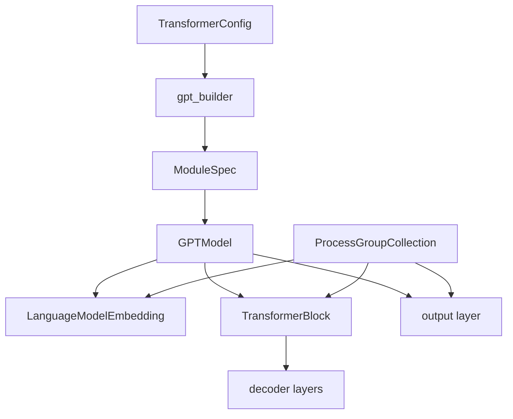

# M01 设计

- 文档目的：说明 Core 模型的组合设计和边界。
- 适用范围：GPT/Transformer 主路径。
- 对应源码版本：`8190837c2b6ce176a431bc2a6ffd3439507648a7`
- 证据状态：部分推断
- 最后更新：2026-09-10
- 前置阅读：[M01 README](README.md)
- 后续阅读：[M01 实现](implementation.md)

## 结论摘要

模型实现把“结构配置”“层实现规格”“通信上下文”和“运行时输入”分开：配置决定维度和特性，ModuleSpec 决定本地/TE/MoE/实验层，`ProcessGroupCollection` 决定通信组，forward 只消费已准备好的 tensors。这支持同一 GPT 外壳适配多种后端，但配置组合和动态 kernel 选择带来较高验证成本。

## 内部分层

`gpt_builder` 的分支在 [gpt_builders.py:31-54]；GPTModel 的子模块创建在 [gpt_model.py:175-242,256-279]；通信组传递在 [gpt_model.py:176-196,234-242]。节点是实际类/函数，箭头表示构造或注入。

## 核心取舍

- **组合而非继承爆炸**：规格对象把层选择外置；收益是扩展 backend，代价是 spec 与 config 的契约必须同步。
- **显式通信上下文**：新模型构造接受 `pg_collection`；收益是可测试/多网格，旧 global MPU 仍存在兼容成本。
- **模型不拥有训练调度**：schedule 可换；代价是 model output、loss callback、pipeline stage 契约严格。
- **deprecated GPTModel 仍可用**：代码显式发出弃用警告，迁移目标是 HybridModel。[gpt_model.py:123-128]

## 资源与并发

参数由 PyTorch module 注册；GPU tensor/activation 的生命周期受 autograd、CUDA graph、pipeline offload 影响。M01 本身不创建 worker thread；并行 collective 和 microbatch 上下文由 M02 调用。

## 修改影响

改变 config 字段可能影响 argument parser、YAML、builder spec、checkpoint key 和模型测试；改变 constructor 或 forward 契约会影响 `pretrain_gpt.py`、inference wrapper、pipeline schedule 和 checkpoint interop。

## 相关文档

- [实现](implementation.md)
- [跨模块接口](../../90-cross-module/interface-contracts.md)

## 源码证据摘要

见图及正文。

## 未解决问题

尚未建立所有 ModuleSpec 分支到具体 TE/local layer 的穷举矩阵。

## 下一步阅读建议

读 `gpt_builders.py` 分支后进入 `TransformerBlock.forward`。
