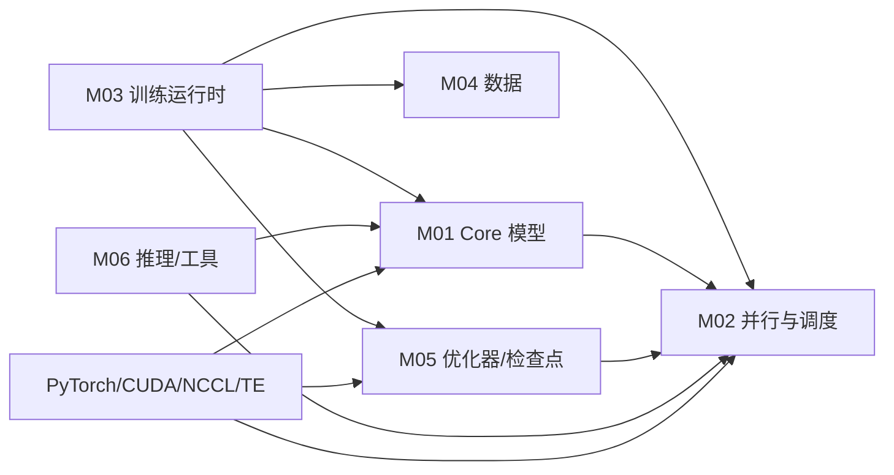

# 模块注册表

- 文档目的：登记稳定模块 ID、边界和证据。
- 适用范围：GPT 主路径及仓库主要能力。
- 对应源码版本：`main@3703d4e33a3a2b2d11ebcc8e41f45af7ce7d1eda`
- 证据状态：首版静态分析已补齐；动态验证未完成。
- 最后更新：2026-09-11
- 前置阅读：[项目入口](../README.md)。
- 后续阅读：[分析状态](../00-overview/analysis-state.md)。
## 结论摘要

本页聚焦 01-modules/module-registry.md；具体事实以正文引用的目标源码版本为准，未执行的构建、运行和硬件行为保持未验证。

| ID | 模块名称 | 源码边界 | 入口 | 依赖/被依赖 | 数据边界 | 生命周期 | 测试边界 | 风险 |
|---|---|---|---|---|---|---|---|---|
| M01 | Core 模型装配与执行 | `megatron/core/models`, `transformer` | `GPTModel`, `TransformerBlock` | M02/M04；被 M03/M05/M06 用 | token/hidden/logits | config→modules→state dict | `tests/unit_tests/models` | 高 |
| M02 | 并行拓扑与 pipeline 调度 | `parallel_state.py`, `pipeline_parallel` | `initialize_model_parallel`, `get_forward_backward_func` | PyTorch distributed；被 M01/M03/M05 | ranks/groups/microbatches | PG init→collectives→destroy | `test_parallel_state`, pipeline tests | 高 |
| M03 | 训练运行时 | `megatron/training` | `initialize_megatron`, `pretrain`, `train_step`, `train` | M01/M02/M04/M05 | args/config/iter/loss | job init→iterations→save/exit | `tests/unit_tests/training` | 高 |
| M04 | 数据集与 tokenization | `megatron/core/datasets`, `training/datasets` | dataset builders, `get_batch` | tokenizer/filesystem；被 M03 | sample→batch tensors | build→iterate→release | `tests/unit_tests/data` | 中 |
| M05 | 优化器与分布式 checkpoint | `core/optimizer`, `dist_checkpointing`, `training/checkpointing.py` | optimizer factory, `save/load` | M02/model state；被 M03 | params/grads/shards | create→step→save/load | optimizer/checkpoint tests | 高 |
| M06 | 推理与工具 | `core/inference`, `tools`, `examples/inference` | inference engines/server/CLI | M01/M02 + optional deps | request/KV cache/output | server init→request→stream→close | inference tests | 高 |

## 模块依赖图

箭头代表源码调用或运行时依赖，不表示所有文件直接 import。M04 的文件格式和 tokenizer 是外部输入；M06 的服务还依赖网络/进程环境。

## 深度审计

| 分析对象 | 入口落地 | 正常路径 | 分支 | 异常 | 清理 | 数据生命周期 | 执行上下文 | 行级证据 | Demo 映射 | 状态/缺口 |
|---|---|---|---|---|---|---|---|---|---|---|
| M01-M06 | 已完成 | 部分完成 | 部分完成 | 部分完成 | 部分完成 | 部分完成 | 部分完成 | 部分完成 | D01 覆盖 M01-M05 | 部分完成：M06 无 D01 覆盖；动态验证不足 |

## 相关文档

- [根入口](../README.md)
- [总架构](../00-overview/architecture.md)
- [分析状态](../00-overview/analysis-state.md)

## 源码证据摘要

`README.md:65-87`; `gpt_builders.py:24-110`; `parallel_state.py:600-1029`; `schedules.py:53-928`; `training.py:1530+`; `gpt_dataset.py:264+`; `dynamic_engine.py:292+`。

## 未解决问题

M06 内部 dynamic batching、跨进程通信和服务部署应在专门版本/硬件上继续核验。

## 下一步阅读建议
先阅读 [分析状态](../00-overview/analysis-state.md)，再沿本页已有链接进入对应模块、Demo 或跨模块流程。
