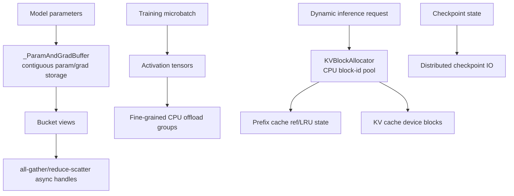

# 池化与资源管理专题

- 文档目的：解释 Megatron-LM 训练与推理中参数/梯度 bucket、KV block、激活 offload、通信 buffer 和 checkpoint 资源的所有权与生命周期。
- 适用范围：当前 checkout `3703d4e33a3a2b2d11ebcc8e41f45af7ce7d1eda`。
- 对应源码版本：`main` / `3703d4e33`。
- 证据状态：静态源码已确认；GPU/NCCL、多节点、真实 checkpoint round-trip 未验证。
- 最后更新：2026-09-14
- 前置阅读：[M02 并行与调度](../01-modules/M02-parallelism/README.md)、[M03 训练运行时](../01-modules/M03-training-runtime/README.md)
- 后续阅读：[M05 优化器与检查点](../01-modules/M05-optimizer-checkpointing/README.md)、[D01 Demo](../80-demos/D01-simple-mcore-training/README.md)

## 结论摘要

Megatron 的“池化”主要是把同一生命周期、同一 dtype 的对象拼成连续 buffer，再以 bucket/index view 复用，而不是为所有 tensor 建立一个通用 allocator：

- 训练 DDP 将参数和梯度放入 `_ParamAndGradBuffer` 的 contiguous `param_data/grad_data`，bucket 只是 view 和通信边界；
- 推理 `KVBlockAllocator` 管理 CPU 侧 block id 池，prefix caching 时用 ref count + LRU 把释放 block 留作可复用 cache；
- activation offload 通过 CPU pinned storage、stream/event 和 group 记录在 GPU/CPU 间转移；
- CUDA Graph 用专用 graph memory pool、静态 tensor 和捕获/replay stream 保持地址稳定；NCCL `MemPool` 则是通信注册资源，二者不可混同；
- scheduler/checkpoint 负责在 microbatch、迭代和 rank 间传递临时 tensor 与持久化 state。

## 资源层次图

## 1. 参数/梯度 contiguous buffer

`_ParamAndGradBuffer` 根据参数布局和 bucket size 计算全局 `numel`、bucket offsets 与 padding，再创建 contiguous `param_data`、`grad_data`。distributed optimizer 要求 buffer 大小可被 DP world size 整除；NVFP4 还为 packed param 和 full-size grad 维护两套 index map。[source/megatron-lm/megatron/core/distributed/param_and_grad_buffer.py:1051-1175]

当启用 NCCL user buffer 时，buffer 在 `nccl_mem_pool` 上分配，并用 barrier + warmup all-reduce 初始化 communicator；MXFP8 路径可让参数 all-gather 临时复用同一 `shared_buffer` 的 grad storage，避免第二份 GPU allocation。[source/megatron-lm/megatron/core/distributed/param_and_grad_buffer.py:1182-1226]

每个参数的 `.data`/`.main_grad` 被映射成 bucket 内的 view。`reset()` 只把 grad buffer 清零，不释放 storage；因此“清梯度”和“回收显存”是两个不同动作。[source/megatron-lm/megatron/core/distributed/param_and_grad_buffer.py:1243-1270] [source/megatron-lm/megatron/core/distributed/param_and_grad_buffer.py:1663-1669]

## 2. 异步通信 buffer 生命周期

`start_param_sync/start_grad_sync` 可返回异步 gather/reduce handle；后续 `finish_*_sync` 必须 wait handle 后才能把 bucket view 当作已完成数据。梯度同步前还会等待 CUDA Graph 产生的 wgrad-ready event，防止 autograd hook 与通信同时读写同一 storage。[source/megatron-lm/megatron/core/distributed/param_and_grad_buffer.py:646-700] [source/megatron-lm/megatron/core/distributed/param_and_grad_buffer.py:584-644]

DDP 的 `free_overlap_buffers()` 只释放参数 gather 的临时重叠 buffer；`zero_grad_buffer()` 复位逻辑 buffer；`offload_grad_buffers()` 则先 synchronize，再把 grad storage resize 为 0，可选 `torch.cuda.empty_cache()`，随后 `restore_grad_buffers()` 重新扩容并清零。[source/megatron-lm/megatron/core/distributed/distributed_data_parallel.py:697-721] [source/megatron-lm/megatron/core/distributed/distributed_data_parallel.py:740-775]

## 3. 推理 KV block pool

`KVBlockAllocator` 在 CPU 上创建 `block_bag`，`pool_size-1` 个 block 可用，最后一个 dummy block 永不分配。无 prefix cache 时，allocate 从 bag 尾部取 id，release 直接放回；启用 prefix cache 后，每个 block 维护 ref count、hash、timestamp 和 parent/child 链。[source/megatron-lm/megatron/core/inference/contexts/kv_block_allocator.py:17-103] [source/megatron-lm/megatron/core/inference/contexts/kv_block_allocator.py:105-151]

分配不足时，LRU 策略可以先淘汰 ref=0 且为叶子的缓存块；REF_ZERO 策略没有 eviction 路径，直接返回 None。新分配 block 的 ref count 初始化为 1，并清掉旧的 MoE routing data。[source/megatron-lm/megatron/core/inference/contexts/kv_block_allocator.py:153-214]

释放使用 `torch.unique(..., return_counts=True)` 一次性扣减引用。ref 归零的 REF_ZERO block 立即 deregister；LRU 下无 hash 的 partial block 直接回到 free bag，而已注册 block 保留在 prefix cache 等待 LRU eviction。[source/megatron-lm/megatron/core/inference/contexts/kv_block_allocator.py:216-258]

动态上下文在请求结束/淘汰时读取 `request_to_kv_block_ids`，调用 allocator release，并将 request 行重置为 -1；hybrid 模型还要同步释放 Mamba slots 和中间 offset，不能只释放 KV id。[source/megatron-lm/megatron/core/inference/contexts/dynamic_context.py:3717-3745] [source/megatron-lm/megatron/core/inference/contexts/dynamic_context.py:4213-4237]

## 4. Activation offload

Fine-grained activation offload 把可管理 tensor 按 group 记录；`tensor_pop` 遇到 CPU tuple 时重新加载，`bulk_offload_group` 在独立 D2H stream 上执行 offload，并通过 `record_stream`、offload event 和 max-inflight 队列维护 storage 的异步生命周期。[source/megatron-lm/megatron/core/pipeline_parallel/fine_grained_activation_offload.py:1063-1074] [source/megatron-lm/megatron/core/pipeline_parallel/fine_grained_activation_offload.py:1093-1138]

该机制报告重复 storage copy，因为同一底层 storage 的多个 view 可能被重复搬到 CPU；重复并不自动消除，只记录 warning 并继续执行。开启 offload 时必须同步检查 CUDA Graph scope、D2H stream 和 backward reload 顺序。[source/megatron-lm/megatron/core/pipeline_parallel/fine_grained_activation_offload.py:60-106]

## 5. Checkpoint 与临时资源

训练迭代中的参数、grad、optimizer state 和 RNG state 以 sharded state dict 进入 distributed checkpoint；checkpoint 目录和 tracker 文件是持久化资源，不是可随意覆盖的临时 buffer。当前源码通过 `load_checkpoint`/`save_checkpoint` 选择 iteration/release、rank shard 和 optimizer 恢复路径；真实 IO、并发写和失败回滚需要环境验证。[source/megatron-lm/megatron/training/checkpointing.py:626-728] [source/megatron-lm/megatron/training/checkpointing.py:2520-2605]

## 6. CUDA Graph 与 NCCL memory pool

Full-iteration 和 optimizer wrapper 可共享 process-wide `graph_pool_handle` 与 capture stream；module-level runner 还维护 graph boundary tensor metadata、reuse count、saved-for-backward 强引用和集中 `delete_cuda_graphs()`。NCCL pluggable `MemPool` 使用整个 pool 级别的 process-group register/deregister，不属于 graph allocator。完整生命周期见 [CUDA Graph 与显存池](cuda-graph-resource-lifecycle.md)。

## 资源所有权表

| 对象 | Owner | 借用者 | 释放/复位 | 主要风险 |
|---|---|---|---|---|
| param/grad contiguous storage | DDP buffer | Parameter/bucket view、collective | process/model teardown；offload 可 resize | view 在 storage=0 时被访问 |
| overlap gather buffer | bucket group | async AG handle | `free_overlap_buffers` 后 wait 完成 | handle 未完成就释放 |
| KV block id | KVBlockAllocator | request/prefix cache | release/de-register/LRU | ref count 负数、partial block 泄漏 |
| device KV block data | inference context/backend | attention | block id 回收后可重写 | stale request mapping |
| activation CPU copy | offload group | backward reload | group pop/iteration end | D2H 未完成、重复 copy |
| CUDA Graph pool/static buffer | wrapper/runner global state | capture/replay | delete/reset/进程退出 | 地址稳定性、长期驻留、side-stream 未 join |
| NCCL `MemPool` | allocator context | DDP/FSDP/collective | group deregister/register + pool owner | 重复/部分注册、snapshot 状态 |
| checkpoint shard | rank/Distributed checkpoint | save/load pipeline | 文件系统完成后保留 | 并发覆盖、恢复不一致 |

## 失败路径和验证建议

- DDP bucket allocation 失败：验证 DP world size 整除、padding/index map 和 NCCL pool 初始化；不要把 OOM 当作单一 param tensor 问题。
- 异步 gather/reduce：在测试中强制 `finish_*_sync`、CUDA event wait 和异常退出，确认 handle 不再引用已 offload storage。
- KV block 不足：分别覆盖 REF_ZERO 返回 None、LRU eviction 成功和所有块被 pin 的失败路径。
- 请求结束：检查 KV blocks、Mamba slots、routing metadata 和 request rows 是否全部清理。
- Activation offload：用固定 microbatch 统计 offload bytes、重复 storage warning 和 reload 后梯度一致性。
- Checkpoint：使用临时目录做 save/load round-trip；禁止在未确认路径上执行递归删除。
- CUDA Graph：分别覆盖 single/multi pool、training/validation static buffer、argument mismatch、delete/reset、capture fault 和 GTP side-stream join。
- NCCL pool：覆盖 empty/non-empty snapshot、单/多 process group、symmetric 参数降级及部分注册失败。

## 设计取舍与风险

| 取舍/风险 | 影响 | 控制方法 |
|---|---|---|
| contiguous bucket | 减少 collective 数量、改善通信重叠；padding/布局复杂 | 维护 bucket index map，修改参数注册时更新布局测试 |
| buffer storage resize(0) | 快速释放 GPU grad 内存且保留 view 对象 | offload 期间禁止访问 view；restore 后再继续计算 |
| KV prefix cache 保留 ref=0 block | 命中前缀可低成本复用；峰值内存长期驻留 | 选择 eviction policy，监控 allocatable/evictable |
| activation D2H 异步 | 降低峰值 GPU 内存；增加 stream/event 依赖 | 显式 record_stream、event wait 和重复 storage 统计 |
| 多种模型/并行路径 | 资源边界可组合；动态目标难静态证明 | 按 TP/PP/DP/EP、MoE、hybrid、speculative 分矩阵验证 |

## 相关文档

- [M02 并行与调度](../01-modules/M02-parallelism/README.md)
- [M03 训练运行时](../01-modules/M03-training-runtime/README.md)
- [M05 优化器与检查点](../01-modules/M05-optimizer-checkpointing/README.md)
- [M06 推理与工具](../01-modules/M06-inference-and-tools/README.md)
- [跨模块系统串联](system-wiring.md)
- [CUDA Graph 与显存池](cuda-graph-resource-lifecycle.md)

## 源码证据摘要

训练 buffer：[source/megatron-lm/megatron/core/distributed/param_and_grad_buffer.py:1051-1270,1630-1701]；DDP offload：[source/megatron-lm/megatron/core/distributed/distributed_data_parallel.py:697-775]；KV block：[source/megatron-lm/megatron/core/inference/contexts/kv_block_allocator.py:17-258]；动态上下文释放：[source/megatron-lm/megatron/core/inference/contexts/dynamic_context.py:3717-3745,4213-4237]；activation offload：[source/megatron-lm/megatron/core/pipeline_parallel/fine_grained_activation_offload.py:60-1138]；Graph pool：[source/megatron-lm/megatron/core/full_cuda_graph.py:14-267]、[source/megatron-lm/megatron/core/transformer/cuda_graphs.py:280-347,613-808]；NCCL pool：[source/megatron-lm/megatron/core/nccl_allocator.py:111-364]。

## 未解决问题

- NCCL user buffer、CUDA Graph、TP/PP/EP 多卡下的真实 buffer 峰值和事件顺序未验证；full graph 静态 buffer/共享 pool 的进程级清理仍需显存快照确认。
- KV block prefix cache 的动态 hash/eviction 与 disaggregation handoff 仍需端到端运行。
- checkpoint 失败、恢复和跨版本 state dict 兼容性需要临时目录实验。

## 下一步阅读建议

训练读 `_ParamAndGradBuffer` 的 layout→bucket→sync；推理读 `KVBlockAllocator` 的 allocate→retain/release→evict，再对照 D01 的 checkpoint 阶段。
