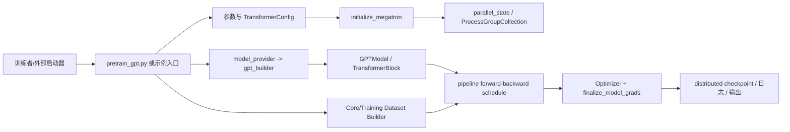

# Megatron-LM 项目理解知识库

- 文档目的：为没有参与过项目的开发者提供可追溯的架构、实现、运行、调试和扩展地图。
- 适用范围：当前工作树中的 Megatron-LM 与 Megatron Core 源码。
- 对应源码版本：`main`，提交 `3703d4e33a3a2b2d11ebcc8e41f45af7ce7d1eda`。
- 证据状态：总览已完成；M01-M06、Demo 和跨模块文档已完成首版静态分析，动态验证仍待完成，详见 [分析状态](00-overview/analysis-state.md)。
- 最后更新：2026-09-11
- 前置阅读：[项目入口](README.md)。
- 后续阅读：[分析状态](00-overview/analysis-state.md)。
## 结论摘要

本页聚焦 README.md；具体事实以正文引用的目标源码版本为准，未执行的构建、运行和硬件行为保持未验证。

## 项目一句话介绍

Megatron-LM 是 NVIDIA 面向大规模 Transformer 训练的参考实现与基础库；Megatron Core 将模型、并行、数据、优化器、分布式检查点和推理能力拆成可组合的 GPU 优化组件。[README.md:15-21]

## 5 分钟快速理解

外部入口（如 `pretrain_gpt.py` 或示例脚本）读取参数，创建配置与数据集，调用初始化逻辑建立 CUDA/NCCL 与 TP/PP/DP/CP/EP 等进程组；模型 provider/builder 选择模块规格并创建 Core 模型；训练运行时通过 pipeline schedule 驱动 microbatch 的前向/反向，随后完成梯度同步、优化器更新、日志与检查点。[pretrain_gpt.py:33-80] [megatron/training/initialize.py:48-176] [megatron/core/pipeline_parallel/schedules.py:53-168]



图示证据：入口和 builder 见 [pretrain_gpt.py:33-80]、[gpt_builders.py:24-110]；初始化见 [megatron/training/initialize.py:113-176]；调度选择见 [megatron/core/pipeline_parallel/schedules.py:53-168]。箭头表示控制调用或数据传递；进程组和底层 CUDA/NCCL 的确切运行时行为依赖硬件与启动参数，静态证据之外标为推断。

## 知识库导航

### 总览层

- [项目定位](00-overview/project-overview.md)
- [总体架构](00-overview/architecture.md)
- [设计原则与取舍](00-overview/design-principles.md)
- [运行时模型](00-overview/runtime-model.md)
- [全局数据流](00-overview/global-data-flow.md)
- [依赖地图](00-overview/dependency-map.md)
- [构建、运行与部署](00-overview/build-and-deploy.md)
- [全局错误模型](00-overview/global-error-model.md)
- [术语表](00-overview/glossary.md)
- [源码证据索引](00-overview/evidence-index.md)
- [决策记录](00-overview/decision-log.md)
- [分析状态](00-overview/analysis-state.md)

### 模块层

- [模块注册表](01-modules/module-registry.md)
- [M01 Core 模型](01-modules/M01-core-models/README.md)
- [M02 并行状态与调度](01-modules/M02-parallelism/README.md)
- [M03 训练运行时](01-modules/M03-training-runtime/README.md)
- [M04 数据管线](01-modules/M04-data-pipeline/README.md)
- [M05 优化器与检查点](01-modules/M05-optimizer-checkpointing/README.md)
- [M06 推理与工具](01-modules/M06-inference-and-tools/README.md)

### Demo 层

- [Demo 注册表](80-demos/demo-registry.md)
- [D01 最小 Core GPT 训练](80-demos/D01-simple-mcore-training/README.md)

### 关联层

- [系统串联](90-cross-module/system-wiring.md)
- [接口契约](90-cross-module/interface-contracts.md)
- [运行时轨迹](90-cross-module/runtime-trace.md)
- [端到端流程](90-cross-module/end-to-end-flows.md)
- [跨模块调用链](90-cross-module/cross-module-call-chains.md)
- [共享数据与类型](90-cross-module/shared-data-and-types.md)
- [配置影响图](90-cross-module/configuration-impact-map.md)
- [错误边界](90-cross-module/error-boundaries.md)
- [修改影响图](90-cross-module/change-impact-map.md)
- [性能关键路径](90-cross-module/performance-critical-paths.md)
- [池化与资源管理专题](90-cross-module/pooling-and-resource-management.md)
- [CUDA Graph 与显存池生命周期](90-cross-module/cuda-graph-resource-lifecycle.md)

### 分级面试题库

- [QA 总入口](99-roadmap/qa.md)
- [入门级 100 题](99-roadmap/qa-beginner.md)
- [中级 100 题](99-roadmap/qa-intermediate.md)
- [高级 100 题](99-roadmap/qa-advanced.md)
- [专家级 100 题](99-roadmap/qa-expert.md)

### 实践层

- [快速上手](99-roadmap/quick-start.md)
- [阅读路线](99-roadmap/reading-guide.md)
- [调试指南](99-roadmap/debugging-guide.md)
- [功能开发配方](99-roadmap/feature-development-recipes.md)
- [测试配方](99-roadmap/testing-recipes.md)
- [性能指南](99-roadmap/performance-guide.md)
- [风险登记](99-roadmap/risk-register.md)
- [技术债务](99-roadmap/technical-debt.md)
- [后续路线](99-roadmap/next-steps.md)

## 模块摘要

| ID | 模块 | 一句话职责 | 状态 |
|---|---|---|---|
| M01 | Core 模型 | 用配置和 ModuleSpec 组装 GPT/Hybrid/Mamba 等模型 | 首版完成，待深挖 |
| M02 | 并行性 | 创建并维护 TP、PP、DP、CP、EP 等通信拓扑与 pipeline 调度 | 首版完成，待实测 |
| M03 | 训练运行时 | 初始化作业、驱动迭代、同步梯度、记录与保存 | 首版完成，待专项验证 |
| M04 | 数据管线 | 构建 tokenizer、mock/真实数据集并形成 microbatch | 首版完成，待真实数据验证 |
| M05 | 优化器与检查点 | 更新参数并以 sharded state dict 保存/恢复模型 | 首版完成，待 round-trip |
| M06 | 推理与工具 | 提供推理引擎、服务入口、转换和数据预处理工具 | 首版完成，待运行验证 |

## 三条最重要的端到端流程

1. **最小训练**：`D01` 初始化分布式环境 → 构造 mock GPT 数据 → forward/backward schedule → 梯度 finalize → Adam 更新 → 分布式检查点。[examples/run_simple_mcore_train_loop.py:28-283]
2. **正式 GPT 预训练**：`pretrain_gpt.py` → `pretrain` → `initialize_megatron` → `model_provider/gpt_builder` → dataset builder → training loop；完整参数和数据要求见 `docs/get-started/quickstart.md` 与 `docs/user-guide/training-examples.md`。
3. **并行拓扑建立**：`initialize_model_parallel` 根据 TP/PP/CP/EP 与 order 生成 RankGenerator 和多个 process group；测试直接验证 group ranks 和 destroy 行为。[megatron/core/parallel_state.py:232-260] [tests/unit_tests/test_parallel_state.py:57-101]

## 主 Demo

主 Demo 选择仓库自带的最小训练程序，因为它使用真实 Core API、包含输入构造、训练、梯度同步、checkpoint 保存和加载，且不需要外部数据集。当前仅完成静态源码分析，未在本环境执行 GPU 命令：[D01 README](80-demos/D01-simple-mcore-training/README.md)。

## Demo—模块—源码覆盖矩阵

| Demo 阶段 | 模块 | 入口/实现 | 证据 |
|---|---|---|---|
| 分布式初始化 | M02 | `initialize_distributed` → `parallel_state.initialize_model_parallel` | [examples/run_simple_mcore_train_loop.py:28-53] |
| 模型创建 | M01 | `model_provider` → `GPTModel.__init__` | [examples/run_simple_mcore_train_loop.py:56-78] [megatron/core/models/gpt/gpt_model.py:98-130] |
| 数据创建 | M04 | `get_train_data_iterator` → `BlendedMegatronDatasetBuilder.build` | [examples/run_simple_mcore_train_loop.py:81-120] |
| 前后向 | M02/M03 | `get_forward_backward_func` → `forward_backward_func` | [examples/run_simple_mcore_train_loop.py:246-261] [megatron/core/pipeline_parallel/schedules.py:53-168] |
| 参数更新 | M05 | `finalize_model_grads` → `Adam.step` | [examples/run_simple_mcore_train_loop.py:263-268] |
| 检查点 | M05 | `save_distributed_checkpoint` / `load_distributed_checkpoint` | [examples/run_simple_mcore_train_loop.py:168-217] |

## 构建和运行入口

默认开发应在 CI 容器中完成，安装锁定依赖：

```bash
uv sync --locked --group dev --group test
uv sync --locked --only-group linting
uv pip install --no-build-isolation -e "[training,dev]"
```

最小 Demo 命令（需要两张 CUDA GPU，当前未验证）：

```bash
torchrun --nproc_per_node=2 examples/run_simple_mcore_train_loop.py
```

格式化检查：

```bash
BASE_REF=main CHECK_ONLY=true SKIP_DOCS=false bash tools/autoformat.sh
```

## 按角色推荐阅读

- 初学者：本页 → [项目定位](00-overview/project-overview.md) → [运行时模型](00-overview/runtime-model.md) → D01。
- Core/模型开发者：架构 → M01 → M02 → M03 → 对应 unit tests。
- 数据/训练开发者：M04 → M03 → M05 → `pretrain_gpt.py`。
- 调试/性能开发者：运行时轨迹 → [调试指南](99-roadmap/debugging-guide.md) → [性能关键路径](90-cross-module/performance-critical-paths.md)。

## 文档状态与未解决问题

当前文档已完成仓库盘点、模块划分、总览、M01-M06 首版静态分析、D01 轨迹、跨模块地图和实践路线；M01 backend、复杂并行/异步路径、完整资源清理以及实际 GPU/NCCL/推理验证仍待继续，具体缺口见 [analysis-state.md](00-overview/analysis-state.md)。

## 文档元数据（规范补充）

- 文档目的：说明 `README.md` 的源码分析范围、结论和维护入口。
- 适用范围：当前项目对应模块/入口的静态源码与测试分析。
- 对应源码版本：以本项目 `00-overview/analysis-state.md` 或同页版本字段为准。
- 证据状态：静态源码证据；未执行的构建、测试、GPU、网络或多进程行为保持“未验证”。
- 最后更新：2026-09-15
- 前置阅读：本项目根 README 与 `00-overview/analysis-state.md`。
- 后续阅读：本模块/示例的实现、测试和风险页面。

## 全文档索引

### 00-overview
- [00-overview/analysis-state.md](00-overview/analysis-state.md)
- [00-overview/architecture.md](00-overview/architecture.md)
- [00-overview/build-and-deploy.md](00-overview/build-and-deploy.md)
- [00-overview/decision-log.md](00-overview/decision-log.md)
- [00-overview/dependency-map.md](00-overview/dependency-map.md)
- [00-overview/design-principles.md](00-overview/design-principles.md)
- [00-overview/evidence-index.md](00-overview/evidence-index.md)
- [00-overview/global-data-flow.md](00-overview/global-data-flow.md)
- [00-overview/global-error-model.md](00-overview/global-error-model.md)
- [00-overview/glossary.md](00-overview/glossary.md)
- [00-overview/project-overview.md](00-overview/project-overview.md)
- [00-overview/runtime-model.md](00-overview/runtime-model.md)

### 01-modules
- [01-modules/M01-core-models/README.md](01-modules/M01-core-models/README.md)
- [01-modules/M01-core-models/call-chains.md](01-modules/M01-core-models/call-chains.md)
- [01-modules/M01-core-models/data-structures.md](01-modules/M01-core-models/data-structures.md)
- [01-modules/M01-core-models/design.md](01-modules/M01-core-models/design.md)
- [01-modules/M01-core-models/development-guide.md](01-modules/M01-core-models/development-guide.md)
- [01-modules/M01-core-models/diagrams.md](01-modules/M01-core-models/diagrams.md)
- [01-modules/M01-core-models/examples.md](01-modules/M01-core-models/examples.md)
- [01-modules/M01-core-models/execution-flows.md](01-modules/M01-core-models/execution-flows.md)
- [01-modules/M01-core-models/implementation.md](01-modules/M01-core-models/implementation.md)
- [01-modules/M01-core-models/interfaces.md](01-modules/M01-core-models/interfaces.md)
- [01-modules/M01-core-models/line-level-analysis.md](01-modules/M01-core-models/line-level-analysis.md)
- [01-modules/M01-core-models/risks-and-debt.md](01-modules/M01-core-models/risks-and-debt.md)
- [01-modules/M01-core-models/source-map.md](01-modules/M01-core-models/source-map.md)
- [01-modules/M01-core-models/testing.md](01-modules/M01-core-models/testing.md)
- [01-modules/M02-parallelism/README.md](01-modules/M02-parallelism/README.md)
- [01-modules/M02-parallelism/data-structures.md](01-modules/M02-parallelism/data-structures.md)
- [01-modules/M02-parallelism/design.md](01-modules/M02-parallelism/design.md)
- [01-modules/M02-parallelism/execution-flows.md](01-modules/M02-parallelism/execution-flows.md)
- [01-modules/M02-parallelism/implementation.md](01-modules/M02-parallelism/implementation.md)
- [01-modules/M02-parallelism/interfaces.md](01-modules/M02-parallelism/interfaces.md)
- [01-modules/M02-parallelism/source-map.md](01-modules/M02-parallelism/source-map.md)
- [01-modules/M03-training-runtime/README.md](01-modules/M03-training-runtime/README.md)
- [01-modules/M03-training-runtime/call-chains.md](01-modules/M03-training-runtime/call-chains.md)
- [01-modules/M03-training-runtime/data-structures.md](01-modules/M03-training-runtime/data-structures.md)
- [01-modules/M03-training-runtime/execution-flows.md](01-modules/M03-training-runtime/execution-flows.md)
- [01-modules/M03-training-runtime/implementation.md](01-modules/M03-training-runtime/implementation.md)
- [01-modules/M03-training-runtime/interfaces.md](01-modules/M03-training-runtime/interfaces.md)
- [01-modules/M03-training-runtime/source-map.md](01-modules/M03-training-runtime/source-map.md)
- [01-modules/M04-data-pipeline/README.md](01-modules/M04-data-pipeline/README.md)
- [01-modules/M04-data-pipeline/implementation.md](01-modules/M04-data-pipeline/implementation.md)
- [01-modules/M04-data-pipeline/interfaces.md](01-modules/M04-data-pipeline/interfaces.md)
- [01-modules/M04-data-pipeline/source-map.md](01-modules/M04-data-pipeline/source-map.md)
- [01-modules/M05-optimizer-checkpointing/README.md](01-modules/M05-optimizer-checkpointing/README.md)
- [01-modules/M05-optimizer-checkpointing/execution-flows.md](01-modules/M05-optimizer-checkpointing/execution-flows.md)
- [01-modules/M05-optimizer-checkpointing/implementation.md](01-modules/M05-optimizer-checkpointing/implementation.md)
- [01-modules/M05-optimizer-checkpointing/source-map.md](01-modules/M05-optimizer-checkpointing/source-map.md)
- [01-modules/M06-inference-and-tools/README.md](01-modules/M06-inference-and-tools/README.md)
- [01-modules/M06-inference-and-tools/execution-flows.md](01-modules/M06-inference-and-tools/execution-flows.md)
- [01-modules/M06-inference-and-tools/implementation.md](01-modules/M06-inference-and-tools/implementation.md)
- [01-modules/M06-inference-and-tools/source-map.md](01-modules/M06-inference-and-tools/source-map.md)
- [01-modules/module-registry.md](01-modules/module-registry.md)

### 80-demos
- [80-demos/D01-simple-mcore-training/README.md](80-demos/D01-simple-mcore-training/README.md)
- [80-demos/D01-simple-mcore-training/build-and-run.md](80-demos/D01-simple-mcore-training/build-and-run.md)
- [80-demos/D01-simple-mcore-training/data-and-state-trace.md](80-demos/D01-simple-mcore-training/data-and-state-trace.md)
- [80-demos/D01-simple-mcore-training/debug-walkthrough.md](80-demos/D01-simple-mcore-training/debug-walkthrough.md)
- [80-demos/D01-simple-mcore-training/debugging-and-failures.md](80-demos/D01-simple-mcore-training/debugging-and-failures.md)
- [80-demos/D01-simple-mcore-training/execution-trace.md](80-demos/D01-simple-mcore-training/execution-trace.md)
- [80-demos/D01-simple-mcore-training/failure-paths.md](80-demos/D01-simple-mcore-training/failure-paths.md)
- [80-demos/D01-simple-mcore-training/modification-exercises.md](80-demos/D01-simple-mcore-training/modification-exercises.md)
- [80-demos/demo-registry.md](80-demos/demo-registry.md)

### 90-cross-module
- [90-cross-module/change-impact-map.md](90-cross-module/change-impact-map.md)
- [90-cross-module/configuration-impact-map.md](90-cross-module/configuration-impact-map.md)
- [90-cross-module/cross-module-call-chains.md](90-cross-module/cross-module-call-chains.md)
- [90-cross-module/cuda-graph-resource-lifecycle.md](90-cross-module/cuda-graph-resource-lifecycle.md)
- [90-cross-module/end-to-end-flows.md](90-cross-module/end-to-end-flows.md)
- [90-cross-module/error-boundaries.md](90-cross-module/error-boundaries.md)
- [90-cross-module/interface-contracts.md](90-cross-module/interface-contracts.md)
- [90-cross-module/performance-critical-paths.md](90-cross-module/performance-critical-paths.md)
- [90-cross-module/pooling-and-resource-management.md](90-cross-module/pooling-and-resource-management.md)
- [90-cross-module/runtime-trace.md](90-cross-module/runtime-trace.md)
- [90-cross-module/shared-data-and-types.md](90-cross-module/shared-data-and-types.md)
- [90-cross-module/system-wiring.md](90-cross-module/system-wiring.md)

### 99-roadmap
- [99-roadmap/README.md](99-roadmap/README.md)
- [99-roadmap/debugging-guide.md](99-roadmap/debugging-guide.md)
- [99-roadmap/feature-development-recipes.md](99-roadmap/feature-development-recipes.md)
- [99-roadmap/next-steps.md](99-roadmap/next-steps.md)
- [99-roadmap/performance-guide.md](99-roadmap/performance-guide.md)
- [99-roadmap/qa-advanced.md](99-roadmap/qa-advanced.md)
- [99-roadmap/qa-beginner.md](99-roadmap/qa-beginner.md)
- [99-roadmap/qa-expert.md](99-roadmap/qa-expert.md)
- [99-roadmap/qa-intermediate.md](99-roadmap/qa-intermediate.md)
- [99-roadmap/qa.md](99-roadmap/qa.md)
- [99-roadmap/quick-start.md](99-roadmap/quick-start.md)
- [99-roadmap/reading-guide.md](99-roadmap/reading-guide.md)
- [99-roadmap/risk-register.md](99-roadmap/risk-register.md)
- [99-roadmap/technical-debt.md](99-roadmap/technical-debt.md)
- [99-roadmap/testing-recipes.md](99-roadmap/testing-recipes.md)

## 深度审计

| 分析对象 | 入口落地 | 正常路径 | 分支 | 异常 | 清理 | 数据生命周期 | 执行上下文 | 行级证据 | Demo 映射 | 状态/缺口 |
|---|---|---|---|---|---|---|---|---|---|---|
| `README.md` | 已完成 | 部分完成 | 部分完成 | 部分完成 | 部分完成 | 部分完成 | 部分完成 | 部分完成 | 已映射或不适用 | 部分完成：动态行为、边界或专用变体仍需验证 |

## 相关文档

- 仓库 [README.md](../source/megatron-lm/README.md)
- [Megatron Core 官方文档](https://docs.nvidia.com/megatron-core/developer-guide/latest/)

## 源码证据摘要

关键证据统一登记在 [evidence-index.md](00-overview/evidence-index.md)。

## 未解决问题

硬件/容器是否可用、实际 NCCL 拓扑、所有可选 backend 的动态分派以及完整 functional-test 结果尚未在本工作树验证。

## 下一步阅读建议

先阅读 D01 的执行轨迹，再阅读 M02 的 process-group 与 schedule 实现，最后进入正式 GPT 训练入口。
