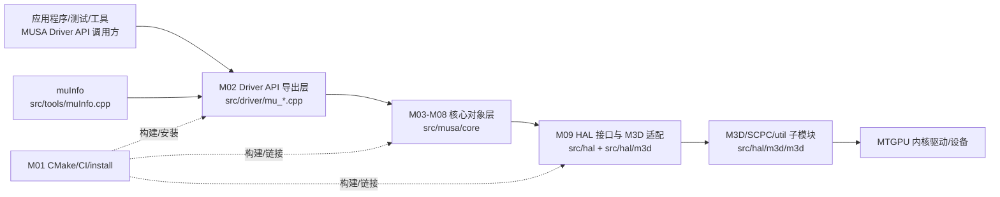
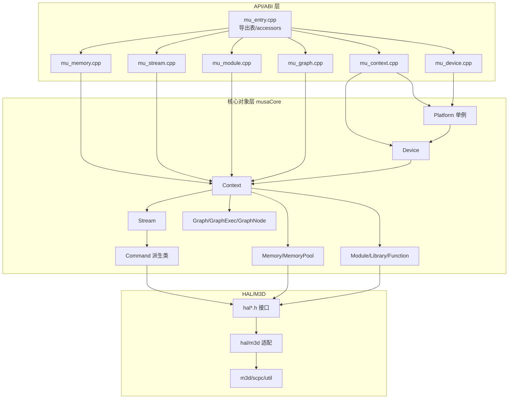
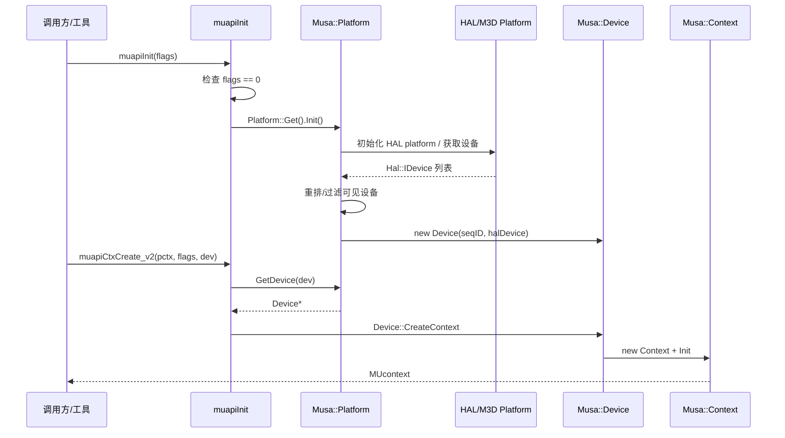
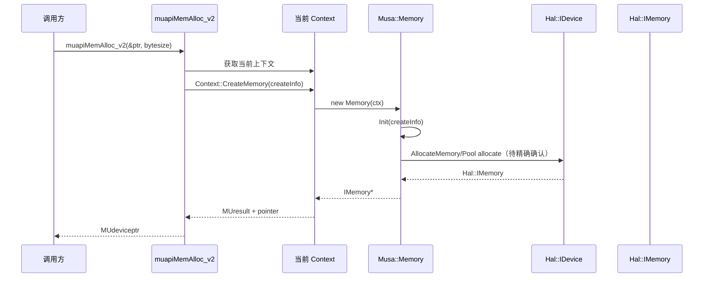
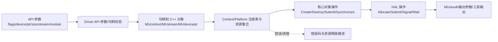
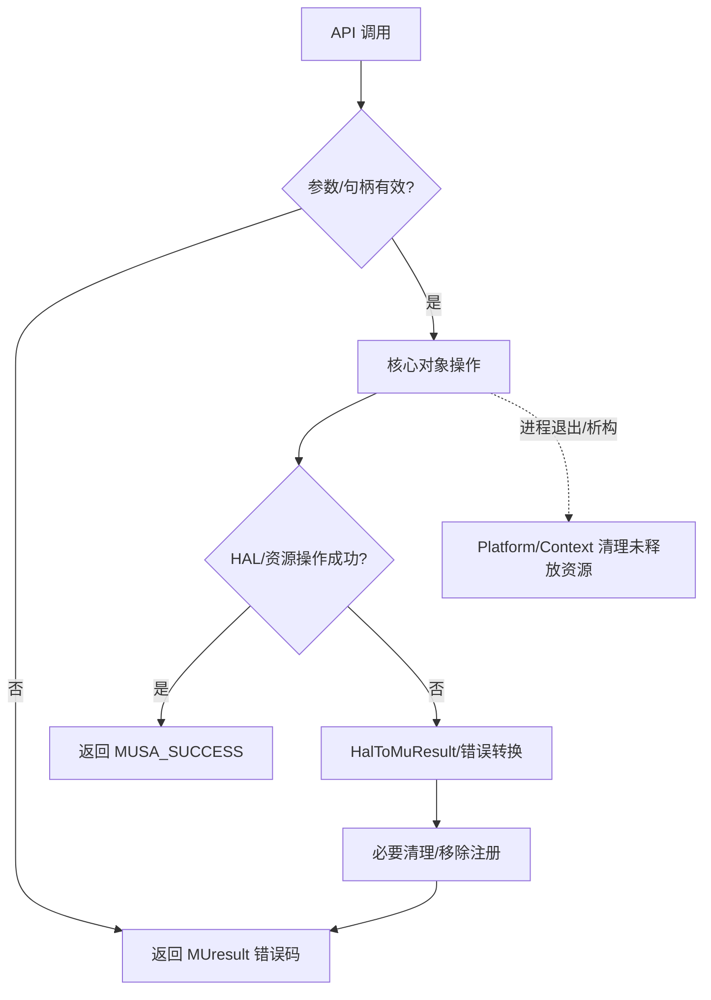

# 总体架构

- 文档目的：解释 MUSA Driver 的系统边界、分层架构、关键控制流/数据流、资源生命周期和首批架构判断。
- 适用范围：`/home/shanfeng/workspace/linux-ddk/musa` 当前 HEAD。
- 对应源码版本：`b8dce2b2f23849e8e99350c20d7eaac3c129caba`。
- 证据状态：部分推断
- 最后更新：2026-09-16
- 前置阅读：[`project-overview.md`](project-overview.md)
- 后续阅读：[`../01-modules/module-registry.md`](../01-modules/module-registry.md)、[`../90-cross-module/system-wiring.md`](../90-cross-module/system-wiring.md)

## 结论摘要

结论：MUSA Driver 采用典型 GPU 用户态驱动分层：C ABI/API 导出层负责兼容性和参数校验，核心对象层负责生命周期和调度，HAL/M3D 层负责底层资源和命令提交。  
状态：已确认 + 推断。  
证据：`driver` 生成共享库并链接 `musaCore` [src/driver/CMakeLists.txt:9-18]；`musaCore` 静态库聚合 core/command/node/graph/copyManager2 并链接 `halM3d` [src/musa/core/CMakeLists.txt:1-11]；`halM3d` 链接 M3D/SCPC/util [src/hal/m3d/CMakeLists.txt:36-59]。

结论：`Musa::Platform` 是进程内全局入口，初始化时发现 HAL 设备并创建 `Musa::Device`；`Musa::Context` 是设备资源的生命周期中心。  
状态：已确认。  
证据：`Platform::Get()` 返回静态单例 [src/musa/core/platform.cpp:13-18]；`Platform::Init()` 执行 HAL 初始化和设备创建 [src/musa/core/platform.cpp:84-140]；`Context::CreateMemory`/`DestroyMemory` 和 `CreateStream`/`DestroyStream` 管理资源 [src/musa/core/context.cpp:1037-1099]、[src/musa/core/context.cpp:1207-1247]。

## 1. 系统上下文图



节点说明：

| 节点 | 源码位置 | 状态 |
|---|---|---|
| 应用/工具 | `src/tools/muInfo.cpp`、`tests/*.cu` | 部分确认 |
| Driver API | `src/driver/mu_context.cpp`、`mu_memory.cpp`、`mu_module.cpp` 等 | 已确认 |
| 核心对象层 | `src/musa/core/*.cpp` | 已确认 |
| HAL/M3D | `src/hal/*.h`、`src/hal/m3d/*.cpp` | 已确认 |
| M3D 子模块 | `src/hal/m3d/m3d` | 已确认存在，未展开 |
| 内核驱动/设备 | CI 安装 `mtgpu` 并 `modprobe mtgpu` | 部分确认 |

箭头含义：实线表示运行时调用/数据传递，虚线表示构建/安装关系。

## 2. 总体架构图



核心理解：API 层不应直接持有底层硬件资源；它主要把 C 句柄转换为核心 C++ 对象。核心对象层维护对象关系、错误边界和同步语义。HAL/M3D 层承担硬件相关实现。

## 3. 模块依赖图

详见 [`../01-modules/module-registry.md`](../01-modules/module-registry.md)。构建依赖方向为：

```text
libmusa.so / M02 driver
  -> musaCore / M03-M08
    -> halM3d / M09
      -> m3d + scpc + util + OS libs
```

证据：`target_link_libraries(${target} PRIVATE musaCore)` [src/driver/CMakeLists.txt:17]；`target_link_libraries(musaCore PRIVATE halM3d)` [src/musa/core/CMakeLists.txt:11]；`target_link_libraries(halM3d PRIVATE ${M3D_LIBS} ... dl;pthread;rt)` [src/hal/m3d/CMakeLists.txt:56-59]。

## 4. 启动和关闭流程图



关闭/清理首批确认点：`Context::DestroyMemory` 删除内存并从 CriticalBase 移除 [src/musa/core/context.cpp:1089-1099]；`Platform::~Platform` 调用 `ReleaseUnfreedMemories` 与 `ReleaseDevResourceDescs` [src/musa/core/platform.cpp:478-506]。完整关闭状态机需后续深挖 `Context::Dispose`、`Device::~Device` 与 HAL 对象析构。

## 5. 核心请求时序图：设备内存分配



已确认链路：API 入口存在 [src/driver/mu_memory.cpp:271-320]；`Context::CreateMemory` 存在并负责创建 Memory [src/musa/core/context.cpp:1037-1066]；`Memory::Init` 与 `GeneralAlloc` 存在 [src/musa/core/memory.cpp:382-520]。未确认：`GeneralAlloc` 到 M3D 具体函数的完整落地链。

## 6. 全局数据流图



关键点：

- API 参数在 `src/driver/mu_*.cpp` 进入系统；
- 资源状态主要由 `Platform`、`Device::CriticalBase`、`Context::CriticalBase` 维护；
- 外部可见结果通过 `MUresult`、输出参数、`MUdeviceptr`、工具 stdout 返回；
- 资源错误需要沿原调用链向上转换为 `MUresult`。

## 7. 关键状态机图：Context 生命周期

```mermaid
stateDiagram-v2
    [*] --> Created: Device::CreateContext
    Created --> Initialized: Context::Init
    Initialized --> Active: Set current / API 使用
    Active --> Busy: Stream/Command/Memory/Module/Graph 操作
    Busy --> Active: Synchronize/Command complete
    Active --> Resetting: Context::Reset
    Resetting --> Active: LockedReset 完成
    Active --> Disposing: Release/Destroy/Detach
    Busy --> Disposing: 错误或进程清理
    Disposing --> Destroyed: Dispose + destructor
    Destroyed --> [*]
```

证据：`Device::CreateContext` [src/musa/core/device.cpp:593-635]；`Context::Context`、`Context::Init`、`Context::~Context`、`Context::Dispose` [src/musa/core/context.cpp:1875-1988]；`Context::Reset` [src/musa/core/context.cpp:932-944]。

## 8. 异常传播和恢复流程图



证据：多处 API 使用 `ValidateContext` 和空指针/设备数检查；`Platform::ValidateContext` [src/musa/core/platform.cpp:428]；`Platform::~Platform` 释放未释放 memory/resource desc [src/musa/core/platform.cpp:478-506]。错误码细节需后续 `mu_error.cpp` 与各 API 逐项深挖。

## 9. 设计思想与取舍（首批）

| 设计点 | 解决的问题 | 源码如何体现 | 收益 | 代价/风险 | 状态 |
|---|---|---|---|---|---|
| C API + C++ 对象实现 | 对外维持稳定 ABI，对内使用对象封装资源 | `muapi*` 调用 `Musa::Platform/Context/Memory` | ABI 兼容与实现组织分离 | 句柄转换和生命周期易出错 | 已确认 |
| 全局 Platform 单例 | 进程内设备发现和全局资源注册 | `Platform::Get()` 静态对象 | 简化访问、集中管理 | 全局状态、析构顺序风险 | 已确认 |
| Context 作为资源所有者 | 将设备相关资源绑定到上下文 | `Context::CriticalBase` 维护 stream/event/memory 等集合 | 边界清晰、便于验证句柄 | 锁和清理复杂 | 已确认 |
| HAL/M3D 分层 | 隔离硬件实现与 MUSA API | `musaCore -> halM3d -> m3d` | 可替换底层、集中平台差异 | 调用链长，错误转换复杂 | 已确认 |
| Command/Stream 异步模型 | 表达 GPU 异步执行、capture、依赖 | `Stream::Cmd*`、`Context::ResolveDependencyAndQueueCommand` | 支持默认流、异步和 graph | 并发与资源生命周期风险 | 部分确认 |

## 10. 稳定契约与实现细节

| 类型 | 内容 | 判断 |
|---|---|---|
| 稳定契约 | `muapi*` ABI、`MUresult`、`MUdevice`/`MUcontext`/`MUstream`/`MUdeviceptr` 句柄语义 | 对外接口，修改需极谨慎 |
| 稳定契约 | CMake 产物 `libmusa.so` 和安装路径 | 对 CI/部署敏感 |
| 实现细节 | `Musa::Context::CriticalBase` 内部集合、锁实现 | 可重构但需保持 API 行为 |
| 实现细节 | HAL/M3D wrapper 类名和封装细节 | 可随底层实现演进 |
| 实现细节 | `mu_wrappers_generated.cpp` 生成策略 | 对 ABI 导出重要，但需要进一步确认 |

## 相关文档

- [`project-overview.md`](project-overview.md)
- [`build-and-deploy.md`](build-and-deploy.md)
- [`../01-modules/module-registry.md`](../01-modules/module-registry.md)
- [`../90-cross-module/system-wiring.md`](../90-cross-module/system-wiring.md)

## 源码证据摘要

- 构建链：`driver -> musaCore -> halM3d -> m3d/scpc/util`：[src/driver/CMakeLists.txt:9-18]、[src/musa/core/CMakeLists.txt:1-11]、[src/hal/m3d/CMakeLists.txt:36-59]
- 初始化：`muapiInit`、`Platform::Init`：[src/driver/mu_context.cpp:121-133]、[src/musa/core/platform.cpp:84-140]
- Context 资源：`Context::CreateMemory`、`CreateStream`、生命周期：[src/musa/core/context.cpp:1037-1099]、[src/musa/core/context.cpp:1207-1247]、[src/musa/core/context.cpp:1875-1988]

## 未解决问题

1. `Hal::IPlatform`/`Hal::IDevice` 的具体实现选择和 M3D 入口尚未逐行确认。
2. Queue/cmdBuffer 提交、fence/event 同步、默认流和 capture 状态机需要模块深挖。
3. 错误码映射和异常清理路径需要结合 `mu_error.cpp` 与每个 API 分析。

## 下一步阅读建议

进入 [`../90-cross-module/system-wiring.md`](../90-cross-module/system-wiring.md)，从初始化、内存分配、kernel launch 三条主线观察模块串联。
