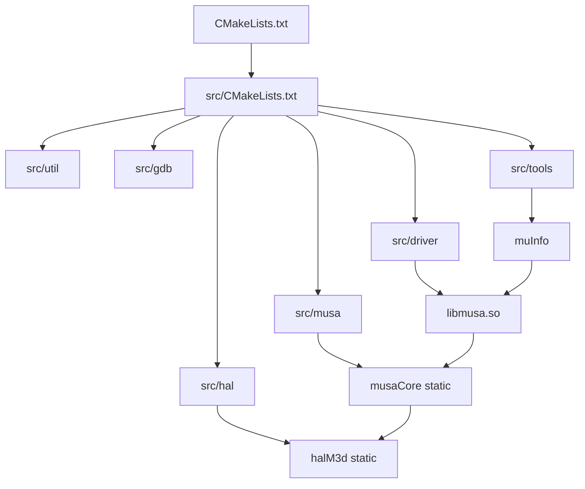

# 构建、运行、测试和部署总览

- 文档目的：汇总 MUSA Driver 当前源码可确认的构建选项、产物、测试入口、安装脚本和 CI 流程。
- 适用范围：`/home/shanfeng/workspace/linux-ddk/musa`。
- 对应源码版本：`b8dce2b2f23849e8e99350c20d7eaac3c129caba`。
- 证据状态：已确认/命令未验证
- 最后更新：2026-09-16
- 前置阅读：[`project-overview.md`](project-overview.md)
- 后续阅读：[`../99-roadmap/quick-start.md`](../99-roadmap/quick-start.md)

## 结论摘要

结论：仓库使用 CMake 构建，Linux 默认生成 `libmusa.so` 动态库、内部静态库 `musaCore`/`halM3d` 和工具 `muInfo`。  
状态：已确认。  
证据：Linux 下 `DRIVER_LIB_NAME` 为 `musa` [src/CMakeLists.txt:1-5]；driver 目标为 `${DRIVER_LIB_NAME}_dynamic` 共享库 [src/driver/CMakeLists.txt:9-18]；tools 下每个 `.cpp` 生成一个可执行文件并链接 driver 动态库 [src/tools/CMakeLists.txt:10-18]。

结论：当前未在本地执行构建/测试/安装；所有命令均来自 README、CMake 或 CI，标记为“未验证”。  
状态：已确认。  
证据：本次工作只执行了远端只读检查和本地文档写入。

## 1. 环境要求和支持矩阵

| 项 | 内容 | 状态 | 证据 |
|---|---|---|---|
| CMake | 最低 `3.15` | 已确认 | [CMakeLists.txt:1] |
| C++ 标准 | UNIX: C++17；Windows: C++20 | 已确认 | [CMakeLists.txt:155-174] |
| Linux 安全链接选项 | `-z now -z relro -z noexecstack` | 已确认 | [CMakeLists.txt:165-169] |
| 依赖库 | `libelf-dev`、`gcc-multilib` | README 确认，未验证 | [README.md:3-6] |
| 子模块 | `module_version`、`m3d`、`musa_shared_include` | 已确认 | [.gitmodules:1-13] |
| CI 容器/依赖 | 私有 Harbor 镜像、mt-toolchain、LLVM 14、libdrm-mt、shared_include | 已确认 | [.ciConfig.yaml:13-16], [.mthreads-ci.yml:37-52] |
| 硬件/驱动 | MTGPU 内核驱动和 MUSA toolkit | CI 部分确认 | [.mthreads-ci.yml:125-148] |

## 2. CMake 选项

| 选项 | 默认值 | 作用 | 证据 |
|---|---:|---|---|
| `DDK_2_0` | OFF | ddk2.0 临时选项 | [CMakeLists.txt:21] |
| `ENABLE_ASAN_CHECK` | OFF | AddressSanitizer | [CMakeLists.txt:22], [CMakeLists.txt:178-181] |
| `ENABLE_TSAN_CHECK` | OFF | ThreadSanitizer | [CMakeLists.txt:23], [CMakeLists.txt:183-186] |
| `MUSA_BUILD_DEBUG` | OFF | Debug 构建；否则 Release + IPO | [CMakeLists.txt:24], [CMakeLists.txt:195-200] |
| `CSV_UNSUPPORTED` | OFF | README 称用于整理 unsupported API/flag 原因；CMake 中拼写为 `CSV_UNSPPORTED` | [README.md:34-35], [CMakeLists.txt:202-204] |
| `M3D_BUILD_MT_TRACE_CAPTURE` | OFF | M3D trace capture 编译定义 | [CMakeLists.txt:26], [CMakeLists.txt:206-209] |
| `M3D_BUILD_MTTX_TRACE` | ON | M3D mttx trace | [CMakeLists.txt:27] |
| `ENABLE_USERQ_FOR_PRESI` | OFF | userq 编译定义 | [CMakeLists.txt:28], [CMakeLists.txt:210-212] |
| `MUSA_BUILD_UT` | OFF | 启用 gtest 单元测试 | [CMakeLists.txt:29], [CMakeLists.txt:214-237] |
| `MTUB_BUILD` | OFF | mt-toolchain 版本/打包集成 | [CMakeLists.txt:30], [CMakeLists.txt:38-61] |
| `MUSA_WSL2_BUILD` | OFF | WSL2 构建宏 | [CMakeLists.txt:31], [CMakeLists.txt:170-173] |

风险：`CSV_UNSUPPORTED` 与 `CSV_UNSPPORTED` 拼写不一致，可能导致 README 说明的开关无法触发 CMake 分支。状态：已确认；需后续验证是否有兼容变量或历史原因。

## 3. 构建目标和链接关系



证据：`src/CMakeLists.txt` 添加子目录 [src/CMakeLists.txt:7-12]；driver 目标链接 `musaCore` [src/driver/CMakeLists.txt:17]；tools 链接 `${DRIVER_LIB_NAME}_dynamic` [src/tools/CMakeLists.txt:15]。

## 4. 构建命令（未验证）

### 4.1 最小构建

```bash
mkdir build
cd build
cmake ..
make
```

来源：[README.md:9-16]。  
当前状态：未执行。  
适用条件：需要子模块和依赖完整；README 还要求安装 `libsrv_um` 和 `libusc` of gr-umd [README.md:7]。

### 4.2 Debug 构建

```bash
mkdir build
cd build
cmake .. -DMUSA_BUILD_DEBUG=ON
make
```

来源：[README.md:39-45]。  
当前状态：未执行。  
代码效果：顶层 CMake 设置 `CMAKE_BUILD_TYPE` 为 Debug；否则 Release 并启用 IPO [CMakeLists.txt:195-200]。

### 4.3 单元测试构建

```bash
cmake -S . -B build -DMUSA_BUILD_UT=ON
cmake --build build
ctest --test-dir build --output-on-failure
```

来源：CMake 行为推导，未在 README 中完整写出。  
当前状态：未执行。  
证据：`MUSA_BUILD_UT` 时 FetchContent 拉取 googletest 并添加 `unittest` [CMakeLists.txt:214-237]；`unittest/CMakeLists.txt` 为每个 `.cpp` 添加 executable 和 CTest [unittest/CMakeLists.txt:1-46]。

### 4.4 CI 构建

CI 从 linux-ddk 根仓库执行：

```bash
./ddk_build.sh -a 0 -m 1
```

来源：[.ciConfig.yaml:13-34]。  
当前状态：未执行。  
注意：该命令属于 linux-ddk 根仓库，不是 `musa` 子仓库根目录内已确认存在的脚本。

## 5. 安装

### 5.1 README 安装命令

```bash
./install.sh
```

来源：[README.md:46-50]。当前未执行。

### 5.2 安装脚本真实行为

`install.sh`：

1. 要求 `./build/lib` 存在，否则报错退出 [install.sh:27-30]；
2. 支持 `-l <LIB_INSTALL_DIR>` 和 `-b <BIN_INSTALL_DIR>` [install.sh:32-49]；
3. 若未指定库目录，根据 CPU 架构和发行版选择 `/usr/lib/x86_64-linux-gnu`、`/usr/lib64`、`/usr/lib` 或 `/usr/lib/aarch64-linux-gnu` [install.sh:51-80]；
4. 默认 bin 目录为 `/usr/local/bin` [install.sh:83-85]；
5. 复制 `build/lib/libmusa*` 到库目录 [install.sh:100]；
6. 若 `build/bin` 存在，复制 `musa_driver_version` 和 `muInfo` [install.sh:102-105]。

风险：安装脚本会写系统目录，属于外向/难回滚操作，不能在未明确授权下执行。

## 6. 测试结构

| 测试来源 | 内容 | 状态 | 证据 |
|---|---|---|---|
| `unittest` | gtest C++ 单元测试，每个 `.cpp` 一个可执行文件 | 已确认结构，未执行 | [unittest/CMakeLists.txt:1-46] |
| `tests/*.cu` | 功能/示例候选：graph、memcpy batch、conditional node 等 | 已确认存在，未执行 | 文件清单 |
| CI Photon tests | 安装 MUSA/driver 后构建 Photon 和 photon_samples，运行 `run_tests.py` | 已确认 CI 脚本，未执行 | [.mthreads-ci.yml:181-207] |

## 7. 调试与 Sanitizer

| 能力 | 开关/入口 | 状态 | 证据 |
|---|---|---|---|
| Debug 编译 | `-DMUSA_BUILD_DEBUG=ON` | 已确认 | [README.md:39-45], [CMakeLists.txt:195-200] |
| ASAN | `-DENABLE_ASAN_CHECK=ON` | 已确认 | [CMakeLists.txt:178-181] |
| TSAN | `-DENABLE_TSAN_CHECK=ON` | 已确认 | [CMakeLists.txt:183-186] |
| GDB/debugger | `src/gdb`、`src/driver/mugdb` | 部分确认 | 源码清单、[src/CMakeLists.txt:11] |
| MUPTI/MUASAN hooks | `src/driver/mupti`、`src/driver/muasan` 被编译进 driver | 已确认 | [src/driver/CMakeLists.txt:4-11] |

README 明确提示 ASAN 和 TSAN 互斥 [README.md:27-31]。

## 8. 常见失败与排查

| 场景 | 可能原因 | 首查位置 | 状态 |
|---|---|---|---|
| `install.sh` 报 build dir 不存在 | 未先构建或构建目录不是 `./build` | [install.sh:27-30] | 已确认 |
| CMake 找不到子模块/头文件 | `src/musa_shared_include`、`src/hal/m3d/m3d` 未初始化 | [.gitmodules:5-13] | 推断 |
| `MUSA_BUILD_UT` 拉取失败 | googletest URL 是私有/内网地址 | [CMakeLists.txt:214-221] | 推断 |
| `CSV_UNSUPPORTED` 不生效 | CMake 中变量拼写为 `CSV_UNSPPORTED` | [README.md:34-35], [CMakeLists.txt:202-204] | 已确认 |
| 运行 `muInfo` 无设备 | 内核驱动、设备节点或 MUSA 安装环境缺失 | CI 安装/`modprobe mtgpu` 流程 | 推断 |

## 相关文档

- [`project-overview.md`](project-overview.md)
- [`architecture.md`](architecture.md)
- [`../99-roadmap/quick-start.md`](../99-roadmap/quick-start.md)

## 源码证据摘要

- CMake 选项：[CMakeLists.txt:21-35]
- 构建类型和 sanitizer：[CMakeLists.txt:127-130], [CMakeLists.txt:178-200]
- 单元测试：[CMakeLists.txt:214-237], [unittest/CMakeLists.txt:1-46]
- driver/tools 产物：[src/driver/CMakeLists.txt:9-50], [src/tools/CMakeLists.txt:10-18]
- 安装脚本：[install.sh:27-105]

## 未解决问题

1. 未执行构建，尚不知道当前远端工作区是否能 clean build。
2. 未确认 `ddk_build.sh` 在 linux-ddk 根仓库中的具体行为。
3. 未确认 `muInfo` 实际运行输出格式和设备依赖。

## 下一步阅读建议

阅读 [`../99-roadmap/quick-start.md`](../99-roadmap/quick-start.md)，按“只读确认 → 构建前检查 → 用户授权后构建”的顺序操作。
