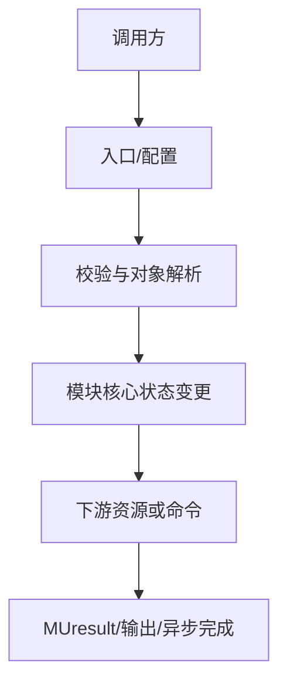

# 构建/发布/安装系统：执行流

## 主流程



## 同步与异步

同步路径在 API 或 Core 内等待资源操作完成；异步路径把工作放入 stream/command，并由 query/synchronize 暴露最终状态。具体 `blocking` 来源于模块设置或 API 语义，不能仅凭函数名推断。

## 清理流

```text
停止/同步工作 -> 从 tracker/Context 集合移除 -> 释放 Core 对象 -> 释放 HAL 对象 -> 返回状态
```

## 观测点

建议记录 API 序号、对象 ID、stream、command 类型、queued/submitted/completed 时间戳；`mu_entry.cpp` 对 profiler/debugger 提供了多类 accessor。[src/driver/mu_entry.cpp:121-198] [src/driver/mu_entry.cpp:1085-1249]
