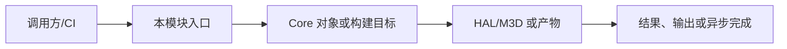
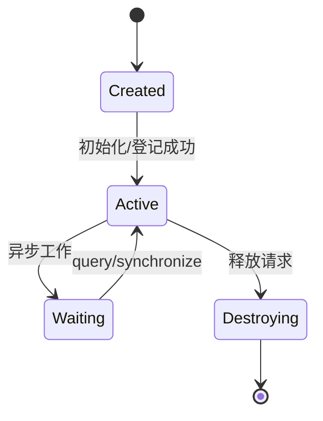

# 平台与设备管理：图示

## 分层图

```mermaid
flowchart LR
 U[调用方/CI] --> I[本模块入口]
 I --> O[Core 对象或构建目标]
 O --> H[HAL/M3D 或产物]
 H --> R[结果、输出或异步完成]
```

## 生命周期图

```mermaid
stateDiagram-v2
 [*] --> Created
 Created --> Active: 初始化/登记成功
 Active --> Waiting: 异步工作
 Waiting --> Active: query/synchronize
 Active --> Destroying: 释放请求
 Destroying --> [*]
```

状态名是跨模块抽象，不能替代源码中具体枚举；实际枚举和异常状态请查 `implementation.md`。
