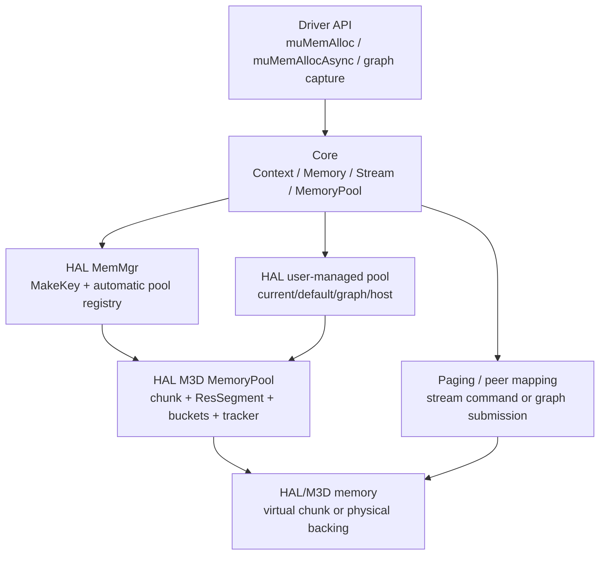
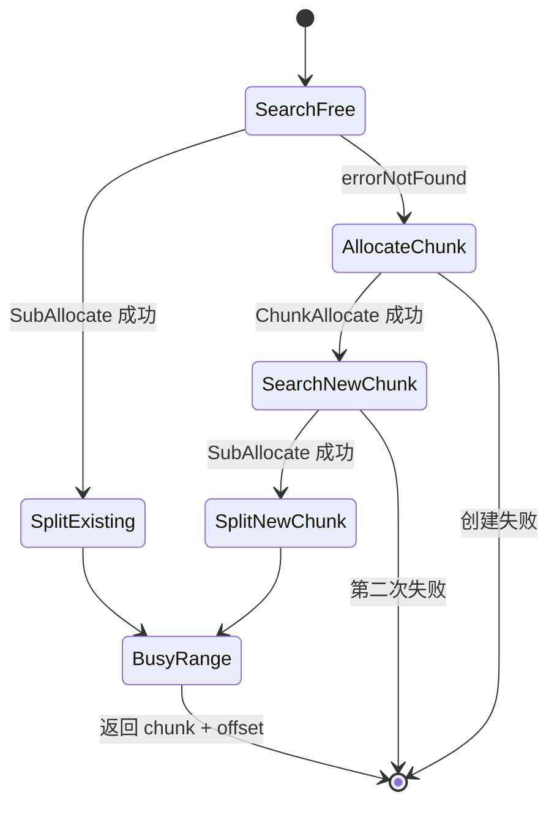
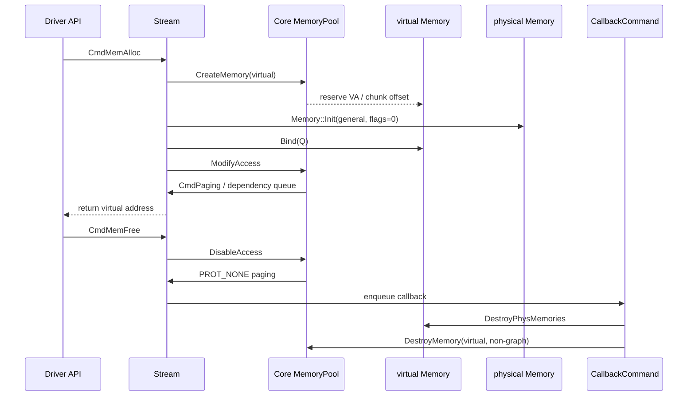
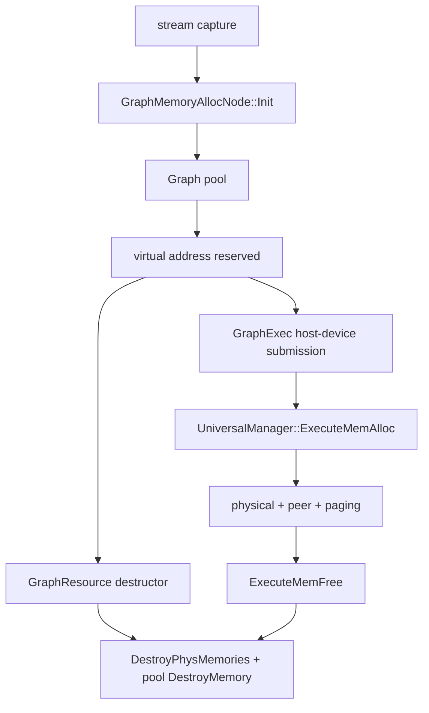

# Memory 与 MemoryPool：图示

## 1. Driver/Core/HAL 分层和三条内存路径



解释：普通同步分配主要从 `MemMgr` 自动 pool 得到 chunk + offset；async/graph 主要先通过 Core user-managed pool reserve virtual range，再在不同执行时机创建 physical backing 并映射。源码证据见 `call-chains.md`。

## 2. HAL pool 内部结构

```mermaid
flowchart LR
    P[MemoryPool]
    P --> B[m_FreeBuckets[]\nLog2(size) free lists]
    P --> H[m_EltMappingHash\nnon-empty bucket bitmap]
    P --> S[m_pHeadSegment\naddress-ordered list]
    P --> T[m_SegmentTracker\nvirtual busy range map]

    C[one HAL chunk] --> S
    S --> R1[free prefix]
    S --> R2[busy allocation]
    S --> R3[free suffix]
    R1 -. free .-> B
    R3 -. free .-> B
    R2 -. virtual only .-> T
```

一个 `ResSegment` 同时携带空间链表指针和 free-list 指针；busy segment 从 free bucket 移出，virtual busy range 进入 interval tracker。`ResSegment` 字段见 [`src/hal/m3d/memoryPool.h:48-85`]，容器见 [`src/hal/m3d/memoryPool.h:121-150`]。

## 3. 一次 `FullAllocate` 的状态转换



实现只有一次 `ChunkAllocate` 重试，不是无限扩容循环。[`src/hal/m3d/memoryPool.cpp:82-95`]

## 4. segment split / free / merge

```mermaid
flowchart LR
    F[free segment\nbase ---------------- end]
    F --> A[AlignUp(base, alignment)]
    A --> PRE[prefix free\n对齐 padding]
    A --> BUSY[busy request\nalignedBase + size]
    BUSY --> SUF[suffix free\n剩余容量]
    BUSY --> FREE[Free exact range]
    FREE --> LEFT[merge left if free]
    LEFT --> RIGHT[merge right if free]
    RIGHT --> WHOLE{覆盖完整 chunk?}
    WHOLE -->|否| BUCKET[重新插入 free bucket]
    WHOLE -->|是| LIMIT{reuse count/size 超限?}
    LIMIT -->|否| BUCKET
    LIMIT -->|是| DESTROY[Destroy chunk]
```

`ResourceSplit` 负责 prefix/suffix，`Free` 负责邻接合并，`ResourceRemove` 决定完整 chunk 的 lazy reuse 或 destroy。[`src/hal/m3d/memoryPool.cpp:214-259,318-331,358-413`]

## 5. async allocation/free 生命周期



物理创建和映射不是同一个步骤；free 的 virtual segment 也不会在 API 进入时立即回到 pool。[`src/musa/core/stream.cpp:554-671`]

## 6. graph memory 生命周期



capture 阶段只有 virtual reservation；graph execution 才创建 physical backing。graph free node 初始化本身为 no-op，graph resource 析构负责最终归还 virtual pool segment。[`src/musa/core/node/graphMemoryAllocNode.cpp:15-48`、`src/musa/core/node/graphMemoryFreeNode.cpp:6-13`、`src/musa/core/graph.cpp:22-29`]

## 7. 统计关系

```text
Core USED_MEM_CURRENT/HIGH
  = m_RequestedBytes / m_RequestedBytesHigh
  = 用户逻辑请求字节（按 Core Memory::GetSize）

HAL RESERVED_MEM_CURRENT/HIGH
  = m_TotalSize / m_TotalSizeHigh
  = 已创建 chunk 总量

HAL free size
  = m_FreeSize
  = chunk 内当前可切分的 free segment 总量
```

三者不应互换；大 alignment、保留空闲 chunk、graph physical deferred allocation 会放大差异。
