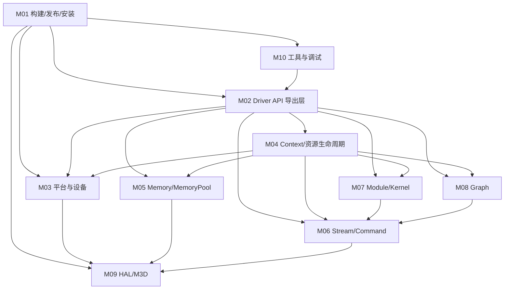

# 模块注册表

- 文档目的：为 MUSA Driver 首批模块划分提供稳定 ID、职责、边界、依赖和证据。
- 适用范围：`/home/shanfeng/workspace/linux-ddk/musa`，首批覆盖核心构建、API、对象、资源、HAL 和工具模块。
- 对应源码版本：`b8dce2b2f23849e8e99350c20d7eaac3c129caba`。
- 证据状态：部分推断
- 最后更新：2026-09-16
- 前置阅读：[`../00-overview/project-overview.md`](../00-overview/project-overview.md)
- 后续阅读：后续逐模块 `Mxx-*` 目录

## 结论摘要

结论：MUSA Driver 的真实模块边界横跨目录：`src/driver` 是 API 接入层，`src/musa/core` 是对象和生命周期层，`src/hal/m3d` 是硬件适配层，构建系统把这些层链接成 `libmusa.so`。  
状态：已确认。  
证据：[src/driver/CMakeLists.txt:9-18]、[src/musa/core/CMakeLists.txt:1-11]、[src/hal/m3d/CMakeLists.txt:56-59]。

## 模块依赖图

箭头含义：编译/链接依赖和主要运行时调用关系的合并摘要。精确区分会在后续 `90-cross-module` 文档展开。

## 模块登记表

| 字段 | M01 |
|---|---|
| 模块名称 | 构建/发布/安装系统 |
| 一句话职责 | 定义项目版本、构建选项、产物、安装路径、CI 包装和测试入口。 |
| 源码目录 | `CMakeLists.txt`、`src/*/CMakeLists.txt`、`install.sh`、`.ciConfig.yaml`、`.mthreads-ci.yml`、`unittest/CMakeLists.txt` |
| 入口 | `cmake ..`、`cmake --build`、`./install.sh`、CI `./ddk_build.sh -a 0 -m 1` |
| 对外接口 | CMake 选项：`MUSA_BUILD_DEBUG`、`MUSA_BUILD_UT`、`ENABLE_ASAN_CHECK`、`ENABLE_TSAN_CHECK`、`MTUB_BUILD` 等 |
| 依赖模块 | 所有源码模块 |
| 被依赖模块 | 所有模块依赖它完成编译、测试、安装 |
| 数据边界 | 输入是源码、CMake 选项、子模块路径和 CI 参数；输出是 `libmusa.so`、tools、包和安装文件 |
| 生命周期 | 配置 → 编译 → 链接 → 安装/打包 → 测试 |
| 测试边界 | CTest 和 gtest 目标由 `unittest/CMakeLists.txt` 生成 |
| 风险等级 | 中：构建依赖外部私有仓库、GPU/驱动环境和 CI 镜像 |
| 证据 | [CMakeLists.txt:21-35], [CMakeLists.txt:214-237], [src/driver/CMakeLists.txt:9-50], [install.sh:27-105] |

| 字段 | M02 |
|---|---|
| 模块名称 | Driver API 导出层 |
| 一句话职责 | 暴露 `muapi*` API，完成参数检查、上下文查找、对象转换、错误码返回和导出表注册。 |
| 源码目录 | `src/driver/*.cpp`、`src/driver/muapi.h`、`src/driver/mu_wrappers_generated.cpp` |
| 入口 | `muapiInit`、`muapiDeviceGetCount`、`muapiCtxCreate_v2`、`muapiMemAlloc_v2`、`muapiStreamCreate`、`muapiModuleLoad`、`muapiLaunchKernel` 等 |
| 对外接口 | Driver API C ABI；导出符号和 accessors 表 |
| 依赖模块 | M03、M04、M05、M06、M07、M08 |
| 被依赖模块 | M10 工具、外部应用、测试 |
| 数据边界 | `MUdevice`、`MUcontext`、`MUdeviceptr`、`MUstream`、`MUmodule`、`MUfunction` 等句柄进入 C++ 对象层 |
| 生命周期 | API 被调用 → 校验参数/句柄 → 调用核心对象 → 返回 `MUresult` |
| 测试边界 | `tests/*.cu`、`unittest`、外部兼容性测试 |
| 风险等级 | 高：ABI、兼容性、错误码和跨版本 API 行为敏感 |
| 证据 | [src/driver/mu_context.cpp:121-220], [src/driver/mu_memory.cpp:271-320], [src/driver/mu_module.cpp:232-285], [src/driver/mu_entry.cpp:1241-1245] |

| 字段 | M03 |
|---|---|
| 模块名称 | 平台与设备管理 |
| 一句话职责 | 全局初始化 HAL/M3D，发现设备，维护设备列表、可见设备和全局注册表。 |
| 源码目录 | `src/musa/core/platform.*`、`src/musa/core/device.*`、`src/musa/musaPlatform.h`、`src/musa/musaDevice.h` |
| 入口 | `Musa::Platform::Get().Init()`、`Platform::GetDevice`、`Device::CreateContext` |
| 对外接口 | 供 Driver API 和 Context 调用的 `IDevice`/`Platform` 方法 |
| 依赖模块 | M09 HAL/M3D |
| 被依赖模块 | M02、M04、M05、M06、M10 |
| 数据边界 | HAL devices 转成 `Musa::Device`，设备 ordinal/PCI bus id/属性转成 API 可见信息 |
| 生命周期 | 进程内单例创建 → Init 枚举设备 → 创建 Device → 析构释放未释放资源 |
| 测试边界 | `muInfo`、device API 测试、初始化路径测试 |
| 风险等级 | 高：全局单例、设备可见性、资源泄漏、进程退出清理 |
| 证据 | [src/musa/core/platform.cpp:13-18], [src/musa/core/platform.cpp:84-140], [src/musa/core/platform.cpp:478-506], [src/musa/core/device.cpp:593-672] |

| 字段 | M04 |
|---|---|
| 模块名称 | 上下文与资源生命周期 |
| 一句话职责 | 作为设备资源归属中心，管理 streams、events、memory、module、graph、texture、surface 等对象的创建、校验、同步和销毁。 |
| 源码目录 | `src/musa/core/context.*`、`src/musa/musaContext.h` |
| 入口 | `Device::CreateContext`、`Context::Init`、`Context::CreateMemory`、`Context::CreateStream`、`Context::Synchronize` |
| 对外接口 | `IContext`/`Context` 方法和 Driver API 句柄映射 |
| 依赖模块 | M03、M05、M06、M07、M08、M09 |
| 被依赖模块 | M02、M10、几乎所有资源对象 |
| 数据边界 | 一个 `Context` 绑定一个 `Device`，并通过 CriticalBase 持有资源集合 |
| 生命周期 | 创建 → 初始化默认流/资源 → 执行命令/创建对象 → 同步/Reset/Dispose → 析构 |
| 测试边界 | context API、stream/event/memory/module/graph 资源测试 |
| 风险等级 | 高：资源所有权、锁、同步、异常清理是核心稳定性问题 |
| 证据 | [src/musa/core/context.cpp:293-475], [src/musa/core/context.cpp:1037-1099], [src/musa/core/context.cpp:1207-1247], [src/musa/core/context.cpp:1875-1988] |

| 字段 | M05 |
|---|---|
| 模块名称 | 内存与内存池 |
| 一句话职责 | 实现 device memory、host pinned memory、managed memory、virtual memory、IPC/external memory 和 memory pool。 |
| 源码目录 | `src/driver/mu_memory.cpp`、`src/musa/core/memory.*`、`src/musa/core/memoryPool.*`、`src/hal/m3d/memory.*`、`src/hal/m3d/memoryPool.*` |
| 入口 | `muapiMemAlloc_v2`、`muapiMemFree_v2`、`muapiMemcpy*`、`Memory::Init`、`Memory::GeneralAlloc` |
| 对外接口 | `MUdeviceptr`、`MUmemoryPool`、IPC/fabric/global handle、copy API |
| 依赖模块 | M03、M04、M06、M09 |
| 被依赖模块 | M02、M07、M08、M10 |
| 数据边界 | `MUdeviceptr` ↔ `Musa::Memory`/`Hal::IMemory`，host pointer ↔ pinned mapping |
| 生命周期 | API 请求 → Context 创建 Memory → HAL 分配/绑定 → 注册到 context/platform → 同步/拷贝 → 释放 |
| 测试边界 | memcpy/memset/mempool/IPC/virtual memory 测试；`tests/memcpyBatchAsync.cu` 等 |
| 风险等级 | 高：泄漏、重叠注册、peer access、虚拟内存映射、异步释放 |
| 证据 | [src/driver/mu_memory.cpp:271-320], [src/driver/mu_memory.cpp:716-758], [src/musa/core/memory.cpp:345-431], [src/musa/core/memory.cpp:470-746] |

| 字段 | M06 |
|---|---|
| 模块名称 | Stream/Command 调度 |
| 一句话职责 | 维护 stream 状态，将 kernel/memcpy/memset/graph 等操作封装成 Command，处理同步、capture、依赖和队列提交。 |
| 源码目录 | `src/driver/mu_stream.cpp`、`src/musa/core/stream.*`、`src/musa/core/command/*`、`src/hal/m3d/queue.*`、`src/hal/m3d/cmdBuffer.*` |
| 入口 | `muapiStreamCreate`、`Stream::Synchronize`、`Stream::Cmd*`、`Context::ResolveDependencyAndQueueCommand` |
| 对外接口 | `MUstream` API、stream capture、callback/host function |
| 依赖模块 | M04、M05、M07、M08、M09 |
| 被依赖模块 | M02、M05、M07、M08 |
| 数据边界 | API 操作参数转为 `Command` 对象，`Command` 被提交到底层 queue/cmdBuffer |
| 生命周期 | stream 创建 → 命令入队 → 依赖处理/capture → 提交 → query/synchronize → destroy |
| 测试边界 | stream API、异步 memcpy、graph capture、event wait/record |
| 风险等级 | 高：并发、异步完成、默认流语义、capture 状态和资源生命周期耦合 |
| 证据 | [src/driver/mu_stream.cpp:16-60], [src/musa/core/stream.cpp:72-102], [src/musa/core/stream.cpp:237-260], [src/musa/core/context.cpp:1984-2065] |

| 字段 | M07 |
|---|---|
| 模块名称 | Module/Kernel 执行 |
| 一句话职责 | 加载 MUSA module/fat binary，解析函数符号，组装 kernel launch 参数并提交 dispatch command。 |
| 源码目录 | `src/driver/mu_module.cpp`、`src/musa/core/module.*`、`src/musa/core/library.*`、`src/musa/core/command/dispatchCommand.*`、`src/hal/m3d/kernel.*` |
| 入口 | `muapiModuleLoad`、`muapiModuleLoadData`、`muapiLaunchKernel`、`Context::GeneralLaunchKernel` |
| 对外接口 | `MUmodule`、`MUfunction`、launch config、kernel params |
| 依赖模块 | M04、M06、M09 |
| 被依赖模块 | M02、Demo/测试、Graph kernel node |
| 数据边界 | 文件/ELF/fat binary → module/function → dispatch command → HAL kernel/cmdBuffer |
| 生命周期 | load → get function → launch → stream submit → unload/destroy |
| 测试边界 | Kernel launch 示例、module load、graph kernel node |
| 风险等级 | 高：ABI、参数布局、shared memory、动态分派、模块生命周期 |
| 证据 | [src/driver/mu_module.cpp:88-130], [src/driver/mu_module.cpp:232-285], [src/musa/core/context.cpp:625-673] |

| 字段 | M08 |
|---|---|
| 模块名称 | Graph 执行 |
| 一句话职责 | 表示 graph、graph node、graph exec，支持捕获、实例化、更新和执行。 |
| 源码目录 | `src/driver/mu_graph.cpp`、`src/musa/core/graph*`、`src/musa/core/node/*`、`src/musa/core/command/graphCommand.*` |
| 入口 | `muapiGraph*`、`Stream::BeginCapture/EndCapture`、`Context::CreateGraph*` |
| 对外接口 | `MUgraph`、`MUgraphNode`、`MUgraphExec`、graph conditional handle |
| 依赖模块 | M04、M05、M06、M07、M09 |
| 被依赖模块 | M02、tests graph 示例 |
| 数据边界 | node params → `GraphNode` → `GraphExec` → `GraphCommand`/stream execution |
| 生命周期 | graph 创建/捕获 → 添加 node → instantiate → launch/update → destroy |
| 测试边界 | `tests/childGraph.cu`、`tests/conditionalNode.cu`、`tests/allocnode.cu` 等 |
| 风险等级 | 高：拓扑依赖、capture 语义、节点资源所有权、更新一致性 |
| 证据 | [src/musa/core/context.cpp:1398-1456], [src/musa/core/context.cpp:2116-2530], 源码清单 |

| 字段 | M09 |
|---|---|
| 模块名称 | HAL/M3D 适配 |
| 一句话职责 | 在 MUSA 核心对象和 M3D 底层库之间提供 device、queue、memory、cmdBuffer、kernel 等适配。 |
| 源码目录 | `src/hal/*.h`、`src/hal/m3d/*`、`src/hal/m3d/m3d` 子模块 |
| 入口 | `halM3d` 静态库；`Hal::IPlatform`/`Hal::IDevice`/`Hal::IQueue`/`Hal::IMemory` 等接口实现 |
| 对外接口 | HAL C++ 接口供 `src/musa/core` 调用；M3D API 供底层调用 |
| 依赖模块 | M3D、SCPC、util、libdrm/内核驱动 |
| 被依赖模块 | M03、M04、M05、M06、M07、M08 |
| 数据边界 | MUSA 对象参数转为 M3D allocation、queue submit、cmd buffer、shader library 等 |
| 生命周期 | CMake 设置 M3D 宏 → 构建 m3d/scpc/util → 构建 halM3d → 运行时由 Platform/Device 调用 |
| 测试边界 | 通过上层 API 和硬件集成测试间接覆盖 |
| 风险等级 | 高：硬件相关、平台宏、ABI、资源所有权和异步提交 |
| 证据 | [src/hal/m3d/CMakeLists.txt:1-59], `src/hal/hal*.h` 源码清单 |

| 字段 | M10 |
|---|---|
| 模块名称 | 工具与调试接口 |
| 一句话职责 | 提供 `muInfo` 工具、GDB/MUPTI/MUASAN hook、tracepoints 和辅助观测接口。 |
| 源码目录 | `src/tools`、`src/gdb`、`src/driver/mugdb`、`src/driver/mupti`、`src/driver/muasan` |
| 入口 | `muInfo` main、GDB interface、MUPTI/MUASAN hook 初始化 |
| 对外接口 | 命令行工具、debugger/profiler/sanitizer hooks |
| 依赖模块 | M02、M03、M04、M05 |
| 被依赖模块 | 开发者、CI、调试/分析工具 |
| 数据边界 | API 查询结果转为用户输出；tracepoints 读取内部命令/内存/graph 状态 |
| 生命周期 | 构建工具/库 → 运行工具或被 profiler/debugger 加载 → 查询/回调 → 输出 |
| 测试边界 | CI/人工运行 `muInfo`；调试工具集成测试 |
| 风险等级 | 中：通常不影响主执行路径，但 ABI/调试信息变化影响排障能力 |
| 证据 | [src/tools/CMakeLists.txt:10-18], [src/driver/CMakeLists.txt:4-11], 源码清单 |

## 依赖与设计问题初查

| 检查项 | 初步结论 | 状态 | 证据/说明 |
|---|---|---|---|
| 循环依赖 | 构建层面未见 `driver -> musaCore -> halM3d -> driver` 回环；运行时回调需后续确认 | 部分完成 | CMake 链接方向清晰 |
| 跳层调用 | Driver API 主要调用 core 对象；是否直接调用 HAL 需后续 grep/符号分析 | 未完成 | 需要模块深挖 |
| 隐式全局状态 | `Musa::Platform::Get()` 是全局单例，context/device 注册表存在全局集合 | 已确认 | [src/musa/core/platform.cpp:13-18], [src/musa/core/platform.cpp:416-428] |
| 职责重叠 | memory 逻辑横跨 driver/core/HAL，需严格区分 API 校验、对象生命周期、底层分配 | 部分完成 | M05 需单独深挖 |
| 名义模块与实现不一致 | README 称 `MUSA-Runtime`，CMake 项目名和 CI 产物更接近 `musa-driver/libmusa.so` | 已确认 | [README.md:1], [CMakeLists.txt:101-103], [.ciConfig.yaml:19-24] |

## 深度审计表（首批）

| 分析对象 | 入口落地 | 正常路径 | 分支 | 异常 | 清理 | 数据生命周期 | 执行上下文 | 行级证据 | Demo 映射 | 状态/缺口 |
|---|---|---|---|---|---|---|---|---|---|---|
| M01 构建 | 部分完成 | 部分完成 | 部分完成 | 部分完成 | 部分完成 | 不适用 | 不适用 | 已有 | 无 | 部分完成：未实际构建 |
| M02 API | 部分完成 | 部分完成 | 未开始 | 部分完成 | 部分完成 | 部分完成 | 未开始 | 已有 | `muInfo` 候选 | 部分完成：未分析 generated wrappers |
| M03 平台设备 | 部分完成 | 部分完成 | 部分完成 | 未开始 | 部分完成 | 部分完成 | 未开始 | 已有 | `muInfo` 候选 | 部分完成：HAL 细节缺失 |
| M04 Context | 部分完成 | 部分完成 | 未开始 | 未开始 | 部分完成 | 部分完成 | 未开始 | 已有 | 内存/Kernel 候选 | 部分完成：锁和 CriticalBase 需深挖 |
| M05 Memory | 部分完成 | 部分完成 | 部分完成 | 部分完成 | 部分完成 | 部分完成 | 未开始 | 已有 | memcpy 候选 | 部分完成：HAL allocation 缺失 |
| M06 Stream | 部分完成 | 部分完成 | 未开始 | 未开始 | 未开始 | 部分完成 | 部分完成 | 已有 | async memcpy 候选 | 部分完成：queue submit 缺失 |
| M07 Module/Kernel | 部分完成 | 部分完成 | 未开始 | 未开始 | 未开始 | 部分完成 | 部分完成 | 已有 | kernel demo 候选 | 部分完成：dispatch command 缺失 |
| M08 Graph | 部分完成 | 未开始 | 未开始 | 未开始 | 未开始 | 未开始 | 未开始 | 部分 | graph tests 候选 | 待深入 |
| M09 HAL/M3D | 部分完成 | 未开始 | 未开始 | 未开始 | 未开始 | 未开始 | 未开始 | 部分 | 间接 | 待深入 |
| M10 工具调试 | 部分完成 | 未开始 | 未开始 | 未开始 | 未开始 | 未开始 | 未开始 | 部分 | `muInfo` | 待深入 |

## 相关文档

- [`../00-overview/architecture.md`](../00-overview/architecture.md)
- [`../90-cross-module/system-wiring.md`](../90-cross-module/system-wiring.md)
- [`../80-demos/demo-registry.md`](../80-demos/demo-registry.md)

## 源码证据摘要

详见 [`../00-overview/evidence-index.md`](../00-overview/evidence-index.md)。

## 未解决问题

1. 每个模块的独立目录尚未生成。
2. 需要为 M05、M06、M07、M09 补完整“声明到落地”链路。
3. 需要确认 `mu_wrappers_generated.cpp` 是否为生成文件、生成脚本在哪里、release 导出符号策略如何工作。

## 下一步阅读建议

先从 M02/M03/M04/M05 进入内存分配主路径，因为该路径覆盖初始化、context、memory、HAL 和清理。
