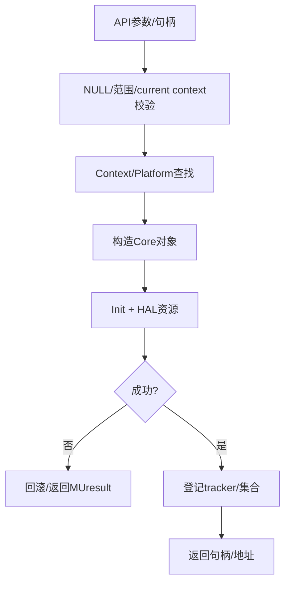

# 端到端流程

## 资源创建通用模板



## 异步工作模板

```text
规范化参数 -> 选择 stream -> 创建 Command/GraphNode
 -> 记录依赖 -> QueueCommand -> AsyncSubmit
 -> HAL queue/cmd buffer -> wait/query -> 完成/错误
```

## 释放模板

```text
查找地址/句柄 -> 检查类型和所属 context -> 同步或排队释放
 -> 从 tracker/Context 删除 -> HAL free/destroy
```

内存释放的类型条件和 virtual 特殊路径可见 [src/driver/mu_memory.cpp:716-747]；Stream 的线程停止和资源释放可见 [src/musa/core/stream.cpp:849-908]。
