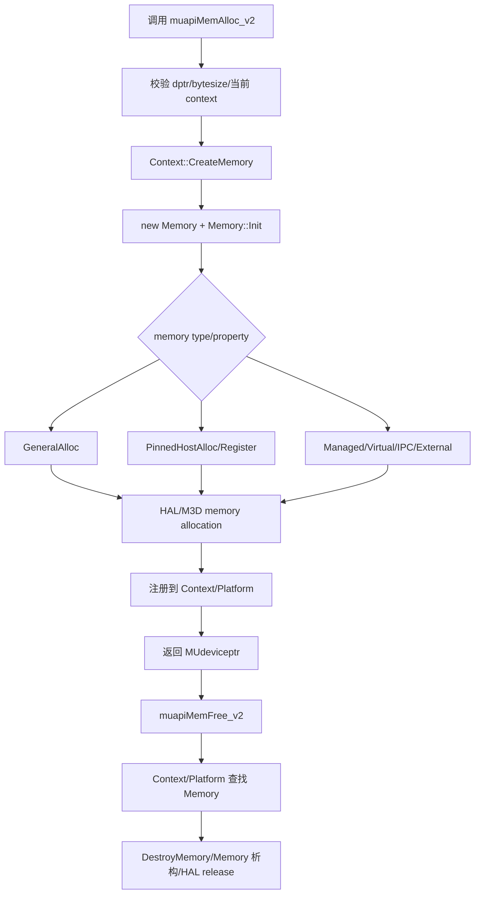
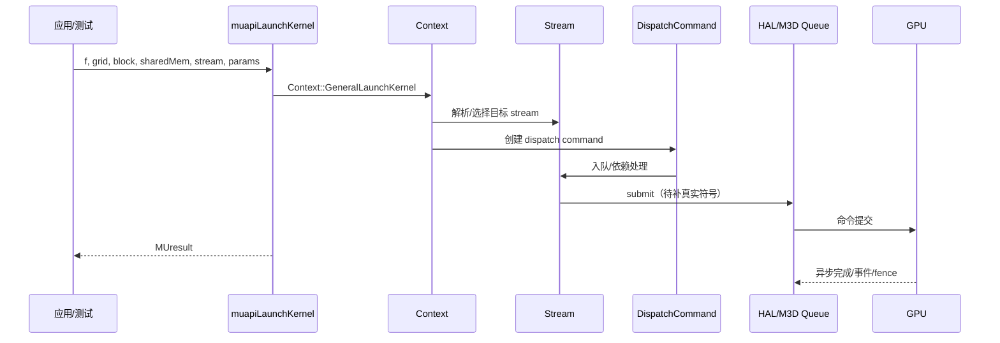

# 系统串联

- 文档目的：用运行时主线解释 MUSA Driver 各模块如何从外部入口串到核心对象、HAL 和底层设备。
- 适用范围：初始化、内存分配、Kernel 启动三条首批核心路径。
- 对应源码版本：`b8dce2b2f23849e8e99350c20d7eaac3c129caba`。
- 证据状态：部分推断
- 最后更新：2026-09-16
- 前置阅读：[`../00-overview/architecture.md`](../00-overview/architecture.md)
- 后续阅读：后续 `end-to-end-flows.md`、逐模块实现文档

## 结论摘要

结论：系统运行主线不是目录层面的 `driver -> musa -> hal` 简单调用，而是“API 函数解析 C 句柄/参数 → Platform/Context 查找对象 → 核心对象创建 Command/Memory/Module → HAL/M3D 执行资源操作或队列提交 → MUresult/输出参数返回”。  
状态：已确认 + 推断。  
证据：`muapiInit` 调用 `Platform::Init` [src/driver/mu_context.cpp:121-133]；memory API 入口存在 [src/driver/mu_memory.cpp:271-320]；context 管理 memory/stream [src/musa/core/context.cpp:1037-1099]、[src/musa/core/context.cpp:1207-1247]；构建链接方向证明 HAL 位于 core 下游 [src/musa/core/CMakeLists.txt:7-11]。

## 1. 系统串联主线

```text
外部入口（应用/工具/测试）
  -> Driver API 导出层（src/driver/mu_*.cpp）
    -> 参数、句柄、当前上下文解析
      -> Platform/Device/Context 核心对象
        -> Memory/Stream/Module/Graph/Command 等资源对象
          -> HAL 接口（src/hal/hal*.h）
            -> M3D 适配层（src/hal/m3d/*.cpp）
              -> M3D 子模块 / 内核驱动 / GPU
                -> MUresult、输出参数、stdout 或异步完成状态
```

## 2. 系统串联矩阵（首批）

| 阶段 | 模块 | 真实入口符号 | 真实实现符号 | 输入数据 | 状态变化 | 执行上下文 | 资源所有者 | 输出/副作用 | 下一模块 |
|---|---|---|---|---|---|---|---|---|---|
| 初始化入口 | M02 | `muapiInit` [src/driver/mu_context.cpp:121-133] | `Musa::Platform::Get().Init()` | `flags` | Platform 从未初始化到初始化中/完成 | 调用线程 | Platform 单例 | `MUresult` | M03 |
| 平台初始化 | M03 | `Platform::Init` [src/musa/core/platform.cpp:84-140] | HAL platform/device discovery（待补） | 无/环境可见设备 | 创建设备列表 | 调用线程 | Platform 持有 Device | Device count | M09 |
| Context 创建 | M02/M03/M04 | `muapiCtxCreate_v2` [src/driver/mu_context.cpp:156-184] | `Device::CreateContext`、`Context::Init` | `MUdevice`、flags | Device/Platform 注册 Context | 调用线程 | Device/Context | `MUcontext` | M04 |
| Memory 分配 | M02/M04/M05 | `muapiMemAlloc_v2` [src/driver/mu_memory.cpp:271-320] | `Context::CreateMemory`、`Memory::GeneralAlloc` | bytesize | Context/Platform 注册 Memory | 调用线程，可能触发 HAL | Context/Memory/HAL | `MUdeviceptr` | M09 |
| Stream 创建 | M02/M04/M06 | `muapiStreamCreate` [src/driver/mu_stream.cpp:16-60] | `Context::CreateStream` | flags/priority | Context 注册 Stream | 调用线程 | Context/Stream | `MUstream` | M06 |
| Kernel 启动 | M02/M04/M06/M07 | `muapiLaunchKernel` [src/driver/mu_module.cpp:232-285] | `Context::GeneralLaunchKernel` → DispatchCommand（待补） | grid/block/sharedMem/params/stream | Command 入队/提交 | 调用线程 + GPU 异步 | Stream/Command/HAL queue | 异步执行或错误 | M09 |
| 工具输出 | M10 | `muInfo` main（待读） | Driver API 查询 | CLI args/设备属性 | 无或初始化 Platform | 进程主线程 | 工具进程 | stdout | 用户 |

## 3. 端到端流程图：初始化 + 设备查询

```mermaid
flowchart TD
    A[muInfo/App main] --> B[muapiInit]
    B --> C{flags == 0?}
    C -- 否 --> E[返回错误 MUresult]
    C -- 是 --> D[Platform::Get().Init]
    D --> F[HAL/M3D 初始化和设备发现]
    F --> G[创建 Musa::Device 列表]
    G --> H[muapiDeviceGetCount]
    H --> I[Platform::GetDeviceCount]
    I --> J[muapiDeviceGet / 属性查询]
    J --> K[Device::GetAttribute/GetProperties]
    K --> L[stdout/API 输出]
```

状态：`muapiInit`、device API、Platform/Device 函数存在已确认；`muInfo` 具体调用序列待确认。

## 4. 端到端流程图：内存分配/释放



已确认分支：`Memory` 中存在 `GeneralAlloc`、`PinnedHostAlloc`、`PinnedHostRegister`、`ManagedAlloc`、`IpcImportAlloc`、`VirtualAlloc` 等 [src/musa/core/memory.cpp:470-746]。缺口：每个分支到 HAL/M3D 的具体函数和错误回滚。

## 5. 端到端流程图：Kernel Launch



状态：入口和 `Context::GeneralLaunchKernel` 已定位；`DispatchCommand` 和 `Queue` 的具体提交路径待补。

## 6. 依赖类型区分

| 关系 | 示例 | 状态 |
|---|---|---|
| 编译/链接依赖 | `driver` 链接 `musaCore`，`musaCore` 链接 `halM3d` | 已确认 |
| 静态源码依赖 | driver include core/shared include；core include HAL | 部分确认 |
| 运行时直接调用 | `muapiInit` → `Platform::Init` | 已确认 |
| 回调/事件关系 | stream callback、host function、MUPTI hooks | 未完成 |
| 数据共享关系 | `Context::CriticalBase` 管理资源集合；`Platform` 全局 memory/context 表 | 部分确认 |
| 资源生命周期关系 | Context 持有/校验/销毁 Memory/Stream/Graph 等 | 部分确认 |

## 7. 接口契约初表

| 上游模块 | 下游模块 | 调用/数据接口 | 前置条件 | 下游保证 | 错误语义 | 生命周期约束 | 并发约束 | 证据 |
|---|---|---|---|---|---|---|---|---|
| M02 API | M03 Platform | `Platform::Get().Init()` | `flags == 0` | 初始化设备或返回错误 | `MUresult` | 进程内单例 | 待确认锁 | [src/driver/mu_context.cpp:121-133] |
| M02 API | M04 Context | `Context::CreateMemory` 等 | 当前 context 有效 | 创建资源或返回错误 | `MUresult` | context 拥有资源 | CriticalBase 锁待确认 | [src/musa/core/context.cpp:1037-1099] |
| M04 Context | M05 Memory | `new Memory`/`Memory::Init` | createInfo 有效 | HAL memory 初始化 | `MUresult` | Context 注册/销毁 | 待确认 | [src/musa/core/memory.cpp:345-431] |
| M05/M06/M07 | M09 HAL | HAL interface methods | HAL device/queue 有效 | 底层资源操作/提交 | `HalToMuResult` 待确认 | HAL 对象释放 | 线程/队列约束待确认 | [src/hal/m3d/CMakeLists.txt:56-59] |
| M10 Tool | M02 API | Driver API | `libmusa.so` 可加载 | 查询/输出 | API 错误码 | 进程退出清理 | 单进程主线程为主 | [src/tools/CMakeLists.txt:10-18] |

## 8. 当前系统串联缺口

1. **动态分派缺口**：Driver API 到具体 `muapi*` 的 wrapper/导出机制尚未分析 `mu_wrappers_generated.cpp`。
2. **HAL 实现缺口**：缺 `Hal::IPlatform/IDevice/IQueue/IMemory` 到 `src/hal/m3d/*.cpp` 和 M3D 子模块的具体符号链。
3. **异步完成缺口**：stream/command 入队后的 fence/event/completion 语义尚未展开。
4. **错误流缺口**：`HalToMuResult`、`mu_error.cpp`、API 参数错误路径尚未系统化。
5. **Demo 验证缺口**：暂无真实运行轨迹；D01 `muInfo` 待解剖。

## 相关文档

- [`../00-overview/architecture.md`](../00-overview/architecture.md)
- [`../01-modules/module-registry.md`](../01-modules/module-registry.md)
- [`../80-demos/demo-registry.md`](../80-demos/demo-registry.md)

## 源码证据摘要

- 初始化：[src/driver/mu_context.cpp:121-133], [src/musa/core/platform.cpp:84-140]
- Context 与资源：[src/musa/core/context.cpp:1037-1099], [src/musa/core/context.cpp:1207-1247]
- Memory：[src/driver/mu_memory.cpp:271-320], [src/musa/core/memory.cpp:470-746]
- Kernel：[src/driver/mu_module.cpp:232-285], [src/musa/core/context.cpp:625-673]
- 链接：[src/driver/CMakeLists.txt:17], [src/musa/core/CMakeLists.txt:11], [src/hal/m3d/CMakeLists.txt:56-59]

## 未解决问题

同“当前系统串联缺口”。

## 下一步阅读建议

下一批以 D01 `muInfo` 为最小真实轨迹，以 M05 内存分配为第一个完整“API 到 HAL 副作用”实现链。
