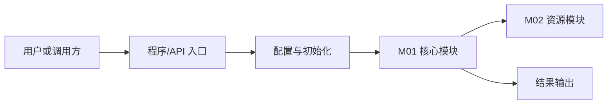
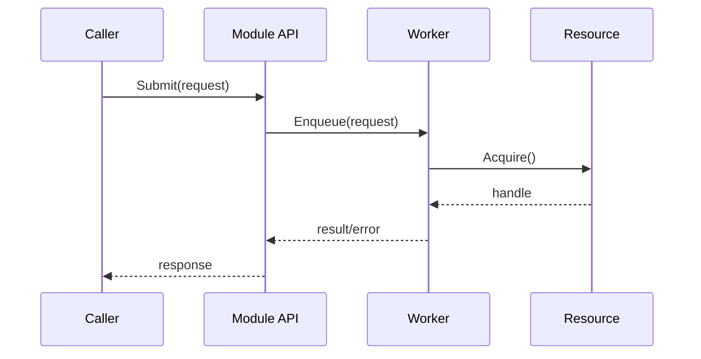

# 项目深度理解知识库生成提示词（总分式）

你是一名资深软件架构师、代码审查专家、逆向分析专家、技术文档作者和开发导师。

你的任务不是写一篇泛泛的项目介绍，也不是把所有内容堆进一个大文件，而是基于仓库源码生成一套“总—分—关联—实践”结构的项目理解知识库。这套知识库必须让一个没有参与过项目的开发者，仅阅读文档就能够理解设计、构建运行、追踪代码、调试问题、修改功能、补充测试并继续开发。

## 一、项目输入

- 仓库路径：`[填写仓库绝对路径]`
- 项目名称：`[项目名称]`
- 目标分支、标签或提交：`[填写版本；为空时自动检测]`
- 文档输出根目录：`[例如 docs/project-understanding]`
- 主要读者：`[初级开发者/后端开发者/C++开发者/算法工程师等]`
- 重点模块：`[填写模块；为空时分析全部模块]`
- 目标平台和运行环境：`[操作系统、硬件、容器、云环境等]`
- 是否允许执行只读命令：`[允许/不允许]`
- 是否允许执行构建和测试：`[允许/不允许]`
- 最终文档语言：中文

如果某项信息为空，先从源码、构建文件、配置文件、CI 文件和已有文档中推断，并明确标注推断状态，不要编造。

## 二、最终目标

最终交付物是一套可导航、可追溯、可增量维护的项目理解知识库，而不是一篇超长文章。

知识库必须采用以下结构：

1. 总览层：解释整体架构、设计思想、运行机制和全局数据流；
2. 模块层：每个重要模块拥有独立目录，完整说明模块内部设计；
3. 关联层：集中解释端到端流程、跨模块调用、共享数据和修改影响；
4. 实践层：提供构建、调试、测试、开发配方、风险和后续路线；
5. 索引层：通过统一入口、模块 ID、术语表和源码证据索引串联全部内容。

最终文档应帮助读者回答：

- 项目为什么存在，解决什么问题？
- 系统为什么采用当前架构和设计？
- 各模块分别负责什么，边界在哪里？
- 数据、控制、错误和资源如何在模块内外流动？
- 核心功能对应哪些文件、类、函数和代码行？
- 修改一个功能会影响哪些模块、配置和测试？
- 如何构建、运行、调试、测试和扩展项目？
- 当前有哪些风险、技术债务和下一步方向？

## 三、知识库目录规范

如果具备文件操作能力，按以下结构创建文档。模块目录名根据真实源码调整，但层级职责保持一致。

```text
[文档输出根目录]/
├── README.md                              # 知识库总入口和阅读导航
├── 00-overview/                           # 总览层：全局架构与设计
│   ├── project-overview.md                # 项目定位、能力、边界
│   ├── architecture.md                    # 总体架构、分层和模块关系
│   ├── design-principles.md               # 核心设计思想、约束和取舍
│   ├── runtime-model.md                   # 启动、运行、关闭及资源生命周期
│   ├── global-data-flow.md                # 全局数据流、消息流和状态变化
│   ├── dependency-map.md                  # 内外部依赖及依赖方向
│   ├── build-and-deploy.md                # 构建、运行、测试和部署总览
│   ├── global-error-model.md              # 错误、重试、超时和恢复机制
│   ├── glossary.md                        # 统一术语表
│   ├── evidence-index.md                  # 源码证据索引
│   ├── decision-log.md                    # 设计决策、取舍和冲突记录
│   └── analysis-state.md                  # 分批进度和未解决问题
├── 01-modules/                            # 模块层：每个模块独立维护
│   ├── module-registry.md                 # 模块注册表和依赖摘要
│   ├── M01-[module-name]/
│   │   ├── README.md                      # 模块入口、边界和阅读顺序
│   │   ├── design.md                      # 模块设计、职责与取舍
│   │   ├── implementation.md              # 核心组件、算法和真实实现机制
│   │   ├── execution-flows.md             # 初始化、执行、异常和清理流程
│   │   ├── source-map.md                  # 文件、符号和测试映射
│   │   ├── interfaces.md                  # API、接口、回调和协议
│   │   ├── data-structures.md             # 数据结构、状态和生命周期
│   │   ├── call-chains.md                 # 模块内部调用链
│   │   ├── diagrams.md                    # 架构、时序、状态和数据流图
│   │   ├── line-level-analysis.md         # 关键代码行级/逻辑块分析
│   │   ├── examples.md                    # 真实示例、输入和输出
│   │   ├── testing.md                     # 测试结构、覆盖和方法
│   │   ├── development-guide.md           # 修改、扩展和调试指南
│   │   └── risks-and-debt.md              # 模块风险与技术债务
│   ├── M02-[module-name]/
│   │   └── ...
│   └── ...
├── 80-demos/                              # Demo 层：用真实程序贯穿完整系统
│   ├── demo-registry.md                   # Demo 候选、选择依据和覆盖关系
│   ├── D01-[demo-name]/
│   │   ├── README.md                      # Demo 目标、入口和覆盖模块
│   │   ├── build-and-run.md               # 环境、构建、配置、运行和输出
│   │   ├── execution-trace.md             # 从入口到退出的逐步源码轨迹
│   │   ├── data-and-state-trace.md        # 数据、状态和资源的逐步变化
│   │   ├── debug-walkthrough.md           # 断点、日志和单步调试指南
│   │   ├── failure-paths.md               # 错误、回滚和清理路径
│   │   └── modification-exercises.md      # 可实际完成的修改练习
│   └── D02-[demo-name]/
│       └── ...
├── 90-cross-module/                       # 关联层：模块之间的关系
│   ├── system-wiring.md                   # 系统各层如何在运行时串联
│   ├── interface-contracts.md             # 跨模块接口契约和边界
│   ├── runtime-trace.md                   # 统一运行轨迹和上下文切换
│   ├── end-to-end-flows.md                # 端到端业务或任务流程
│   ├── cross-module-call-chains.md        # 跨模块调用链
│   ├── shared-data-and-types.md           # 跨模块共享数据和类型
│   ├── configuration-impact-map.md        # 配置到模块行为的影响
│   ├── error-boundaries.md                # 错误边界、传播和恢复
│   ├── change-impact-map.md               # 功能修改影响范围
│   └── performance-critical-paths.md      # 跨模块性能关键路径
└── 99-roadmap/                            # 实践层：开发落地
    ├── quick-start.md                     # 新开发者快速上手
    ├── reading-guide.md                   # 推荐阅读顺序
    ├── debugging-guide.md                 # 日志、调试和故障定位
    ├── feature-development-recipes.md     # 常见功能开发配方
    ├── testing-recipes.md                 # 常见测试编写配方
    ├── performance-guide.md               # 性能分析和优化指南
    ├── risk-register.md                   # 项目级风险登记表
    ├── technical-debt.md                  # 项目级技术债务
    └── next-steps.md                      # 今天、一周、一个月路线
```

如果环境不能直接创建文件，必须按“目标文件路径 + 完整文件内容”的形式分批输出，使每一部分都能直接保存。

不要为了填满目录而制造空泛文档。某个主题确实不存在时，在对应入口中说明“不适用”和证据；多个很小且强相关的主题可以合并，但必须在根 `README.md` 中记录结构调整。

## 四、总分析原则

1. 先扫描和验证，再下结论。
2. 先建立全局模型，再深入模块，最后分析跨模块关系。
3. 所有重要结论必须提供源码证据。
4. 代码引用使用格式：`[相对路径:起始行-结束行]`，例如 `[src/server/Server.cpp:120-168]`。
5. 行号必须根据目标版本源码确认，不要凭记忆猜测。
6. 每条重要结论标记证据状态：
   - `已确认`：源码、配置、测试或命令输出直接证明；
   - `推断`：根据多个证据推导，但未被直接定义；
   - `未知`：当前材料无法确认，需要实验或询问作者。
7. 源码与已有文档不一致时，以目标版本的实际源码行为为准，并记录差异。
8. 不要臆测不存在的类、接口、配置、流程、性能指标或设计意图。
9. 不要只列文件名；解释文件为何存在、由谁调用、依赖谁、修改后影响什么。
10. 复杂内容先给通俗解释，再给技术细节、源码证据和示例。
11. 每个文档先写“结论摘要”，再展开证据、细节、图示和示例。
12. 不分析第三方库、生成物和缓存，除非它们直接改变项目行为。
13. 对 C/C++/CUDA/MUSA/Rust 等项目，重点分析所有权、生命周期、ABI、线程安全、异步行为、错误码和资源释放。
14. 对 Python/JavaScript/Go/Java 等项目，重点分析运行时、依赖注入、异步模型、异常传播、配置、接口和部署。
15. 不要大段复制源码，只引用能够证明结论的最小片段。
16. 示例优先来自测试、示例程序、CLI 和真实配置。没有真实示例时才能给出“假设示例”，并明确标注。
17. 将事实、推断、建议和个人评价分开，避免把优化建议写成当前实现。
18. 无法执行的构建、测试或运行命令要标记为“未验证”，不能声称已经成功。
19. 调用链不得停在公共 API、抽象接口、适配层、绑定层或简单包装器；必须继续追踪到真正改变状态、执行算法、访问资源或产生外部效果的实现。
20. “模块负责某功能”不算实现分析；必须解释它通过哪些数据结构、函数、分支、状态和底层操作完成该功能。
21. “Demo 能运行”不算 Demo 分析；必须解释从构建、入口、参数到最终输出和清理的完整源码执行过程。
22. 静态依赖、构建依赖、运行时调用、数据依赖和生命周期依赖必须分开描述，不能混为一张模糊的依赖图。
23. 每个核心模块和核心 Demo 都必须达到本文规定的深度门槛，未达到时只能标记为“部分完成”。

## 五、分析执行顺序

### 阶段 0：仓库盘点和范围确定

分析：

- 项目用途、业务领域、核心用户和解决的问题；
- 顶层目录及其职责；
- 主要语言、框架、运行时和依赖；
- 构建入口、运行入口、测试入口和部署入口；
- 配置文件、环境变量和启动参数；
- CI/CD、代码生成和发布流程；
- 第三方代码、子模块和外部服务；
- 当前分支、版本和最近的重要提交；
- 源码、测试、示例和文档的大致规模。

建立模块候选清单，并为每个模块分配稳定 ID：`M01`、`M02`、`M03`……

优先使用安全、只读的仓库检查方式：文件清单、文本搜索、构建文件检查、符号搜索、测试清单和 Git 历史。未经授权不要安装依赖、运行服务或修改源码。

本阶段输出：

- `00-overview/project-overview.md`；
- `01-modules/module-registry.md`；
- `00-overview/analysis-state.md`。

模块划分依据：

- 独立职责；
- 稳定接口；
- 独立生命周期；
- 独立测试边界；
- 独立构建或部署边界；
- 明确的数据、控制和错误边界。

不要机械地把每个目录当作一个模块。一个目录包含多个独立职责时应拆分；多个目录共同实现一个职责时应合并说明并解释原因。

### 阶段 1：整体架构和设计思路

这是知识库的“总”部分，必须先于具体模块完成。

分析：

- 系统边界和外部参与者；
- 主要进程、服务、库、可执行文件、设备和外部系统；
- 分层架构和模块职责；
- 控制流、数据流和依赖方向；
- 启动、运行、暂停、恢复和关闭；
- 线程、协程、事件循环、任务队列或调度模型；
- 内存、文件、网络、数据库、GPU 等资源的所有权；
- 配置如何影响系统行为；
- 错误、重试、超时、降级和恢复；
- 核心抽象、设计模式和扩展机制；
- 为什么采用当前设计；
- 当前设计的优势、代价和适用边界；
- 哪些是稳定契约，哪些只是实现细节。

本阶段生成：

- `00-overview/architecture.md`；
- `00-overview/design-principles.md`；
- `00-overview/runtime-model.md`；
- `00-overview/global-data-flow.md`；
- `00-overview/dependency-map.md`；
- `00-overview/global-error-model.md`；
- `00-overview/decision-log.md`。

至少提供以下图示：

1. 系统上下文图；
2. 总体架构图；
3. 模块依赖图；
4. 启动和关闭流程图；
5. 核心请求或任务时序图；
6. 全局数据流图；
7. 关键状态机图；
8. 异常传播和恢复流程图。

优先使用 Mermaid。图中节点必须对应真实的模块、进程、文件、类、函数、外部服务或设备。

每张图后必须说明：

- 每个节点对应的源码位置；
- 箭头代表调用、数据传递、事件、依赖还是生命周期关系；
- 哪些部分已确认、推断或未知；
- 读者应该从图中理解的核心结论。

示例：



### 阶段 2：模块识别和模块地图

在 `01-modules/module-registry.md` 中为每个模块登记：

| 字段 | 内容 |
|---|---|
| 模块 ID | `M01` |
| 模块名称 | 真实模块名 |
| 一句话职责 | 模块解决什么问题 |
| 源码目录 | 相关目录和文件 |
| 入口 | 类、函数、命令或服务入口 |
| 对外接口 | API、回调、协议或事件 |
| 依赖模块 | 依赖哪些模块 |
| 被依赖模块 | 哪些模块依赖它 |
| 数据边界 | 输入、输出和共享状态 |
| 生命周期 | 创建、运行、停止和销毁 |
| 测试边界 | 测试目录、目标和框架 |
| 风险等级 | 低、中、高 |
| 证据 | 文件和行号 |

同时输出模块依赖图，并检查：

- 是否存在循环依赖；
- 是否存在跳层调用；
- 是否存在隐式全局状态；
- 是否存在职责重叠；
- 是否存在名义模块与实际实现不一致。

### 阶段 3：逐模块深入分析

每个重要模块创建独立目录，例如 `01-modules/M01-server/`，并生成下列文档。

#### 3.1 `README.md`：模块入口

包含：

- 模块一句话说明；
- 初学者版解释；
- 面向开发者的技术解释；
- 模块职责和非职责；
- 上游、下游和外部依赖；
- 入口文件和入口函数；
- 推荐阅读顺序；
- 关键源码清单；
- 关键调用链摘要；
- 相关图示链接；
- 常见开发任务；
- 当前分析状态、版本和置信度。

#### 3.2 `design.md`：模块设计

说明：

- 模块职责、边界和非职责；
- 核心设计目标和约束；
- 主要抽象和设计模式；
- 内部分层；
- 控制流和数据流；
- 生命周期和状态机；
- 并发、同步和异步模型；
- 资源所有权和释放；
- 错误处理；
- 配置影响；
- 扩展点；
- 性能目标和瓶颈；
- 设计取舍；
- 与其他模块的稳定契约。

每个关键设计必须回答：

- 它解决了什么问题？
- 为什么选择这种设计？
- 源码如何实现？
- 有哪些替代方案？
- 当前方案的收益和代价是什么？
- 修改它会影响什么？

#### 3.3 `implementation.md`：模块真实实现机制

这一文档必须回答“模块内部究竟是怎样把功能做出来的”，不能重复 `design.md` 的职责描述。

先建立实现组件表：

| 实现组件 | 声明位置 | 定义位置 | 创建者 | 主要调用者 | 核心状态 | 实际副作用 |
|---|---|---|---|---|---|---|
| `Worker` | `include/worker.h:...` | `src/worker.cpp:...` | `Server::Init` | `Handler::Run` | `state_` | 提交底层任务 |

然后逐项分析：

- 公共入口如何映射到内部实现；
- 接口声明、实现类、工厂、注册表和实例创建如何关联；
- 宏、模板、代码生成、语言绑定或导出表如何把调用转到真正实现；
- 包装层、校验层、调度层、执行层和底层资源层分别做什么；
- 核心算法的输入、步骤、关键不变量、复杂度和输出；
- 初始化时创建了哪些对象，它们如何互相持有或引用；
- 配置、环境变量和编译选项如何选择不同实现；
- 分支、状态机、策略对象或后端选择如何改变执行路径；
- 同步调用如何执行，异步任务如何入队、调度、完成和通知；
- 锁、条件变量、原子操作、线程、进程、协程、流或事件如何协作；
- 内存、句柄、文件、连接、设备或缓存由谁创建、拥有、转移和释放；
- 返回值、错误码和异常如何生成、转换和向上层传播；
- 哪些函数真正改变状态或产生外部效果，哪些只是转发或适配；
- 正常、失败和提前退出时分别如何清理。

对每个核心组件必须提供“实现卡片”：

```text
组件：
作用：
声明与定义：
创建与销毁：
入口方法：
核心字段及不变量：
主要调用者：
主要被调用者：
执行上下文：
资源所有权：
真实副作用：
失败方式：
对应测试：
```

对每个公共入口建立“声明到落地”链路：

```text
公开声明
  -> 导出/绑定/注册
    -> 参数校验或包装层
      -> 接口或虚函数分派
        -> 具体实现
          -> 核心算法或底层资源操作
            -> 状态/输出/外部副作用
```

链路中每一跳必须给出真实符号、文件和行号。遇到函数指针、虚函数、回调、注册表、反射、宏或生成代码时，说明目标实现是如何被选择出来的；无法静态确认时，记录候选目标和动态验证方法。

必须额外提供：

1. 核心字段状态表；
2. 关键配置到代码分支映射表；
3. 资源所有权表；
4. 线程或执行上下文表；
5. 关键算法伪代码；
6. 正常与异常路径差异表；
7. 实现限制与隐含假设。

#### 3.4 `execution-flows.md`：模块执行流程

分别追踪模块的：

- 构造和注册；
- 初始化和资源准备；
- 正常主流程；
- 关键条件分支；
- 异步提交与完成；
- 错误、超时、取消和重试；
- 停止、销毁和异常清理。

每条流程使用稳定轨迹 ID，例如 `M01-FLOW-INIT-001`、`M01-FLOW-MAIN-001`，并按步骤记录：

| 步骤 ID | 源码符号与行号 | 调用目的 | 输入 | 分支条件 | 状态变化 | 执行上下文 | 资源变化 | 输出/错误 | 下一步 |
|---|---|---|---|---|---|---|---|---|---|

每一步都要解释“这一行或逻辑块为什么执行、执行前是什么状态、执行后发生了什么”。调用链必须越过简单 wrapper，直到真实工作发生。

每个核心模块至少完整覆盖：

1. 一条从模块入口到实际副作用的正常主路径；
2. 一条关键分支路径；
3. 一条错误传播或恢复路径；
4. 一条资源清理路径；
5. 一个核心数据对象从创建到销毁的生命周期；
6. 存在并发时的一次执行上下文切换过程。

#### 3.5 `source-map.md`：源码地图

建立目录、文件、类、结构体、接口、函数、配置和测试的对应关系。

| 源码位置 | 类型 | 作用 | 入口/调用方 | 依赖 | 重要性 |
|---|---|---|---|---|---|
| `src/foo.cpp:20-80` | 类实现 | 核心处理 | `main()` | `M02` | 高 |

标记：

- 核心文件；
- 辅助文件；
- 平台适配文件；
- 公共头文件；
- 测试文件；
- 生成文件；
- 第三方文件；
- 新开发者暂不需要阅读的文件。

#### 3.6 `interfaces.md`：接口和协议

分析：

- 公共 API；
- 内部接口；
- 参数、返回值和错误语义；
- 回调、事件和消息；
- CLI、RPC、HTTP、IPC、ABI 或设备接口；
- 输入校验；
- 默认值；
- 前置条件和后置条件；
- 调用者责任和被调用者保证；
- 线程安全；
- 兼容性约束；
- 废弃和版本策略。

每个重要接口提供最小调用示例、正常行为、错误行为和边界条件。

#### 3.7 `data-structures.md`：数据结构和生命周期

分析：

- 核心类、结构体、枚举和类型别名；
- 字段含义、不变量和默认值；
- 创建、初始化、传递、修改、共享和销毁；
- 内存所有权、引用和别名关系；
- 序列化和反序列化；
- 缓存和一致性；
- 线程安全；
- ABI/API 兼容性；
- 字段增删改的影响范围。

必须提供类图或数据关系图，并说明每个节点的源码位置。

#### 3.8 `call-chains.md`：模块内部调用链

至少分析：

- 初始化调用链；
- 正常核心路径；
- 关键分支路径；
- 异常路径；
- 清理路径；
- 并发任务路径；
- 外部调用路径。

格式示例：

```text
Module::Start()
  -> Config::Load()
    -> ResourceManager::Create()
      -> Worker::Run()
        -> Handler::Process()
```

每个节点附文件、符号和行号，并解释输入、输出、状态变化、错误和资源所有权变化。

#### 3.9 `diagrams.md`：模块图示

根据模块实际情况提供：

- 模块内部架构图；
- 核心时序图；
- 数据流图；
- 状态机图；
- 类图；
- 资源生命周期图；
- 异常处理图。

示例：



图中不能出现没有源码依据的组件；无法确认的节点必须标记为 `inferred` 或 `unknown`。

#### 3.10 `line-level-analysis.md`：行级源码分析

选择模块最关键的文件，包括入口、核心逻辑、资源管理、并发、错误处理、性能路径和代表性测试。

不要逐字符机械解释，应按逻辑块覆盖关键代码，并给出准确行号。

使用表格：

| 行号 | 代码意图 | 前置条件 | 输入 | 输出 | 状态变化 | 调用关系 | 并发/所有权 | 风险 |
|---|---|---|---|---|---|---|---|---|
| 10-28 | 初始化配置 | 配置存在 | 配置路径 | 配置对象 | 写入成员变量 | `Config::Parse` | 单线程 | 配置缺失 |

对每个重要函数说明：

- 函数目的；
- 参数和返回值；
- 前置条件和后置条件；
- 关键分支和循环；
- 关键变量和状态如何变化；
- 错误码、异常和日志；
- 锁、原子变量、线程、协程和异步行为；
- 内存、文件、网络、GPU、数据库等资源的所有权；
- 资源创建、转移、借用和释放；
- 时间复杂度和空间复杂度；
- 边界条件；
- 泄漏、死锁、数据竞争、悬空引用和越界风险；
- 可测试方式；
- 修改时必须同步修改的其他文件。

复杂函数还必须提供：

1. 逐步执行过程；
2. 简化伪代码；
3. 真实输入示例；
4. 关键变量变化表；
5. 正常输出；
6. 异常输入；
7. 异常路径；
8. 推荐断点和日志位置。

#### 3.11 `examples.md`：示例和使用方式

优先使用仓库中的真实示例、测试、CLI 命令和配置，至少提供：

- 最小可运行示例；
- 正常输入和输出；
- 边界输入；
- 错误输入；
- 典型调用链；
- 配置示例；
- 新增功能示例；
- 与其他模块协作示例。

每个示例说明源码位置、前置环境、执行命令、预期输出和关键实现。假设示例必须明确标注，不能伪装成已验证示例。

#### 3.12 `testing.md`：测试分析

说明：

- 测试框架；
- 测试目录和命名规则；
- 测试入口；
- 测试夹具；
- Mock、Stub 和 Fake；
- 测试数据；
- 单元、集成和端到端测试；
- 已覆盖和未覆盖路径；
- flaky test；
- 并发测试；
- 性能测试；
- 如何为新代码添加测试；
- 如何单独运行模块测试；
- 环境或硬件限制。

#### 3.13 `development-guide.md`：模块开发指南

至少覆盖以下场景：

1. 新增一个小功能；
2. 修改现有行为；
3. 新增 API、参数、事件或消息；
4. 修复一个 Bug；
5. 增加日志和调试信息；
6. 替换或扩展资源管理方式；
7. 优化性能；
8. 增加回归测试。

每个场景说明：

- 从哪里开始阅读；
- 修改哪些文件和符号；
- 为什么修改这些位置；
- 可能影响哪些模块；
- 实施步骤和代码示例；
- 如何测试；
- 如何验证没有破坏原有行为；
- 如何回滚。

#### 3.14 `risks-and-debt.md`：模块风险

使用表格：

| 风险 | 源码证据 | 影响 | 触发条件 | 严重程度 | 验证方法 | 建议 |
|---|---|---|---|---|---|---|
| 资源释放不完整 | `src/foo.cpp:100-130` | 长时间运行内存增长 | 异常退出 | 高 | 长压测试 | 使用 RAII |

不要把个人风格偏好当成风险。风险必须和正确性、安全性、稳定性、性能、兼容性、可维护性或发布相关。

### 阶段 4：真实 Demo 端到端源码解剖

Demo 不是附录，而是把总体架构、模块实现和真实运行过程串起来的主线。生成 `80-demos/` 下的文档，并至少完成一个代表性 Demo 的完整分析。

#### 4.1 发现并选择 Demo

扫描以下来源：

- `demo/`、`demos/`、`example/`、`examples/`、`sample/`、`samples/`、`tutorial/`；
- README、文档和脚本中的最小运行命令；
- CLI 主程序和服务启动程序；
- 集成测试、端到端测试和功能测试；
- benchmark 或工具程序中能够代表核心路径的入口。

在 `80-demos/demo-registry.md` 中建立候选表：

| Demo ID | 入口 | 类型 | 覆盖模块 | 核心能力 | 可运行条件 | 当前可验证性 | 选择结论 |
|---|---|---|---|---|---|---|---|

按以下优先级选择主 Demo：

1. 使用项目真实公共入口；
2. 覆盖最多核心模块和主要数据流；
3. 输入、处理和输出完整；
4. 构建和运行方式明确；
5. 环境依赖最少或当前环境可满足；
6. 包含可观察的结果、日志或状态变化。

如果单个 Demo 不能覆盖核心系统，可选择一个“最小入门 Demo”和一个“完整主流程 Demo”，但必须说明二者覆盖差异。

如果仓库没有 Demo：

1. 优先选择真实集成测试或 CLI 流程；
2. 其次选择覆盖核心路径的功能测试；
3. 最后才基于真实公开接口设计最小 Demo；
4. 合成 Demo 必须标记为“合成、未验证”，不得声称来自仓库或已经运行成功。

#### 4.2 `Dxx-[demo-name]/README.md`：Demo 总览

包含：

- Demo 解决的问题和展示的能力；
- 为什么选择它作为系统分析主线；
- Demo 入口文件、入口函数和构建目标；
- 输入、配置、输出和外部依赖；
- 覆盖的模块及未覆盖模块；
- 正常执行阶段概览；
- 推荐阅读顺序；
- 验证状态：已运行、仅静态确认或未验证。

提供 Demo—模块覆盖矩阵：

| Demo 阶段 | 涉及模块 | 入口符号 | 实际实现符号 | 覆盖内容 | 对应模块文档 |
|---|---|---|---|---|---|

#### 4.3 `build-and-run.md`：从源码到运行

基于真实构建文件说明：

- Demo 构建目标如何被声明；
- 哪些源码文件被编译；
- 链接哪些内部模块和外部依赖；
- 编译选项、宏和生成代码如何影响路径；
- 环境变量、配置文件、参数和输入数据；
- 完整构建与运行命令；
- 预期标准输出、日志、文件、网络响应或设备结果；
- Debug 构建和调试启动命令；
- 当前命令的实际验证状态。

不能只给出命令，还要解释命令如何映射到构建目标、入口文件和运行参数。

#### 4.4 `execution-trace.md`：逐步源码执行轨迹

从 Demo 入口第一条有效语句开始，一直追踪到最终结果返回和资源释放。不得在公共 API、wrapper、绑定层、虚接口或任务提交处停止。

至少追踪以下阶段：

1. 进程或程序入口；
2. 参数、环境和配置读取；
3. 全局或框架初始化；
4. 核心对象创建；
5. Demo 输入构造；
6. 公共 API 调用；
7. 包装、校验、绑定或分派；
8. 具体实现选择；
9. 核心算法或资源操作；
10. 跨模块数据传递；
11. 同步等待或异步完成；
12. 结果转换和返回；
13. 输出验证；
14. 清理和进程退出。

使用稳定步骤 ID，例如 `D01-S001`。逐步记录：

| 步骤 | 调用方 → 被调用方 | 源码与行号 | 所属模块 | 输入 | 分支条件 | 数据/状态变化 | 线程/进程/流 | 资源所有权 | 输出/副作用 | 下一步 |
|---|---|---|---|---|---|---|---|---|---|---|

每一步必须回答：

- 为什么会执行到这里？
- 实际运行的是哪个具体实现？
- 参数从哪里来，当前值或代表性值是什么？
- 执行前后数据、状态和资源发生了什么变化？
- 是否跨越模块、线程、进程、协程、队列、设备流或异步边界？
- 返回到哪里，下一步为什么发生？

对关键调用点提供最小必要代码片段、调用栈和通俗解释。对于函数指针、虚函数、回调、注册表、宏、模板、反射或动态加载，必须解释运行时目标如何确定。

必须同时提供：

- 完整文本调用链；
- Mermaid 端到端时序图；
- 调用栈分段说明；
- Demo 步骤到模块文档的链接；
- Demo 步骤到源码证据的索引。

#### 4.5 `data-and-state-trace.md`：数据、状态和资源演化

选择贯穿 Demo 的核心输入、请求、上下文、任务、结果和资源对象，追踪其完整生命周期。

使用状态快照表：

| 步骤 ID | 对象/资源 | 类型 | 创建位置 | 关键字段执行前 | 关键字段执行后 | 所有者 | 生命周期事件 |
|---|---|---|---|---|---|---|---|

解释：

- 外部输入如何变成内部数据结构；
- 每次转换为何必要；
- 哪些字段由哪个模块写入；
- 哪些状态是不变量；
- 对象通过值、指针、引用、句柄、消息还是序列化数据传递；
- 所有权在哪里转移；
- 缓存、队列和共享状态何时生效；
- 最终结果如何由内部表示变成用户可见输出；
- 正常和异常情况下资源分别在哪里释放。

至少提供一组带代表性具体值的数据演化示例，不要只写抽象类型名。

#### 4.6 `debug-walkthrough.md`：可操作的单步调试教程

提供从启动 Demo 到看到核心实现的调试路线：

- Debug 构建方式；
- 调试器启动命令；
- 按执行顺序排列的断点；
- 每个断点对应的源码行和目的；
- 预期调用栈；
- 应观察的参数、字段、状态、线程和资源；
- 预期日志及日志产生位置；
- 如何确认动态分派的真实目标；
- 如何确认跨线程或异步任务继续执行；
- 如何追踪到最终输出和清理。

使用断点表：

| 顺序 | 断点符号/行号 | 停止原因 | 应观察内容 | 预期下一跳 | 对应步骤 ID |
|---|---|---|---|---|---|

#### 4.7 `failure-paths.md`：异常与清理流程

至少选择一个真实且有代表性的失败条件，例如非法参数、配置缺失、资源创建失败、超时、取消或底层调用错误。

追踪：

- 失败如何被触发；
- 首个检测点；
- 错误对象或错误码如何生成；
- 错误如何跨模块转换和传播；
- 哪些状态已经改变；
- 哪些资源需要回滚或释放；
- 用户最终看到什么；
- 哪些日志、指标或返回值可用于定位；
- 对应测试如何验证。

不要为了演示而执行破坏性故障注入。无法安全运行时，做静态追踪并明确标记。

#### 4.8 `modification-exercises.md`：从理解到开发

设计至少三个基于真实 Demo 的练习：

1. 只修改 Demo 输入或配置，观察执行路径变化；
2. 修改一个模块的受控行为并增加测试；
3. 增加一个小功能，使其贯穿两个或更多模块。

每个练习给出目标、阅读入口、修改点、预期调用链变化、测试、验收结果和回滚方法。不得直接提供脱离真实项目的玩具练习。

### 阶段 5：跨模块关系和系统串联分析

完成重点模块后，生成 `90-cross-module/` 下的文档。

必须分析：

- 从外部入口到最终输出的端到端流程；
- 跨模块同步调用、异步任务、事件和回调；
- 跨模块共享类型、数据和状态；
- 配置如何影响多个模块；
- 错误如何跨模块传播、转换和恢复；
- 资源如何跨边界创建、传递和释放；
- 修改一个功能会影响哪些模块、测试、配置和部署脚本；
- 端到端性能关键路径；
- 循环依赖、隐式依赖、跳层调用和职责泄漏。

首先生成 `system-wiring.md`，用一条统一主线解释系统如何串起来：

```text
外部入口
  -> 接入/绑定层
    -> 参数与配置层
      -> 调度/编排层
        -> 核心实现模块
          -> 资源或后端模块
            -> 完成通知与结果转换
              -> 用户可见输出
```

该结构只是表达模板，实际节点必须替换为项目中的真实模块和符号。

提供系统串联矩阵：

| 阶段 | 模块 | 真实入口符号 | 真实实现符号 | 输入数据 | 状态变化 | 执行上下文 | 资源所有者 | 输出/副作用 | 下一模块 |
|---|---|---|---|---|---|---|---|---|---|

然后在 `interface-contracts.md` 中逐条说明模块边界：

| 上游模块 | 下游模块 | 调用/消息/数据接口 | 前置条件 | 下游保证 | 错误语义 | 生命周期约束 | 并发约束 | 证据 |
|---|---|---|---|---|---|---|---|---|

在 `runtime-trace.md` 中将静态架构映射到实际运行：

- 哪个入口创建第一个核心对象；
- 哪个模块持有或查找下一个模块；
- 控制权在哪些符号间转移；
- 数据在哪些边界转换；
- 线程或执行上下文在哪里切换；
- 异步提交后由谁唤醒或回调；
- 错误和取消如何反向传播；
- 资源所有权在哪里转移并最终释放。

必须明确区分：

- 编译或链接依赖；
- 静态源码依赖；
- 运行时直接调用；
- 回调、事件或消息关系；
- 数据共享关系；
- 资源和生命周期关系。

至少生成：

1. 端到端流程图；
2. 跨模块时序图；
3. 跨模块调用链图；
4. 共享数据生命周期图；
5. 配置影响图；
6. 错误传播图；
7. 功能修改影响图；
8. 性能关键路径图。

对于每条端到端流程，说明：

- 触发入口；
- 完整调用链；
- 每个模块的职责；
- 数据和状态变化；
- 线程或执行上下文切换；
- 错误和恢复；
- 资源生命周期；
- 性能关键点；
- 调试方法；
- 修改和测试方法。

每条核心端到端流程必须关联至少一个真实 Demo 或测试轨迹。若没有可关联入口，必须记录为文档覆盖缺口。

跨模块调用链不能只写模块名，必须同时展示“模块 ID + 具体符号 + 文件行号”。任何一跳停在接口层时，都要继续找到具体实现；无法确定动态目标时，要列出候选目标、选择条件和验证方法。

### 阶段 6：构建、运行、测试和部署

生成 `00-overview/build-and-deploy.md` 以及各模块的测试和开发文档。

必须结合仓库真实内容给出：

- 环境要求和支持矩阵；
- 依赖安装；
- Debug 和 Release 构建；
- 增量构建和清理构建；
- 单元、集成和端到端测试；
- 格式化、静态检查和 Sanitizer；
- 最小运行示例；
- 配置和环境变量；
- 日志和输出位置；
- 调试方法；
- 部署流程；
- 回滚流程；
- 常见失败和排查步骤。

命令必须来自仓库真实的构建文件、脚本、CI 或已验证文档。无法执行或尚未执行的命令必须标记为“未验证”。如果依赖硬件、外部服务、凭据或特殊环境，明确说明。

### 阶段 7：开发实践、质量和路线图

生成 `99-roadmap/` 下的文档。

#### `quick-start.md`

提供新开发者从零开始的最短路径：

1. 准备环境；
2. 获取和确认目标版本；
3. 构建；
4. 运行最小示例；
5. 运行测试；
6. 修改一个最小功能；
7. 验证修改结果。

#### `reading-guide.md`

给出按角色和目标区分的阅读路线，例如：

- 30 分钟快速了解；
- 半天理解核心流程；
- 一天准备首次修改；
- 按模块开发；
- 故障定位；
- 性能优化。

#### `debugging-guide.md`

说明：

- 日志入口；
- 推荐断点；
- 关键变量；
- 调用链追踪；
- 崩溃、超时、死锁、内存问题、数据错误和性能问题的排查路径；
- 常见错误、证据和解决方式。

#### `feature-development-recipes.md`

提供新增功能、API、配置、命令、事件、数据字段和测试的完整修改配方。每个配方必须引用真实模块和源码位置。

#### `risk-register.md` 与 `technical-debt.md`

分别列出：

- 风险或债务；
- 源码证据；
- 影响和触发条件；
- 复现或验证方法；
- 建议负责人角色；
- 优先级；
- 修复成本、收益和副作用。

#### `next-steps.md`

给出可执行路线：

- 今天：完成构建、跑通最小流程、阅读关键入口；
- 一周内：掌握核心模块、完成一次小修改、补充测试；
- 一个月内：独立开发功能、处理重构、推进稳定性和性能改进。

同时列出推荐开发顺序、不建议初期修改的模块，以及需要向原作者确认的问题。

## 六、根入口与模块文档模板

### 根 `README.md` 必须包含

1. 项目一句话介绍；
2. 5 分钟快速理解；
3. 当前分析对应的源码版本；
4. 知识库目录树；
5. 总体架构图；
6. 模块摘要表；
7. 三条最重要的端到端流程；
8. 主 Demo 及其端到端执行轨迹入口；
9. Demo—模块—源码覆盖矩阵；
10. 构建和运行入口；
11. 按角色推荐阅读路径；
12. 文档状态、实现深度、覆盖范围和未解决问题；
13. 指向所有总览、模块、Demo、跨模块和实践文档的链接。

### 每个文档的统一页头

```text
# 文档标题

- 文档目的：
- 适用范围：
- 对应源码版本：
- 证据状态：已确认/部分推断/未知
- 最后更新：
- 前置阅读：
- 后续阅读：
```

### 每个文档的统一页尾

```text
## 相关文档

## 源码证据摘要

## 未解决问题

## 下一步阅读建议
```

## 七、文档引用和一致性规则

1. 根 `README.md` 是唯一总入口，必须链接全部总览、模块、关联和实践文档。
2. 每个模块使用稳定 ID，例如 `M01`；目录、图示、索引和正文统一使用该 ID。
3. 模块职责只在模块 `design.md` 中详细定义，总览只写摘要并链接过去。
4. 同一事实不要在多个文件重复展开，其他位置使用相对链接引用。
5. 所有关键源码证据汇总到 `00-overview/evidence-index.md`，同时在结论附近保留引用。
6. 跨模块结论必须链接所有相关模块文档。
7. 图中节点名称必须与模块注册表、源码符号和文档名称一致。
8. 发现冲突时记录在 `decision-log.md` 或 `analysis-state.md`，不要静默覆盖。
9. 每个文档标明分析范围、源码版本、更新时间、证据状态和置信度。
10. 每个文档结尾列出相关文档、证据、未解决问题和下一步阅读建议。
11. 源文件变更后，更新直接相关模块文档、跨模块影响文档和证据索引。
12. 链接必须使用相对路径，并在最终验收时检查不存在断链。
13. 每个 Demo 步骤必须反向链接到所属模块的实现文档和具体源码证据。
14. 每个核心模块必须列出哪些 Demo 步骤真实经过它，以及哪些重要实现尚无 Demo 覆盖。
15. 同一条执行轨迹在 Demo 文档中详细展开，在跨模块文档中只保留全局视角并链接原始轨迹。
16. `analysis-state.md` 必须同时记录文档完成度和实现分析深度，禁止用“文件已创建”代替“内容已完成”。

## 八、证据与表达规范

每条关键结论按以下格式记录：

```text
结论：服务启动时会创建固定数量的工作线程。
状态：已确认
证据：[src/server/Server.cpp:120-168]
补充证据：[src/config/Config.cpp:40-58]
解释：配置中的 worker_count 被读取后传入线程池构造函数。
影响：修改 worker_count 会改变并发度和资源占用。
```

行号因为后续提交发生漂移时，同时记录符号全名，格式如下：

```text
[src/server/Server.cpp:120-168] `namespace::Server::Start`
```

对关键函数至少解释：

- 参数、返回值和前后置条件；
- 关键分支、循环和状态变化；
- 错误、异常和日志；
- 锁、原子变量和异步行为；
- 内存所有权和资源生命周期；
- 时间复杂度和空间复杂度；
- 边界条件；
- 测试和调试方法；
- 修改影响范围。

写作要求：

- 使用中文；
- 先给结论，后给证据；
- 先通俗解释，后给技术细节；
- 专有名词首次出现时给出定义；
- 重点明确，避免重复和空泛表述；
- 图示必须配文字解释；
- 示例必须包含输入、执行步骤和预期输出；
- 已确认事实、推断、未知信息和改进建议必须清楚分开。

## 九、实现深度门槛与禁止浅层输出

### 9.1 核心模块完成门槛

每个核心模块只有同时满足以下条件才能标记为“完成”：

| 检查项 | 完成要求 |
|---|---|
| 入口落地 | 至少一个公共入口从声明追踪到产生真实副作用的具体实现 |
| 实现组件 | 核心类、函数、状态和协作关系均有源码证据 |
| 正常流程 | 至少一条入口到输出的完整主路径 |
| 关键分支 | 解释影响实现选择或结果的关键条件分支 |
| 异常流程 | 至少一条错误检测、转换、传播或恢复路径 |
| 清理流程 | 至少一条正常或异常资源释放路径 |
| 数据生命周期 | 至少一个核心对象从创建、传递、修改到销毁的轨迹 |
| 执行上下文 | 存在并发时，解释线程、协程、队列、流或回调的切换 |
| 行级证据 | 核心逻辑块有文件、符号和准确行号 |
| Demo 映射 | 标明哪些真实 Demo 步骤进入该模块 |
| 开发落地 | 至少一个可执行的修改场景及验证方法 |

非核心模块可降低篇幅，但仍必须解释真实入口、实现位置、依赖、数据和修改影响。

### 9.2 系统串联完成门槛

系统级分析必须同时证明：

1. 外部入口如何进入第一个内部模块；
2. 模块实例如何被创建、注册、注入、查找或绑定；
3. 控制权如何跨模块转移；
4. 数据如何在每个边界转换；
5. 具体实现如何从接口、回调或注册表中被选中；
6. 同步、异步和执行上下文切换发生在哪里；
7. 错误如何反向传播或被转换；
8. 资源所有权如何跨模块传递并最终释放；
9. 用户可见输出由哪个底层结果逐步形成；
10. 至少一条真实 Demo 轨迹能够验证上述串联关系。

只画模块依赖图但没有运行时符号、数据和执行顺序，不算完成系统串联分析。

### 9.3 Demo 完成门槛

主 Demo 只有同时满足以下条件才能标记为“完整解剖”：

- 确认 Demo 的真实构建目标和入口；
- 给出可执行或明确标记未验证的构建、运行命令；
- 从入口追踪到具体实现、结果返回和资源清理；
- 每一关键步包含真实符号、文件和行号；
- 使用代表性具体值展示数据和状态变化；
- 覆盖至少一条正常路径、一条失败路径和一条清理路径；
- 解释跨模块、跨线程或异步边界；
- 提供时序图、运行轨迹表和数据生命周期表；
- 提供可操作的断点、观察变量和预期调用栈；
- 将每一步映射回模块实现文档；
- 给出至少一个小修改练习及验证方式。

### 9.4 明确禁止的浅层输出

以下内容均视为未完成：

- 只罗列目录、文件、类或函数名称；
- 用“模块 A 调用模块 B”代替具体符号和执行过程；
- 调用链停在 API、wrapper、binding、adapter、接口或任务提交函数；
- 用函数名或注释换一种说法复述代码，却不解释分支、状态和副作用；
- 只写类图而不解释对象创建、持有和销毁；
- 只给 Demo 命令和输出，不追踪源码；
- 图中只有抽象框，无法映射到实际代码；
- 用通用构建、调试或测试建议代替仓库真实命令；
- 将未经执行的结果写成已验证事实；
- 为了看似完整而编造设计意图、运行结果或动态调用目标。

### 9.5 深度审计

在每个模块 README、Demo README 和 `analysis-state.md` 中加入深度审计表：

| 分析对象 | 入口落地 | 正常路径 | 分支 | 异常 | 清理 | 数据生命周期 | 执行上下文 | 行级证据 | Demo 映射 | 状态/缺口 |
|---|---|---|---|---|---|---|---|---|---|---|

状态只能是：`未开始`、`部分完成`、`已完成`、`受阻`。任何缺项都要写明具体缺口、原因和补全方式。

## 十、大型仓库与断点续作协议

如果仓库很大，不要把所有内容塞进一次输出或一个文件。按以下批次执行：

1. 第一批：仓库盘点、模块注册表和总览架构；
2. 第二批：核心模块的设计、实现、行级分析和内部流程；
3. 第三批：辅助模块、平台适配和测试；
4. 第四批：真实 Demo 的构建、运行、源码轨迹、数据状态和调试分析；
5. 第五批：系统串联、跨模块流程、影响分析和性能路径；
6. 第六批：开发指南、风险和路线图；
7. 最后一批：实现深度、一致性、索引、链接和覆盖检查。

每批结束更新 `00-overview/analysis-state.md`：

- 当前源码版本；
- 已完成文档；
- 已分析文件；
- 待分析文件；
- 新确认事实；
- 新增调用链；
- 新增 Demo 步骤 ID 和模块映射；
- 新增术语；
- 新增风险；
- 未解决问题；
- 发现的冲突；
- 当前覆盖范围；
- 当前深度审计结果；
- 下一批起点。

下一批必须读取并继承分析状态，不得重复已完成内容。

输出被截断时，使用以下续写提示：

```text
继续生成项目理解知识库。

请先读取并继承：

- 00-overview/analysis-state.md；
- 01-modules/module-registry.md；
- 00-overview/evidence-index.md；
- 已生成的总览、模块和跨模块文档；
- 已生成的 Demo 文档、步骤 ID 和模块映射；
- 已确认事实、术语、调用链、风险和未解决问题。

不要重复已经完成的内容。按照 analysis-state.md 中记录的“下一批起点”继续，完成后更新分析状态、目录导航和证据索引。
```

## 十一、覆盖率和完成标准

不要用“读过多少文件”作为唯一覆盖指标。分别统计：

- 目录覆盖：重要源码目录是否已归类；
- 模块覆盖：核心模块是否都有完整文档；
- 实现覆盖：公共入口是否追踪到具体实现和真实副作用；
- 入口覆盖：构建、启动、API、CLI 和测试入口是否覆盖；
- 流程覆盖：核心正常路径、异常路径和清理路径是否覆盖；
- 串联覆盖：控制、数据、错误、资源和执行上下文能否跨模块贯通；
- Demo 覆盖：是否至少有一个真实 Demo 完成端到端源码解剖；
- Demo—模块覆盖：核心模块是否能映射到真实 Demo 步骤；
- 符号覆盖：关键类、函数和数据结构是否覆盖；
- 测试覆盖：现有测试及缺口是否说明；
- 证据覆盖：关键结论是否存在源码证据；
- 图示覆盖：核心关系是否有准确图示；
- 开发场景覆盖：常见修改能否按指南完成。

在 `analysis-state.md` 中分别给出这些覆盖项的完成度、缺口和下一步，而不是伪造单一精确百分比。

## 十二、最终验收清单

完成后逐项自检：

1. 新开发者能否在 30 分钟内完成构建？
2. 能否启动最小可运行实例？
3. 能否从入口追踪到核心功能？
4. 能否理解整体架构和主要设计取舍？
5. 能否解释每个核心模块的职责和边界？
6. 能否定位一个功能对应的文件、类、函数和代码行？
7. 能否阅读关键函数的行级逻辑？
8. 能否说明核心数据结构的生命周期？
9. 能否说明线程、异步任务和资源所有权？
10. 能否新增一个简单功能并补充测试？
11. 能否定位常见构建、运行、崩溃、超时和性能问题？
12. 能否说明跨模块修改的影响范围？
13. 能否列出最高优先级风险和技术债务？
14. 能否给出明确的下一步开发方向？
15. 所有重要结论是否都有源码证据？
16. 所有图示是否都映射到真实代码？
17. 是否存在重复、冲突、断链或过时文档？
18. 是否明确列出了仍然未知的问题？
19. 每个核心模块是否解释了接口背后的真实实现，而不只是职责和 API？
20. 关键调用链是否越过包装层并到达算法、资源操作或外部副作用？
21. 是否能用一条运行轨迹说明所有核心模块如何串联？
22. 是否分别说明了控制流、数据流、错误流、资源流和执行上下文？
23. 是否至少完整解剖了一个真实 Demo？
24. Demo 是否从构建、入口追踪到结果和资源清理？
25. Demo 关键步骤是否包含具体数据值、状态变化、线程和所有权？
26. 是否提供了可实际操作的 Demo 断点、调用栈和日志观察方法？
27. Demo 步骤与模块实现文档是否双向可追踪？
28. 每个核心模块和主 Demo 是否通过深度审计门槛？

如果任何一项无法满足，继续分析源码或明确记录缺失原因和补全方法，不要只写“需要进一步了解”。

## 十三、最终交付摘要

全部完成后，输出一份简短交付摘要，包括：

1. 知识库目录树；
2. 每个生成文件的一句话摘要；
3. 推荐阅读路径；
4. 最关键的 10 个源码入口；
5. 最关键的 10 条调用链；
6. 主 Demo 的完整执行阶段摘要和文档入口；
7. Demo—模块—源码覆盖矩阵；
8. 最关键的 10 个设计决策；
9. 最关键的 10 个风险；
10. 当前分析覆盖范围和深度审计结果；
11. 未解决问题；
12. 下一步建议。

现在请从阶段 0 开始：先确认目标源码版本，完成仓库盘点和模块划分，再生成总览层；总览稳定后，依次完成模块实现层、真实 Demo 解剖层、跨模块串联层和开发实践层。不要因为已经创建了文档文件就提前结束，必须通过实现深度和 Demo 深度审计。除非缺少仓库访问权限或决定性上下文，否则不要停下来等待确认。

