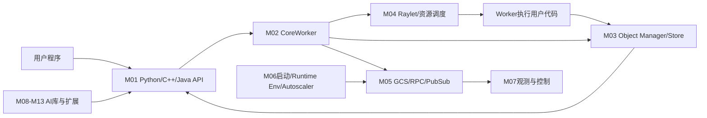

# 总体架构

- 文档目的：解释 Ray 的控制面、数据面和语言层如何组合。
- 对应源码版本：HEAD `cfe4725d23`（2026-09-17）。
- 证据状态：核心分层已确认；完整动态拓扑未验证。
- 前置阅读：[项目总览](project-overview.md)。后续阅读：[运行时模型](runtime-model.md)。

## 结论摘要

Ray 的稳定骨架是“语言 API/Driver → CoreWorker → Raylet/GCS/Object Manager → Worker/对象结果”。Python 公共导出位于 `python/ray/__init__.py`，CoreWorker 初始化时建立 Raylet IPC/RPC clients 并注册 worker；具体调度和跨节点传输由运行时组件完成。[已确认：`python/ray/__init__.py:80-130`、`src/ray/core_worker/core_worker_process.cc:231-285`]

- 节点映射：M01 `python/ray`、M02 `src/ray/core_worker`、M03 `src/ray/object_manager`、M04 `src/ray/raylet`、M05 `src/ray/gcs`/`rpc`、M06 `python/ray/autoscaler`/`runtime_env`。
- 实线表示代码调用、RPC 或数据传递；AI library 到 API 是运行时依赖。跨进程边界的确切消息序列需动态追踪。[已确认/推断]

## 分层解释

1. **入口层**：用户调用 `ray.init`、`ray.remote`、`ray.get`；公共 API 负责契约和句柄。
2. **提交层**：RemoteFunction/Actor wrapper 将 Python 对象和选项转换为 CoreWorker 可提交的任务。
3. **控制层**：Raylet 决定资源和节点，GCS 保存/传播集群控制元数据，RPC/protobuf 描述协议。
4. **数据层**：ObjectRef 指向不可变结果；对象管理器承担本地/跨节点对象可用性与存储策略。
5. **执行层**：worker 进程运行用户函数或 Actor 方法，并通过 CoreWorker 回传状态/结果。
6. **产品层**：Data、Train、Tune、RLlib、Serve 复用 Core，不改变 Core 的基本任务/对象契约。[已确认/推断]

## 设计边界

控制消息、对象数据、用户代码和运维观测是四类不同流；修改其中一类不得默认只影响一个目录。公共 API 的 wrapper 不是最终副作用位置，阅读调用链必须继续至 CoreWorker/Raylet/Object Manager。

## 相关文档
[依赖地图](dependency-map.md) · [全局数据流](global-data-flow.md) · [端到端流程](../90-cross-module/end-to-end-flows.md)

## 源码证据摘要
`README.rst:17-47`；`python/ray/__init__.py:80-130`；`python/ray/_private/worker.py:1439-1505`；`src/ray/core_worker/core_worker_process.cc:231-285`。

## 未解决问题
精确 RPC 方法、worker 进程创建分支和对象 spill 策略需分别阅读 protobuf、raylet 和 object_manager 实现。

## 下一步阅读建议
从 M01 的 `ray.remote` 进入 M02，再横向读取 M03-M05。
