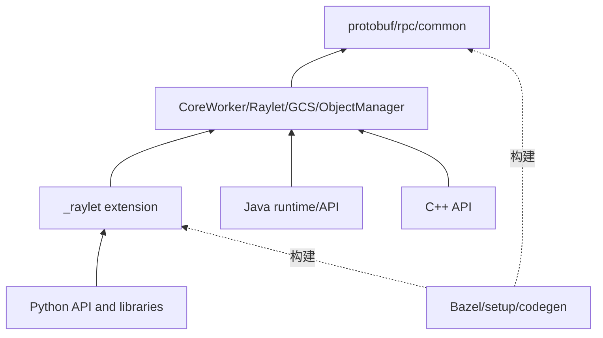

# 依赖地图

- 目的：区分静态、构建、运行、数据和生命周期依赖。
- 版本：HEAD `cfe4725d23`。状态：首轮静态盘点。
- 前置：[架构](architecture.md)。后续：[构建部署](build-and-deploy.md)。

## 结论摘要

Ray 是 Bazel/CMake/Python packaging 混合、多语言、多进程仓库；“目录引用”不等于运行时调用。Core 的 C++ target、Python extension/API、Java/C++ bindings 和 AI libraries 形成不同依赖层。[已确认：`BUILD.bazel`、`WORKSPACE`、`python/setup.py`、各模块 BUILD]

## 五类依赖

| 类型 | 代表关系 | 验证方式 |
|---|---|---|
| 静态源码 | Python wrapper→`_raylet`; CoreWorker→rpc/raylet clients | imports/includes、符号调用 |
| 构建 | wheel/extension→Bazel targets/protobuf | BUILD、setup、生成脚本 |
| 运行时 | Driver→Raylet/GCS/Worker | RPC/IPC 初始化与日志 |
| 数据 | Worker result→Object Store→ObjectRef consumer | object manager/CoreWorker 状态 |
| 生命周期 | runtime startup precedes registration/submission | init/shutdown path |

箭头指“依赖于”；虚线仅代表构建生成关系。第三方库不展开，除非版本或 ABI 直接影响 Ray target。

## 高影响依赖

- `src/ray/protobuf` 改动可能影响所有语言和跨进程协议。
- `_raylet` 绑定和公共 IDs/ObjectRef 改动影响 Python/Core ABI。
- `src/ray/common` 和 scheduling 类型被多模块共享，需做影响扫描。
- AI libraries 的 Python 依赖不表示 C++ Core 反向依赖它们。

## 相关文档
[模块注册表](../01-modules/module-registry.md) · [接口契约](../90-cross-module/interface-contracts.md)

## 源码证据摘要
`BUILD.bazel`、`WORKSPACE`、`python/setup.py`、`src/ray/protobuf/BUILD.bazel`、`src/ray/core_worker/BUILD.bazel`。

## 未解决问题
未生成完整 include/import/target 图，循环和跳层调用需后续静态工具验证。

## 下一步阅读建议
读 M14 理解产物，再回到 M01-M05 的运行时关系。
