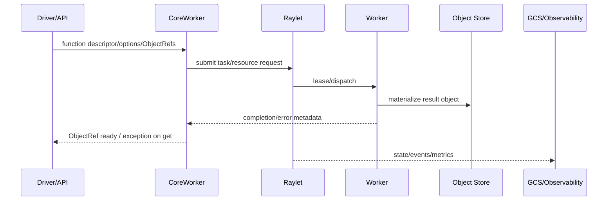

# 全局数据流

- 目的：区分任务控制、对象数据、错误和观测流。
- 版本：HEAD `cfe4725d23`。状态：代表路径静态确认。
- 前置：[运行时模型](runtime-model.md)。后续：[依赖地图](dependency-map.md)。

## 结论摘要

一次远程任务至少包含四条相互关联但不同的流：任务定义/参数进入提交链，调度元数据进入 Raylet/GCS，实际参数和结果通过对象引用与对象管理器流动，错误/指标/事件通过 worker 与观测系统传播。[推断，入口与组件存在性已确认]

## 数据类别

| 类别 | 输入 | 状态变化 | 输出/副作用 |
|---|---|---|---|
| 控制 | 函数描述、资源和重试选项 | pending→scheduled→running→finished/failed | worker dispatch、状态更新 |
| 对象 | Python 值、ObjectRef | local/remote availability、pin/spill/reconstruct | immutable object/result |
| 错误 | 序列化、用户异常、worker/node failure | error object/status/retry | `ray.get` 异常、日志/事件 |
| 观测 | task/node/object metrics、events | dashboard/GCS/metrics state | UI、日志、告警数据 |

## 所有权边界

Python 变量由用户进程拥有；ObjectRef 是逻辑引用，不等于对象字节所有权；CoreWorker 管理引用/任务上下文；对象数据由本地 store/object manager 与集群机制维护。具体 reference counting 和 pinning 需在 M03 深化，当前不可据此断言所有故障分支。

## 相关文档
[共享数据与类型](../90-cross-module/shared-data-and-types.md) · [性能关键路径](../90-cross-module/performance-critical-paths.md)

## 源码证据摘要
`python/ray/remote_function.py:41,358+`；`src/ray/core_worker/core_worker.cc:312-363`；`src/ray/object_manager/`；`src/ray/raylet/`。

## 未解决问题
跨节点 object pull/push、spill/restore、lineage reconstruction 的精确状态机仍待逐符号证据。

## 下一步阅读建议
按任务链读 M02/M04，再按 ObjectRef 读 M03。
