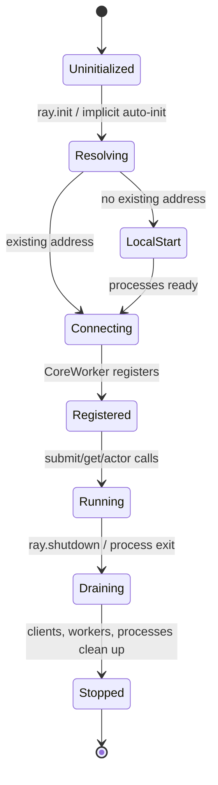

# 运行时模型

- 目的：解释 Ray 从启动、任务执行到关闭的生命周期。
- 版本：HEAD `cfe4725d23`；静态确认，未运行。
- 前置：[架构](architecture.md)。后续：[全局数据流](global-data-flow.md)。

## 结论摘要

`ray.init` 是 Python driver 的显式入口：它可连接已有集群或启动本地进程；CoreWorker 初始化建立与 Raylet 的 IPC/RPC 连接并注册 worker；`ray.shutdown` 触发 driver 侧断开和清理。实际子进程集合取决于地址、head/worker、dashboard 和部署配置。[已确认：`python/ray/_private/worker.py:1439-1505,2070+`、`src/ray/core_worker/core_worker_process.cc:231-285`]

## 生命周期

- `Resolving→LocalStart/Connecting` 由 `ray.init` 地址和环境配置选择。[已确认]
- CoreWorker 构造/初始化/Shutdown 位于 `core_worker.cc:312-363,585-628`。[已确认]
- “draining”的具体等待语义因组件而异，图中为统一概念，不表示源码中存在同名状态。[推断]

## 执行上下文

| 上下文 | 典型职责 | 所有权/边界 |
|---|---|---|
| Driver Python 进程 | 初始化、提交、持有 ObjectRef、获取结果 | 用户启动；`ray.shutdown` 清理连接 |
| Worker 进程 | 执行 task/Actor 方法 | runtime 创建/管理 |
| CoreWorker | 语言 worker 与分布式 runtime 桥接 | worker 进程内 |
| Raylet | 节点级资源与任务管理 | 每节点运行时进程 |
| GCS | 集群控制元数据和服务 | head/control plane |
| Object Manager/store | 对象可用性和传输 | 节点数据面 |

## 正常与异常

正常路径在注册成功后提交任务；初始化失败、worker 注册失败、资源不可满足、对象丢失和进程退出分别跨越 M01-M07。当前未运行，重试次数、超时和清理顺序不能仅凭公共 API 推断。

## 相关文档
[错误模型](global-error-model.md) · [运行轨迹](../90-cross-module/runtime-trace.md)

## 源码证据摘要
`python/ray/_private/worker.py:1439-1505,2070+`；`src/ray/core_worker/core_worker_process.cc:231-285`；`src/ray/core_worker/core_worker.cc:312-363,585-628`。

## 未解决问题
需补充单机启动进程树、信号处理、异常退出和 GCS/Raylet 重连的动态证据。

## 下一步阅读建议
阅读 D01 execution trace，将状态映射到具体 API 调用。
