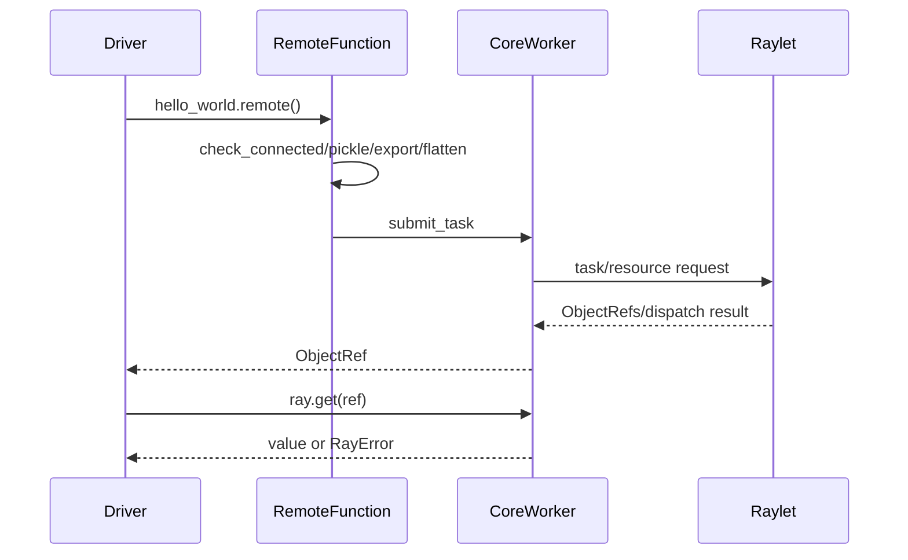

# M01 执行流程与图示

## 结论摘要

定义阶段只创建 wrapper；第一次 `.remote()` 才触发连接检查、函数序列化/export 和任务提交。[已确认：`remote_function.py:355-415`]

箭头代表调用或结果传递；Raylet 之后的 worker/object store 细节由 M02-M04 补充。图中已确认入口，跨进程顺序为静态推断。

## 相关文档
[README](README.md) · [M02](../M02-core-worker/README.md)

## 源码证据摘要
`remote_function.py:355-574`；`worker.py:2881-3029`。

## 未解决问题
需补 shutdown 和失败清理时序。

## 下一步阅读建议
读 D01 的 execution-trace。
