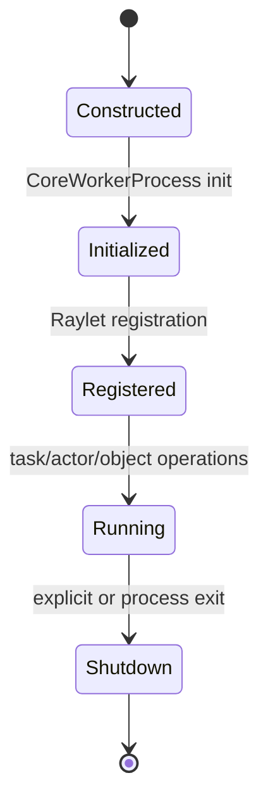

# M02 CoreWorker、任务提交与执行

- 文档目的：解释 Python/C++ worker 如何承接任务并管理生命周期。
- 对应源码版本：HEAD `cfe4725d23`（2026-09-17）。
- 证据状态：初始化、任务提交和生命周期代表代码已确认；动态执行与测试未验证。
- 前置阅读：[M01](../M01-public-api/README.md)。后续阅读：[M04 Raylet](../M04-raylet-scheduling/README.md)。

## 结论摘要

CoreWorker 是语言 worker 和 Ray C++ runtime 的桥接：进程初始化建立 Raylet IPC/RPC clients 并注册 worker；运行期接收 Python wrapper 的任务/对象操作；关闭时释放 runtime 状态。[已确认：`src/ray/core_worker/core_worker_process.cc:231-285`、`core_worker.cc:312-363,585-628`]

## 实现要点

- `CoreWorkerProcess`/`CoreWorker` 处在 worker 进程内，不是 Driver API 的简单别名。
- Raylet client、对象/任务管理器和 worker 注册形成初始化依赖。
- 任务执行、Actor、对象引用、调试和 metrics 共享生命周期边界；任一初始化失败都可能阻止提交。

## 调用链（代表）

```text
M01 worker.core_worker.submit_task
→ `_raylet.pyx:3938-4032`：参数、资源和调度策略转换
→ `CoreWorker::SubmitTask`：生成 TaskID/TaskSpec，加入 pending task
→ `NormalTaskSubmitter::SubmitTask`：依赖解析与 scheduling-key 排队
→ RequestWorkerLease → AddWorkerLeaseClient → PushNormalTask
→ worker execution
→ object result / error
```

该链描述源码中的调用和异步投递边界；尚未由真实 Ray 集群运行验证。

## 生命周期图



## 深度审计

| 分析对象 | 入口落地 | 正常路径 | 分支 | 异常 | 清理 | 数据生命周期 | 执行上下文 | 行级证据 | Demo 映射 | 状态/缺口 |
|---|---|---|---|---|---|---|---|---|---|---|
| CoreWorker | 初始化、binding、SubmitTask 已定位 | normal task 静态链已确认 | 依赖/lease/取消已记录 | 失败和重试边界已记录 | 初始化/关闭已记录 | TaskSpec/ObjectRef/pending task 已记录 | 已确认 worker 进程、IO/RPC 并发 | 已有代表区间 | D01 已映射 | Actor execution body 与动态故障待补 |

## 相关文档
[M01 调用链](../M01-public-api/call-chains.md) · [全局运行时](../../00-overview/runtime-model.md)

## 源码证据摘要
`python/ray/_raylet.pyx:3938-4032`；`src/ray/core_worker/core_worker.cc:2056-2135`；`src/ray/core_worker/task_submission/normal_task_submitter.cc:33-504`；`src/ray/core_worker/core_worker_process.cc:231-285`。

## 未解决问题
Actor 提交、worker execution body、跨语言描述符和动态故障恢复尚需逐符号/实验补齐；normal task 提交边界已确认。

## 下一步阅读建议
先读 `CoreWorker::SubmitTask` 和 `NormalTaskSubmitter::SubmitTask`，再看 M04 的 lease 和 NodeManager。
