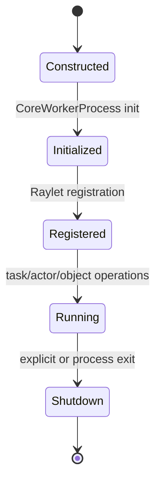

# M02 CoreWorker、任务提交与执行

- 文档目的：解释 Python/C++ worker 如何承接任务并管理生命周期。
- 对应源码版本：HEAD `cfe4725d23`（2026-09-17）。
- 证据状态：初始化和生命周期代表代码已确认；提交到执行的完整链部分完成，动态未验证。
- 前置阅读：[M01](../M01-public-api/README.md)。后续阅读：[M04 Raylet](../M04-raylet-scheduling/README.md)。

## 结论摘要

CoreWorker 是语言 worker 和 Ray C++ runtime 的桥接：进程初始化建立 Raylet IPC/RPC clients 并注册 worker；运行期接收 Python wrapper 的任务/对象操作；关闭时释放 runtime 状态。[已确认：`src/ray/core_worker/core_worker_process.cc:231-285`、`core_worker.cc:312-363,585-628`]

## 实现要点

- `CoreWorkerProcess`/`CoreWorker` 处在 worker 进程内，不是 Driver API 的简单别名。
- Raylet client、对象/任务管理器和 worker 注册形成初始化依赖。
- 任务执行、Actor、对象引用、调试和 metrics 共享生命周期边界；任一初始化失败都可能阻止提交。

## 调用链（代表）

```text
M01 worker.core_worker.submit_task
→ Python/Cython _raylet binding（待精确定位）
→ CoreWorker task submission（待精确定位）
→ Raylet RPC/client
→ worker execution
→ object result / error
```

## 生命周期图



## 深度审计

| 分析对象 | 入口落地 | 正常路径 | 分支 | 异常 | 清理 | 数据生命周期 | 执行上下文 | 行级证据 | Demo 映射 | 状态/缺口 |
|---|---|---|---|---|---|---|---|---|---|---|
| CoreWorker | 初始化/构造/Shutdown 已定位 | 部分完成 | 未完成 | 未完成 | 部分完成 | 未完成 | 已确认 worker 进程 | 已有代表区间 | D01 待映射 | 部分完成 |

## 相关文档
[M01 调用链](../M01-public-api/call-chains.md) · [全局运行时](../../00-overview/runtime-model.md)

## 源码证据摘要
`src/ray/core_worker/core_worker_process.cc:231-285`；`src/ray/core_worker/core_worker.cc:312-363,585-628`。

## 未解决问题
需定位 `_raylet` binding、CoreWorker submit/execute、task manager、worker registration RPC 和异常/重试清理。

## 下一步阅读建议
先从 C++ BUILD 和 core_worker 头文件定位具体提交符号，再看 M04。
