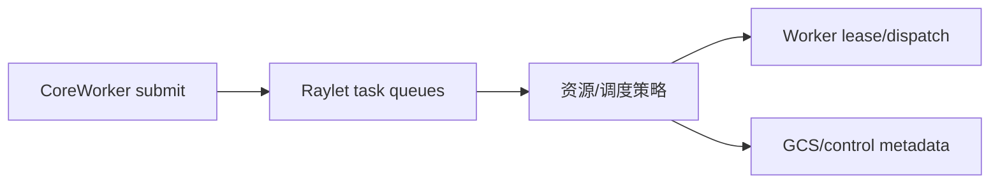

# M04 Raylet 调度与资源

- 目的：说明节点级调度、资源和 worker 管理边界。
- 版本：HEAD `cfe4725d23`；证据状态：目录/构建边界确认，算法待补。
- 前置：[M02](../M02-core-worker/README.md)。后续：[M05](../M05-gcs-control-plane/README.md)。

## 结论摘要

Raylet 是节点级任务、worker 和资源管理组件，源码位于 `src/ray/raylet`，调度相关公共数据和策略位于 `src/ray/common`/scheduling；它承接 CoreWorker 的提交并决定任务何时、在哪个节点资源上运行。[已确认目录与 BUILD；具体算法待符号级验证]

箭头表示提交、选择、派发或控制元数据关系；队列和策略节点是源码职责抽象，具体类待补。

## 深度审计

| 分析对象 | 入口落地 | 正常路径 | 分支 | 异常 | 清理 | 数据生命周期 | 执行上下文 | 行级证据 | Demo 映射 | 状态/缺口 |
|---|---|---|---|---|---|---|---|---|---|---|
| Raylet | 目录与 BUILD 已定位 | 未完成 | 未完成 | 未完成 | 未完成 | 未完成 | 节点进程推断 | 部分 | D01 间接 | 静态深化完成，动态未验证 |

## 相关文档
[架构](../../00-overview/architecture.md) · [性能路径](../../90-cross-module/performance-critical-paths.md)

## 源码证据摘要
`src/ray/raylet/`、`src/ray/common/scheduling/`、`src/ray/raylet/BUILD.bazel`。

## 未解决问题
需补 cluster_task_manager、local task manager、resource view、worker pool、placement group 和调度失败/重试。

## 下一步阅读建议
从 `src/ray/raylet/BUILD.bazel` 的 target 进入对应 `.cc/.h`。
