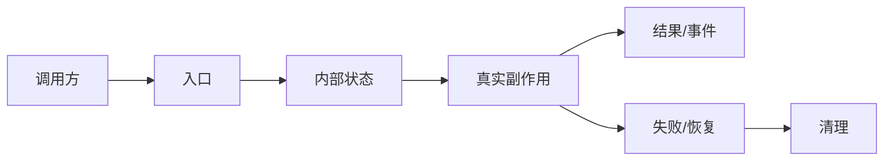
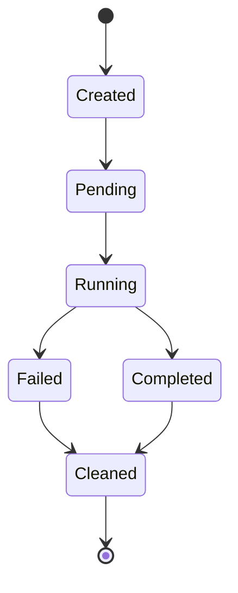

# 构建、CI、proto/codegen 与测试：图示

```mermaid
flowchart LR
 Caller[调用方] --> Entry[入口]
 Entry --> State[内部状态]
 State --> Work[真实副作用]
 Work --> Result[结果/事件]
 Work --> Fail[失败/恢复]
 Fail --> Cleanup[清理]
```

```mermaid
stateDiagram-v2
 [*] --> Created
 Created --> Pending
 Pending --> Running
 Running --> Completed
 Running --> Failed
 Failed --> Cleaned
 Completed --> Cleaned
 Cleaned --> [*]
```
