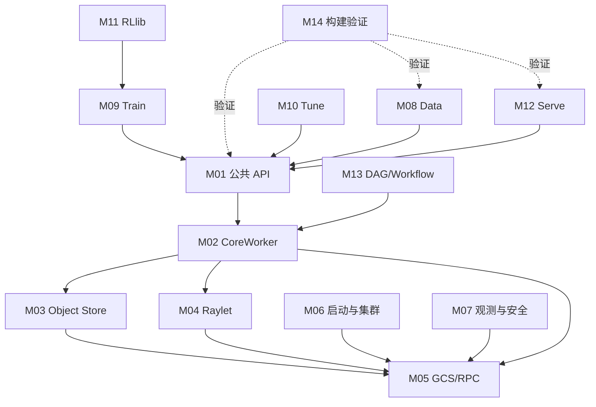

# 模块注册表

- 文档目的：登记稳定模块 ID、职责边界、入口和验证边界。
- 对应源码版本：`source/ray` HEAD `cfe4725d23`（2026-09-17）。
- 证据状态：M01-M14 的职责边界、代表入口和实现证据卡已建立；动态执行、完整符号覆盖和上游测试仍未验证。
- 最后更新：2026-09-17
- 前置阅读：[项目总览](../00-overview/project-overview.md)。
- 后续阅读：各模块 README。

## 结论摘要

模块按职责、接口、生命周期和测试边界划分，不按每个目录机械切分。M01-M07 是运行时骨架；M08-M13 是主要 Python AI/扩展库；M14 是构建、代码生成和验证系统。[已确认/推断，依据源码目录与 BUILD 文件]

| ID | 模块 | 源码范围 | 入口/接口 | 依赖与被依赖 | 测试边界 | 风险 |
|---|---|---|---|---|---|---|
| M01 | 公共 API 与句柄 | `python/ray/`, `cpp/`, `java/api/` | `ray.init/get/put/remote`, ObjectRef、ActorHandle | 依赖 M02；被所有应用库依赖 | `python/ray/tests`, `cpp`, `java/test` | 高 |
| M02 | CoreWorker、任务提交与执行 | `src/ray/core_worker`, `python/ray/_private/workers` | CoreWorker、任务/Actor提交、worker生命周期 | 依赖 M03-M05；被 M01 依赖 | core_worker tests、Python core tests | 高 |
| M03 | Object Store 与 Object Manager | `src/ray/object_manager`, object ref/serialization | object ownership、put/get、spill/restore | 依赖 M05；被 M02 依赖 | object manager、object spilling、object tests | 高 |
| M04 | Raylet 调度与资源 | `src/ray/raylet`, `src/ray/common/scheduling` | node manager、资源分配、任务队列 | 依赖 M05；被 M02 依赖 | raylet、scheduling、resource tests | 高 |
| M05 | GCS、RPC、PubSub 控制面 | `src/ray/gcs`, `gcs_rpc_client`, `rpc`, `pubsub` | GCS server/client、protobuf RPC、发布订阅 | 被 M02-M04、M06-M07 依赖 | gcs/rpc/pubsub tests | 高 |
| M06 | 启动、集群、Autoscaler、runtime env、jobs | `python/ray/autoscaler`, `runtime_env`, `job_submission`, `scripts` | `ray start`, `ray up`, runtime env/job APIs | 依赖 M01/M05；被部署与库依赖 | autoscaler/runtime_env/job tests | 高 |
| M07 | Dashboard、观测、调试与认证 | `python/ray/dashboard`, `src/ray/observability`, `stats`, auth | Dashboard、metrics、events、token auth | 依赖 M05/M06；被运维依赖 | dashboard/observability/auth tests | 高 |
| M08 | Ray Data | `python/ray/data` | Dataset、Datasource、Execution | 依赖 M01-M03；被 Train/Tune/用户依赖 | `python/ray/data/tests` | 高 |
| M09 | Ray Train | `python/ray/train` | Trainer、ScalingConfig、集群训练上下文 | 依赖 M01/M06/M07 | `python/ray/train/tests` | 高 |
| M10 | Ray Tune | `python/ray/tune` | Tuner、Trial、搜索/调度算法 | 依赖 M01/M07/M09 | `python/ray/tune/tests` | 高 |
| M11 | RLlib | `rllib`, `python/ray/rllib` | Algorithm、EnvRunner、Learner、RL modules | 依赖 M01/M08/M09/M10 | RLlib tests | 高 |
| M12 | Ray Serve | `python/ray/serve` | deployment、proxy、router、replica | 依赖 M01/M06/M07 | `python/ray/serve/tests` | 高 |
| M13 | DAG、Workflow、Experimental channels | `python/ray/dag`, `workflow`, `experimental` | DAG nodes、workflow、channels | 依赖 M01-M03；接口实验性较强 | 对应 tests | 中高 |
| M14 | 构建、CI、proto/codegen 与测试 | `BUILD.bazel`, `WORKSPACE`, `ci`, `.buildkite`, `src/ray/protobuf` | Bazel、wheel、CI pipeline、生成脚本 | 验证 M01-M13 | Bazel/pytest/CI 矩阵 | 中高 |

## 依赖图

实线为运行时依赖或控制/数据关系；虚线为构建和测试验证关系。AI libraries 依赖 Core，但各库内部算法不应被简化成同一模块。[推断]

## 边界规则

1. 公共 API 入口与真正改变状态的 Core 实现分开记录。
2. GCS/RPC 是控制面；对象内容和任务执行数据流不与元数据混为一谈。
3. 生成 proto、第三方和缓存不作为实现组件；只有改变构建或运行行为的配置纳入。
4. 当前所有动态运行和测试结果标记为未验证。

## 相关文档
- [总体架构](../00-overview/architecture.md) · [跨模块调用链](../90-cross-module/cross-module-call-chains.md)

## 源码证据摘要
- `source/ray/src/ray/*/BUILD.bazel`（模块构建边界）
- `source/ray/python/ray/*/BUILD.bazel`（Python 包测试/构建边界）
- [`AGENTS.md:56-72`](../../source/ray/AGENTS.md#L56-L72)

## 未解决问题

动态运行、Actor/Java/C++ 全链、跨节点故障和压力性能仍需真实上游环境验证；模块分析卡覆盖代表路径，不声称逐符号穷尽。

## 下一步阅读建议
先读 M01、M02、M04，再读 M03 和 M05 以理解任务与对象的控制/数据分离。
