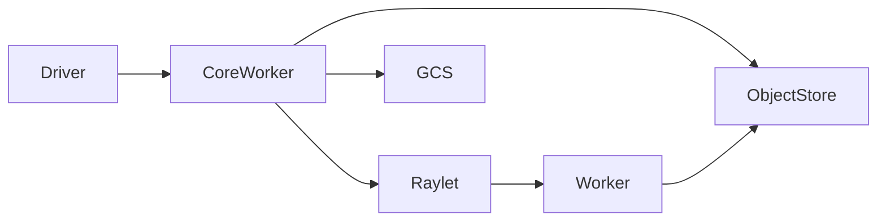

# 系统串联

- 对应源码版本：HEAD `cfe4725d23`（2026-09-17）。
- 证据状态：静态代表路径；运行/性能未验证。

## 结论摘要

Ray 的系统串联是 Driver/API、CoreWorker、Raylet、Object Manager、GCS 和 Worker 的多进程组合；AI libraries 通过 M01-M07 复用这条骨架。

## 关系/流程

节点对应 M01-M05；箭头表示调用、RPC 或对象结果流。

## 相关文档
[项目入口](../README.md) · [分析状态](../00-overview/analysis-state.md)

## 源码证据摘要
`source/ray/README.rst:17-47`；`source/ray/python/ray/__init__.py:80-130`；`source/ray/python/ray/remote_function.py:355-574`；`source/ray/src/ray/core_worker/core_worker_process.cc:231-285`。

## 未解决问题
动态进程、网络、GPU、重试和性能结论需要构建/运行日志；当前只保留静态证据或明确标注推断。

## 下一步阅读建议
从 M01→M05 和 D01 继续补齐精确符号、测试和运行证据。
