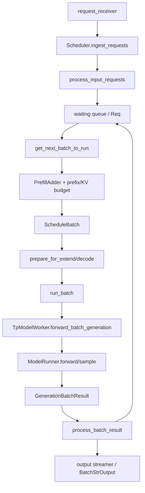

# M04 Scheduler 与连续批处理

- 文档目的：解释 scheduler 如何接收 tokenized request、维护 waiting/running 状态、进行 prefix/KV admission、构造 `ScheduleBatch`、调用 worker 并处理结果。
- 适用范围：`Scheduler`、`ScheduleBatch`、`Req`、`PrefillAdder`、普通/overlap event loop，以及 decode 内存不足时的 retraction。
- 对应源码版本：`f1a512c51c73ab660cf41e1af3110c7c11e3b600`
- 证据状态：部分完成
- 最后更新：2026-09-10
- 前置阅读：[M03 Tokenizer 与请求状态](../M03-tokenizer-request-state/README.md)、[调度器与连续批处理（基础文章）](../../02-request-flow/03-调度器与连续批处理.md)
- 后续阅读：[模型执行与输出](../../02-request-flow/04-模型执行与输出.md)、[D01 离线批量推理](../../80-demos/D01-offline-engine/01-离线批量推理.md)

## 结论摘要

**已确认**：Scheduler 的普通主循环每轮先接收外部请求，再根据 `running_batch` 和 `last_batch` 计算 `NextBatchPlan`，有 batch 时执行 `run_batch` 并调用 `process_batch_result`；没有 batch 时执行 idle 维护。[`python/sglang/srt/managers/scheduler.py:1893-1925`]

**通俗解释**：Scheduler 像一个不断开会的调度员。每轮会议先收取新任务，再看正在执行的任务还占多少资源，然后从等待队列中尽可能挑选新任务。它不会等一个请求完整结束才接下一个请求，而是让不同请求的 prefill/decode 交错进入批次，这就是 continuous batching。

**已确认**：请求在 scheduler 侧由 `Req` 表示，批次由 `ScheduleBatch` 表示。`Req` 保存原始 token、生成 token、KV 信息和 finish 状态；`ScheduleBatch` 还持有请求池、KV allocator、prefix cache、forward mode 和 device tensor 等每轮执行数据。[`python/sglang/srt/managers/schedule_batch.py:926-1018`][`python/sglang/srt/managers/schedule_batch.py:2184-2269`]

**部分推断**：D01 的四个 prompt 会被当前负载和资源预算拆成一个或多个 prefill/decode batch；静态源码能确认调度策略，不能仅凭示例确定实际批次边界。

## 1. 模块边界

### 1.1 负责什么？

| 责任 | 具体机制 | 证据 |
|---|---|---|
| 接收 scheduler 输入 | `ingest_requests` → `request_receiver.recv_requests` | [`python/sglang/srt/managers/scheduler.py:2050-2067`] |
| 把 IPC 对象分派为 scheduler 请求 | `process_input_requests` → `_request_dispatcher` | [`python/sglang/srt/managers/scheduler.py:2070-2105`] |
| 维护等待/运行请求 | admission、`running_batch`、waiting queue | [`python/sglang/srt/managers/scheduler.py:3499-3644`] |
| 预算 prefill 和 KV | `PrefillAdder`、prefix match、allocator capacity | [`python/sglang/srt/managers/schedule_policy.py:537-608`][`python/sglang/srt/managers/schedule_policy.py:1266-1359`] |
| 构造执行批次 | `ScheduleBatch.init_new`、`prepare_for_extend/decode` | [`python/sglang/srt/managers/schedule_batch.py:2380-2417`][`python/sglang/srt/managers/schedule_batch.py:2559-2605`][`python/sglang/srt/managers/schedule_batch.py:3343-3393`] |
| 调用模型 worker | `run_batch` → `forward_batch_generation` | [`python/sglang/srt/managers/scheduler.py:4199-4382`] |
| 处理 token/finish/KV 结果 | `process_batch_result` 分派 decode/prefill processor | [`python/sglang/srt/managers/scheduler.py:4548-4589`] |
| 资源不足时降级 | `retract_decode` 释放/备份或 abort | [`python/sglang/srt/managers/schedule_batch.py:3076-3159`] |

### 1.2 不负责什么？

- 不负责把用户文本 tokenize；由 M03 完成。
- 不负责 Transformer 层内部计算；由 M05、模型类和 device backend 完成。
- 不等于 KV cache 本身；scheduler 调用 M08 的 allocator/tree cache，但 KV tensor 和 cache policy 有独立生命周期。
- 不保证每一种部署变体都走 `event_loop_normal`；PP、overlap、PDMUX、disaggregation 和 speculative decoding 可选择不同 loop。

## 2. 运行时结构



节点对应源码：`Scheduler` 主循环在 [`python/sglang/srt/managers/scheduler.py:1893-1925`]；批次准备在 [`python/sglang/srt/managers/schedule_batch.py:2559-2605`]；执行在 [`python/sglang/srt/managers/scheduler.py:4199-4382`]。箭头表示调用或状态传递，`BatchStrOutput` 的跨进程返回由 M15/M03 接管。

## 3. 核心数据结构

### 3.1 scheduler-side `Req`

`Req` 是一个请求在 scheduler 进程内的可变执行状态。构造时保存 `rid`、原始 input ids、`SamplingParams`、日志概率/stream/LoRA 等选项；随后维护 `output_ids`、`full_untruncated_fill_ids`、`extend_range`、`ReqKvInfo`、batch index 和 finish 信息。[`python/sglang/srt/managers/schedule_batch.py:926-1018`]

关键不变量：

- `rid` 保持与 M03 输入/输出的关联；
- `origin_input_ids` 不等于完整序列，生成 token 位于 `output_ids`；
- `prefix_indices` 表示已经命中/拥有的 KV 前缀；
- `extend_range` 表示本次 prefill 需要写入的区间；
- `kv.req_pool_idx` 指向 request-to-token pool 的行；
- `output_ids` 按 decode 追加，不能通过保持长度不变的原地重写破坏 fill id 推导。[`python/sglang/srt/managers/schedule_batch.py:976-1005`]

### 3.2 `ScheduleBatch`

`ScheduleBatch` 是一次 forward 的 scheduler-side 快照/工作对象，包含：

- `reqs`；
- `req_to_token_pool`、`token_to_kv_pool_allocator`、`tree_cache`；
- `forward_mode`、`is_prefill_only`、chunked/pipeline 状态；
- `input_ids`、`req_pool_indices`、`seq_lens`、`out_cache_loc` 等 tensor；
- sampling、speculative、metrics 和 overlap 字段。[`python/sglang/srt/managers/schedule_batch.py:2184-2269`]

`init_new` 根据请求集合计算是否有 logprob、grammar、hidden states、prefill-only，并把 engine-lifetime 资源引用放入 batch。[`python/sglang/srt/managers/schedule_batch.py:2379-2417`]

### 3.3 `PrefillAdder`

`PrefillAdder` 不直接执行模型，而是用剩余 token budget、page size、running batch、tree cache 和 allocator 决定等待请求能否加入。`add_one_req` 计算输入扩展长度、最大新 token、页面开销和混合 SWA/Mamba 预算；预算不足时返回 `NO_TOKEN`，允许截断时建立 chunked prefill。[`python/sglang/srt/managers/schedule_policy.py:1266-1359`]

## 4. 正常主流程

### M04-FLOW-MAIN-001：normal event loop

```text
while not gracefully_exit:
  1. ingest_requests()
  2. 如果 engine paused，记录 paused state 并继续
  3. get_next_batch_to_run(running_batch, last_batch)
  4. 更新 self.running_batch
  5. 有 batch：run_batch(batch)
  6. process_batch_result(batch, result)
  7. 无 batch：on_idle()
  8. self.last_batch = batch
```

源码中的关键状态转移：

| 步骤 | 状态变化 | 证据 |
|---|---|---|
| ingest | receiver 消息进入 dispatcher | [`python/sglang/srt/managers/scheduler.py:2050-2105`] |
| plan | waiting/running/prefill/decode 形成 `NextBatchPlan` | [`python/sglang/srt/managers/scheduler.py:3499-3644`] |
| launch | batch forward iteration、timestamp、idle gap 更新 | [`python/sglang/srt/managers/scheduler.py:4199-4217`] |
| execute | worker 产生 `GenerationBatchResult` | [`python/sglang/srt/managers/scheduler.py:4234-4382`] |
| process | decode/prefill result processor 更新请求和输出 | [`python/sglang/srt/managers/scheduler.py:4548-4589`] |

### M04-FLOW-OVERLAP-001：overlap loop

overlap loop 将上一批 result 放入 `result_queue`，当前批次 forward 与上一批 CPU result processing 交错；必要时通过 stream/event/WAR barrier 保证共享读写顺序。[`python/sglang/srt/managers/scheduler.py:1927-1990`]

这意味着在调试时，`last_batch`、`result_queue` 中的 batch 和当前 `batch` 可能同时代表不同生命周期阶段；不能把“当前 Python 变量”简单等同于“设备上唯一正在执行的 batch”。

## 5. admission 和 continuous batching

`get_next_batch_to_run` 首先处理 chunked request、上一批 extend 的合并和特定 cache/disaggregation 状态，然后调用 `get_new_batch_prefill`。当可运行的新 prefill 不存在时，它会在 running batch 非空且非 prefill-only 时转入 decode。[`python/sglang/srt/managers/scheduler.py:3509-3593`]

`_get_new_batch_prefill_raw` 的关键决策包括：

1. grammar/cache 事件是否准备好；
2. running batch 是否已满或 waiting queue 是否为空；
3. `min_free_slots_delayer` 是否延迟 prefill；
4. 是否允许 priority preemption；
5. chunked prefill 的 token 上限；
6. attention backend 的 tile block size；
7. 用 `PrefillAdder` 逐个加入请求。[`python/sglang/srt/managers/scheduler.py:3666-3795`]

因此 continuous batching 不是简单的“把 waiting list 拼起来”：它受 token budget、KV 容量、prefix hit、最大 running requests、priority、chunking、PP microbatch 和 backend tile 约束共同决定。

## 6. `run_batch` 到模型执行

`run_batch` 先增加 `forward_ct`、记录 launch 时间和 prefill token counter；prebuilt/disaggregation 分支会提前返回或发送 cache prefix。普通 generation 路径最终调用 `model_worker.forward_batch_generation`，并根据 overlap/speculative 配置选择 stream、future map、copy-to-CPU 和 cache relay。[`python/sglang/srt/managers/scheduler.py:4199-4382`]

最小调用链：

```text
Scheduler.run_batch
  -> resolve_forward_inputs
  -> TpModelWorker.forward_batch_generation
     -> ForwardBatch.init_new
     -> ModelRunner.forward
     -> ModelRunner.sample（decode）
  -> GenerationBatchResult
  -> update_cache_from_scheduler / copy auxiliary output
```

**已确认**：scheduler 的 `run_batch` 不是 token 结果的最终组装点；它把结果交给 `process_batch_result`，后者按 forward mode 选择 processor。[`python/sglang/srt/managers/scheduler.py:4548-4578`]

## 7. KV 不足、抢占和 retraction

`ScheduleBatch.check_decode_mem` 把下一步所需 token 数交给 allocator 的 `check_decode_capacity`。容量不足时 `retract_decode` 按 retraction order 移除请求：普通请求尝试释放并备份以便后续恢复；beam group 或 host backup 不足时设置 abort finish reason。[`python/sglang/srt/managers/schedule_batch.py:3076-3159`]

```text
decode batch
  -> check_decode_mem = false
  -> choose retraction order
  -> release_req / host backup
  -> requeue retractable requests
  -> abort requests that cannot resume
  -> retry capacity check
```

这个路径体现一个重要边界：内存不足不必然是进程崩溃；scheduler 试图把资源不足转换为请求级 retraction 或 abort，但“最后一个请求也放不下”时仍会设置内部错误终止请求。[`python/sglang/srt/managers/schedule_batch.py:3140-3159`]

## 8. 调度器初始化与资源顺序

`Scheduler.init_model_worker` 的顺序是：加载模型权重、可选启动 startup weight loading、创建 KV memory pools、初始化 attention backends、初始化 CUDA graphs、prewarm sampling，最后处理 capture 后的 KV pool resize。[`python/sglang/srt/managers/scheduler.py:1094-1119`]

这解释了为什么 scheduler ready 位于构造之后：ready 之前不只是创建 Python 对象，而是建立 worker、模型、KV 和执行 backend。

## 9. 错误和清理

### 输入/控制错误

`process_input_requests` 对每条 IPC 请求做 VMM materialization、health check 过滤和 dispatcher 分派；控制响应通过 tokenizer/RPC/Rust server 的不同出口返回。[`python/sglang/srt/managers/scheduler.py:2070-2105`]

### 执行错误

`run_scheduler_process` 捕获 scheduler 异常，记录 traceback，通知 parent，按环境变量选择杀掉 process group；正常 graceful exit 时才释放 host resources，避免异常路径在 wedged GPU 上执行可能阻塞的同步清理。[`python/sglang/srt/managers/scheduler.py:5813-5833`]

### 请求结束

`process_batch_result` 的具体 decode/prefill processor 负责把 finish reason、next token、KV 和 output payload 写回请求，之后通过 output streamer 发送 M03 能识别的 output object。该实现跨 M04/M05/M08/M15，本文只定位 M04 边界。

## 10. 调试断点

| 顺序 | 断点 | 观察内容 |
|---|---|---|
| 1 | `event_loop_normal:1893-1923` | 当前 `running_batch`、`last_batch`、`batch` |
| 2 | `ingest_requests:2050-2067` | 收到哪些 tokenized request |
| 3 | `process_input_requests:2070-2105` | dispatcher 输出和 control response |
| 4 | `get_next_batch_to_run:3499-3644` | prefill/decode 选择与 running batch |
| 5 | `_get_new_batch_prefill_raw:3713-3795` | budget、waiting queue、PrefillAdder |
| 6 | `PrefillAdder.add_one_req:1266-1359` | total tokens、KV/page budget、NO_TOKEN |
| 7 | `ScheduleBatch.prepare_for_extend:2559-2605` | extend ids、seq lens、allocator output |
| 8 | `ScheduleBatch.prepare_for_decode:3343-3393` | decode allocation、seq lens + 1 |
| 9 | `run_batch:4199-4382` | forward mode、worker result、overlap branch |
| 10 | `process_batch_result:4548-4589` | decode/prefill processor 和 finish 状态 |
| 11 | `retract_decode:3087-3159` | 被 retracted/aborted 的请求和 KV 释放 |

## 11. 测试地图

已定位但本批未执行：

- `test/registered/scheduler/test_abort_with_metrics.py`：abort 与 metrics；
- `test/registered/scheduler/test_retract_decode.py`：decode retraction；
- `test/registered/scheduler/test_mixed_chunked_prefill.py`：混合 chunked prefill；
- `test/registered/scheduler/test_priority_scheduling.py`：priority admission；
- `test/registered/scheduler/test_prefill_delayer.py`：prefill delay；
- `test/registered/unit/managers/test_scheduler_chunked_req_gate.py`：chunk gate；
- `test/registered/unit/batch_overlap/`：overlap 边界。

**未验证**：没有 GPU 或模型运行，不能声称上述测试通过。

## 12. 开发影响

### 修改 admission budget

同时检查 `PrefillAdder`、KV allocator capacity、chunked prefill、priority/preemption 和 scheduler metrics；不要只修改一个 `max_prefill_tokens` 分支。

### 修改 `ScheduleBatch` 字段

检查 `init_new`、`prepare_for_extend`、`prepare_for_decode`、overlap snapshot/future map、`ForwardBatch.init_new` 和 result processor。对 overlap 路径，直接原地修改共享 batch 字段可能引入跨 stream 生命周期问题。

### 修改 retraction

检查 `check_decode_mem`、retraction order、`release_req`、host backup、beam member rows、abort output 和相应 scheduler tests；必须验证“可恢复请求”和“必须 abort 请求”两类。

## 13. 深度审计

| 分析对象 | 入口落地 | 正常路径 | 分支 | 异常 | 清理 | 数据生命周期 | 执行上下文 | 行级证据 | Demo 映射 | 状态/缺口 |
|---|---|---|---|---|---|---|---|---|---|---|
| normal event loop | 已完成 | 已完成 | 已完成 | 部分完成 | 部分完成 | 已完成 | 已完成 | 已完成 | D01 已映射 | 部分完成：结果 processor 需独立展开 |
| admission/prefill | 已完成 | 已完成 | 已完成 | 部分完成 | 部分完成 | 已完成 | 已完成 | 已完成 | D01 已映射 | 部分完成：prefix/KV 细节属于 M08 |
| overlap loop | 已完成 | 部分完成 | 已完成 | 部分完成 | 部分完成 | 部分完成 | 已完成 | 已完成 | D01 未覆盖 | 部分完成：需要 batch overlap 专题 |
| retraction | 已完成 | 已完成 | 已完成 | 已完成 | 已完成 | 已完成 | 已完成 | 已完成 | D01 未覆盖 | 部分完成：需要实际测试验证 |

## 相关文档

- [M03 Tokenizer 与请求状态](../M03-tokenizer-request-state/README.md)
- [调度器与连续批处理基础文章](../../02-request-flow/03-调度器与连续批处理.md)
- [M08 KV Cache 概念](../../01-concepts/02-Transformer与KV-Cache.md)
- [跨模块系统 wiring](../../90-cross-module/system-wiring.md)
- [D01 Demo](../../80-demos/D01-offline-engine/01-离线批量推理.md)

## 源码证据摘要

- [`python/sglang/srt/managers/scheduler.py:1893-1925`](../../../python/sglang/srt/managers/scheduler.py)
- [`python/sglang/srt/managers/scheduler.py:2050-2105`](../../../python/sglang/srt/managers/scheduler.py)
- [`python/sglang/srt/managers/scheduler.py:3499-3644`](../../../python/sglang/srt/managers/scheduler.py)
- [`python/sglang/srt/managers/scheduler.py:4199-4382`](../../../python/sglang/srt/managers/scheduler.py)
- [`python/sglang/srt/managers/scheduler.py:4548-4589`](../../../python/sglang/srt/managers/scheduler.py)
- [`python/sglang/srt/managers/schedule_batch.py:926-1018`](../../../python/sglang/srt/managers/schedule_batch.py)
- [`python/sglang/srt/managers/schedule_batch.py:2184-2417`](../../../python/sglang/srt/managers/schedule_batch.py)
- [`python/sglang/srt/managers/schedule_batch.py:2559-2605`](../../../python/sglang/srt/managers/schedule_batch.py)
- [`python/sglang/srt/managers/schedule_batch.py:3076-3159`](../../../python/sglang/srt/managers/schedule_batch.py)
- [`python/sglang/srt/managers/schedule_policy.py:1266-1359`](../../../python/sglang/srt/managers/schedule_policy.py)

## 未解决问题

- `Req` 如何由 request dispatcher 的具体 handler 构造，需要补充精确入口和字段映射；
- prefix matching、KV admission 和 `release_req` 的完整 M08 文章尚未完成；
- overlap/future map 的全部 snapshot/restore 不变量尚未独立验证；
- 本批未执行 scheduler 和 GPU 测试。

## 下一步阅读建议

先读 M03 了解 tokenized request，再读本篇 admission，随后读 M05 的 `ForwardBatch`，最后以 M08 解释本篇的所有 KV capacity 判断。
