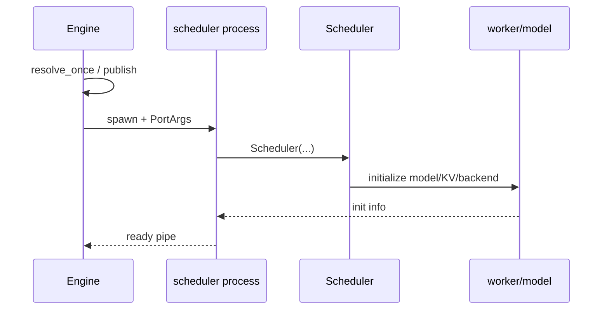
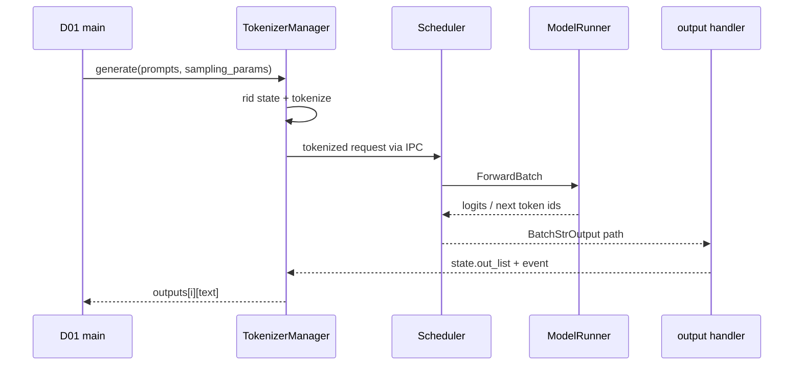

# 端到端流程

- 文档目的：记录最重要的启动、离线生成和 HTTP 生成流程，并链接真实 Demo 与源码。
- 对应源码版本：`f1a512c51c73ab660cf41e1af3110c7c11e3b600`
- 证据状态：部分完成
- 最后更新：2026-09-10

## 流程一：Engine 启动



**已确认**：ready 位于 scheduler 构造后。[`python/sglang/srt/entrypoints/engine.py:846-962`][`python/sglang/srt/managers/scheduler.py:5744-5833`]

## 流程二：D01 普通批量生成



**真实入口**：`examples/runtime/engine/offline_batch_inference.py:6-43`。完整源码轨迹见 [D01](../80-demos/D01-offline-engine/01-离线批量推理.md)。真实模型执行未验证。

## 流程三：失败与取消

```text
输入校验失败
 -> generate_request except
 -> 未 dispatch rid 删除

已 dispatch 后调用者断连
 -> _stream_one_response 检测 disconnected
 -> abort_request
 -> scheduler 清理
 -> 本地调用抛异常
```

[`python/sglang/srt/managers/tokenizer_manager.py:836-845`][`python/sglang/srt/managers/tokenizer_manager.py:1750-1765`]

## 覆盖矩阵

| 流程 | 真实入口 | 核心模块 | Demo/测试 |
|---|---|---|---|
| 启动 | `Engine.__init__` | M01/M06/M07/M09/M15 | D01 静态链路 |
| 批量生成 | `Engine.generate` | M03/M04/M05/M08/M10/M15 | D01 |
| 断连 abort | `_stream_one_response` | M03/M04/M15 | `test/registered/scheduler/test_abort_with_metrics.py` |
| HTTP OpenAI | protocol route | M02/M03/M15 | `test/registered/openai_server/basic/test_openai_server.py` |

## 相关文档

- [D01 执行轨迹](../80-demos/D01-offline-engine/01-离线批量推理.md)
- [跨模块调用链](cross-module-call-chains.md)
- [错误边界](error-boundaries.md)

## 源码证据摘要

- [`examples/runtime/engine/offline_batch_inference.py:6-43`](../../examples/runtime/engine/offline_batch_inference.py)
- [`python/sglang/srt/managers/tokenizer_manager.py:776-845`](../../python/sglang/srt/managers/tokenizer_manager.py)
- [`python/sglang/srt/managers/tokenizer_manager.py:1740-1852`](../../python/sglang/srt/managers/tokenizer_manager.py)

## 未解决问题

尚未对 OpenAI route、Rust server、multimodal 和 disaggregated 流程建立同等深度的端到端轨迹。

## 下一步阅读建议

先按 D01 静态轨迹理解普通路径，再以 `test_abort_with_metrics.py` 对照失败路径。
